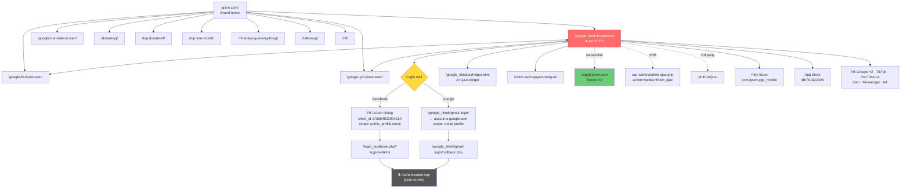
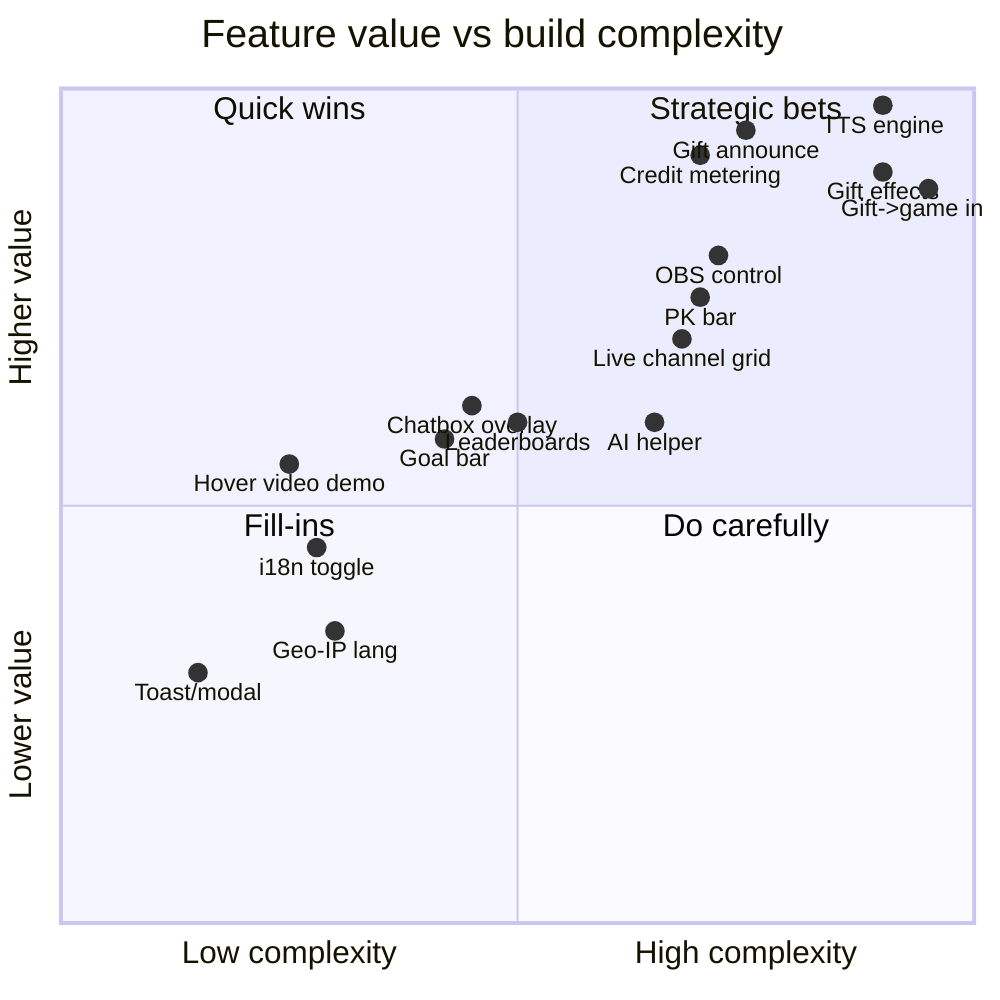
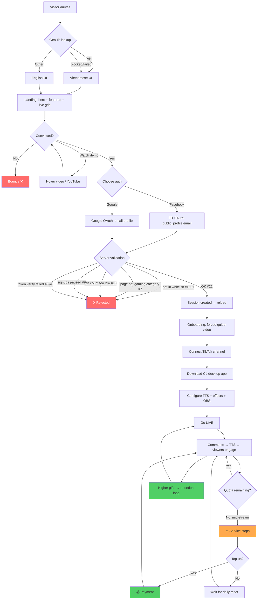
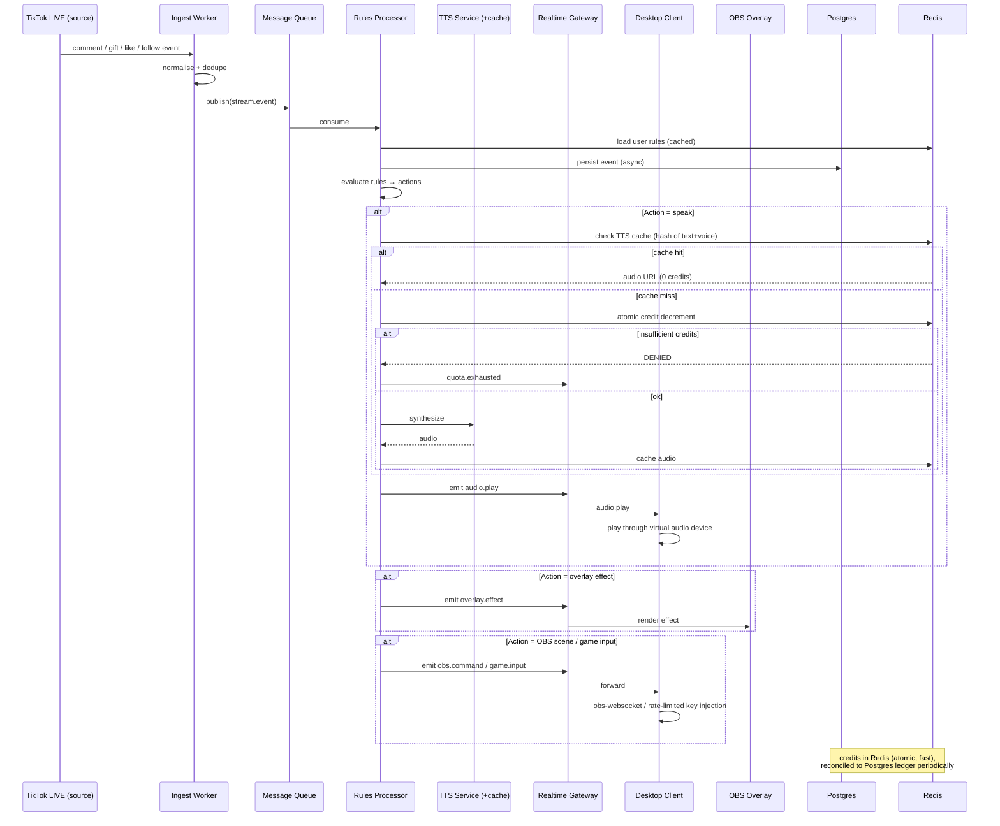
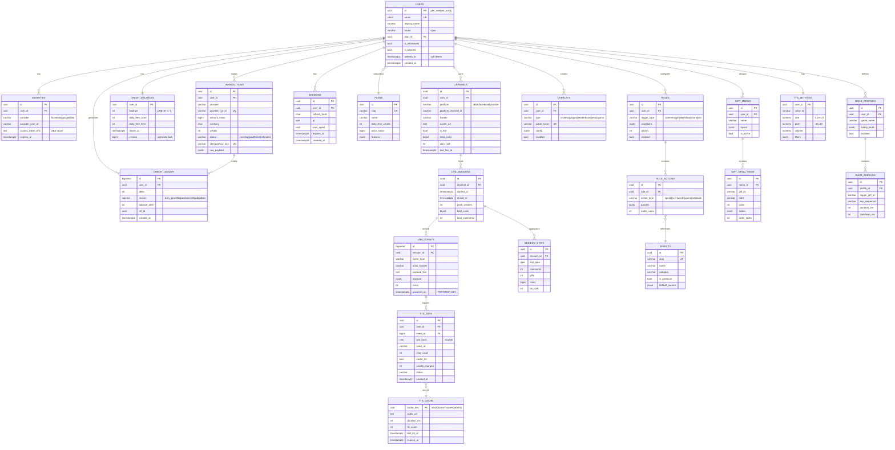
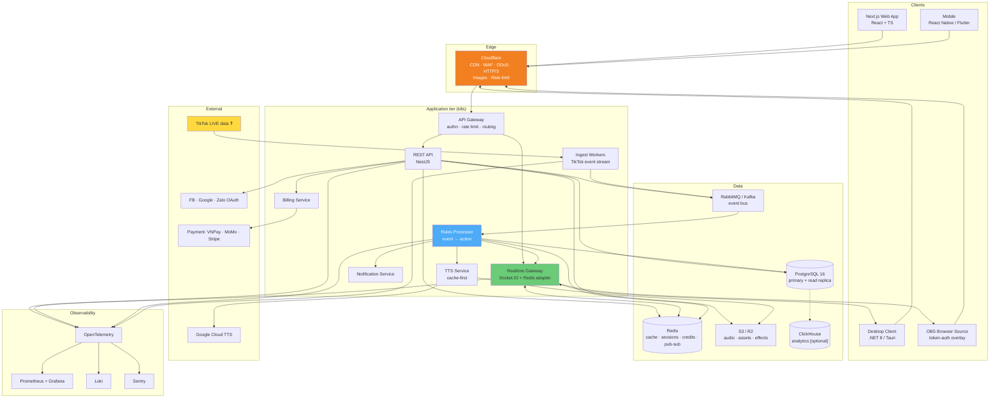
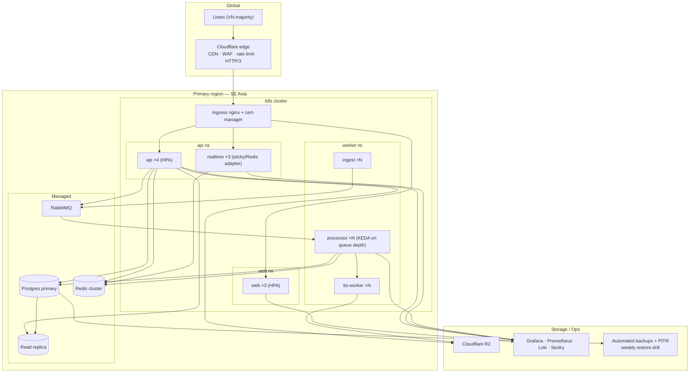
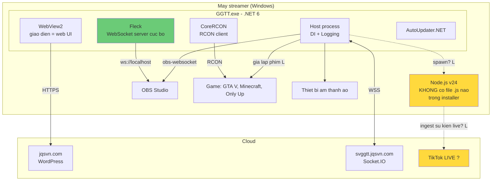

# Website Audit & Rebuild Blueprint
## `https://jqsvn.com/google-tiktok-livestream/` — "Chị Google TikTok" (JQ)

**Audit date:** 2026-08-05
**Auditor:** Autonomous engineering audit (multi-discipline pass: crawler, SEO, frontend, performance, a11y, security, product, UX, business, solution/backend/DB architecture, DevOps, QA, docs)
**Scope:** Public, unauthenticated surface only.

---

## 0. Confidence Legend & Scope Limits — read this first

Every claim in this report is tagged:

| Tag | Meaning |
|---|---|
| **[C] Confirmed** | Directly observed in HTTP responses, DOM, network log, or JS source retrieved from the live site. Evidence quoted. |
| **[L] Likely** | Strong inference from observed signals. Not directly verified. |
| **[U] Unknown** | Not observable from outside. Explicitly not concluded. |

### Hard scope limits (important — do not read past these)

1. **I did not log in.** The product's entire value sits behind a Facebook/Google OAuth wall. I did not create an account or authenticate, so **the whole authenticated application (dashboard, TTS config, gift effects, PK bar, games, billing) is [U]** and is described only from the public marketing copy and from client-side JS that ships to anonymous visitors.
2. **I have no access to source code, server, database, or repos.** Nothing here is derived from internal systems.
3. **No exploitation was performed.** Security findings are limited to observable configuration. Where a risk requires an authenticated session to confirm, it is marked **[L] — needs verification**, never asserted as a vulnerability.
4. **Lighthouse/CrUX field data was not available** in this environment. Performance numbers below are single-run lab timings from one browser session over one network path — directional, not authoritative.
5. **The API Blueprint, Database Design, and Target Architecture sections are original design proposals** for building a functionally comparable product. They are **not** reverse-engineered contracts of jqsvn.com and must not be read as such.
6. This blueprint deliberately describes **how to build equivalent capability from scratch**. It contains no copied source code, assets, copy, or branding from the audited site.

### A note on legal/platform risk (flagged, not blocking)

The product class — reading TikTok LIVE comments/gifts in real time and driving stream overlays — depends on access to TikTok live event data. Whether that access is via an official partner programme or via unofficial means is **[U]**. Anyone building a comparable product should resolve this **before** engineering starts; it is the single largest existential risk to the business model, larger than any technical item in this report. See §14.6.

---

## 1. Executive Summary

### 1.1 What this product is

`jqsvn.com/google-tiktok-livestream/` is the **product landing + login gateway** for "Chị Google TikTok", a Vietnamese **livestream-automation and audience-engagement toolkit** for TikTok LIVE creators. It is one of three sibling products on the same domain (TikTok, Facebook, YouTube variants) **[C]**.

The core promise, per on-page copy **[C]**: convert live comments into speech (TTS) so the streamer can react hands-free, announce gifters/likes/follows/shares, and drive on-stream overlays — PK bars, leaderboards, room-entry effects, gift-triggered animations, gift-triggered game inputs, and a proprietary mini-game.

Delivery is **hybrid**: a **C# desktop program** (stated in on-page copy **[C]**), **iOS + Android apps** (store links present **[C]**), an **OBS WebSocket browser controller** (`OBSController.js` is a bundled `obs-websocket-js` **[C]**), and this **web control panel** behind login **[C]**.

Monetisation is **freemium credit-metering**: on-page copy states 100 free "standard Google reads" per day, with paid top-ups, and explicitly notes the quota may change with user load **[C]**. Revenue also plausibly includes a "Pro" tier — the live-channel grid renders a `LIVE Pro` badge **[C]**.

### 1.2 Verdict

| Dimension | Score | One-line verdict |
|---|---|---|
| **Business model clarity** | **8.0 / 10** | Sharp niche, real monetisation, genuine network effects. Strongest dimension. |
| **Feature depth** | **8.5 / 10** | Unusually deep for the category — OBS control, gift→game input, PK, mini-game. |
| **Technical architecture** | **4.5 / 10** | Works, but WordPress-as-app-server with a single AJAX god-endpoint. Serious ceiling. |
| **Frontend engineering** | **3.5 / 10** | jQuery 2.1.4 (2015), inline `<script>` blocks, string-concat DOM injection, no build step. |
| **UI / visual design** | **5.0 / 10** | Functional and information-dense, but no design system, no dark mode, inconsistent spacing. |
| **UX** | **5.5 / 10** | Excellent social proof; poor first-run clarity, hard login wall, no value demo before signup. |
| **SEO** | **2.5 / 10** | Near-total on-page metadata absence + 2021 sitemap missing the page itself. Worst dimension. |
| **Performance** | **6.0 / 10** | Fast TTFB (108 ms), good caching — undermined by 77 unoptimised images and no compression. |
| **Accessibility** | **2.5 / 10** | Zero semantic landmarks, wrong `lang`, zoom disabled, 2 ARIA attributes site-wide. |
| **Security posture** | **3.5 / 10** | Session cookie readable by JS; no CSP/XFO/XCTO/Referrer-Policy; unvalidated redirect param persisted. |
| **Overall** | **4.9 / 10** | **A strong product on a weak platform.** |

### 1.3 The one-sentence takeaway

> The **product** is genuinely good and defensible; the **engineering platform underneath it is the bottleneck** — and the fastest ROI is not new features, it is (a) 5 security headers, (b) 6 meta tags, (c) killing jQuery-2.1.4-plus-inline-script for a real frontend, in that order.

### 1.4 Top 10 findings by severity

| # | Severity | Finding | Evidence tag |
|---|---|---|---|
| 1 | **Critical** | `PHPSESSID` is readable from JavaScript — `document.cookie` returned it. No `HttpOnly`, no `Secure`, no `SameSite`. Any XSS becomes full session theft. | **[C]** §13.2 |
| 2 | **Critical** | No `Content-Security-Policy`, no `X-Frame-Options`/`frame-ancestors`, no `X-Content-Type-Options`, no `Referrer-Policy`, no `Permissions-Policy`. Site is clickjackable and has zero XSS defence-in-depth. | **[C]** §13.1 |
| 3 | **High** | `?redirect=` on the Google login entry point accepted an arbitrary external origin and persisted it verbatim into a **1-year, domain-wide** cookie. Open-redirect / OAuth-flow-hijack risk. | **[C]** observed; **[L]** impact §13.3 |
| 4 | **High** | Live-channel cards are built by **string concatenation of server-pushed socket data into `innerHTML`** — including user-controlled `namechannel` and `avatar`. DOM-XSS sink. | **[C]** §13.4 |
| 5 | **High** | **No `<meta name="description">`, no `<link rel="canonical">`, no `og:title`/`og:description`, no Twitter Card, no JSON-LD** — on *any* page checked, including the two sibling product pages, the homepage, and the privacy policy. | **[C]** §10.1 |
| 6 | **High** | `sitemap.xml` was generated by a free online tool, last modified **2021-12-26**, and **does not contain the audited page at all**. | **[C]** §10.5 |
| 7 | **High** | `<html lang="en-US">` on a 100% Vietnamese page — plus `<meta name="google" content="notranslate">`. Actively misleads search engines and screen readers. | **[C]** §10.2 / §12.2 |
| 8 | **High** | **Zero semantic landmarks** — `header:0 nav:0 main:0 footer:0 aside:0 section:0`. Whole page is `<div>` soup. Screen-reader navigation is impossible. | **[C]** §12.1 |
| 9 | **Medium-High** | `maximum-scale=1` in the viewport meta **disables pinch-zoom** — WCAG 1.4.4 failure. | **[C]** §12.3 |
| 10 | **Medium-High** | Every client IP is shipped to **`ipinfo.io`** (third party) then POSTed back to the server, on every page load, for language switching. Privacy exposure + third-party availability dependency + adblock breakage. | **[C]** §13.6 |

---

## 2. Methodology & Evidence Log

### 2.1 What was actually run

| Technique | Tool | Result |
|---|---|---|
| Live page load + render | Headless browser (Chromium) | 200 OK, fully rendered |
| Full visible-text extraction | `get_page_text` | Complete copy captured |
| DOM/meta/link/script inventory | In-page JS | 59,205-byte HTML, 12 scripts, 5 stylesheets |
| Inline script source dump | In-page JS | ~17 KB of inline JS read |
| Response headers | `curl -D -` | Nginx, no security headers |
| Static asset headers | `curl -D -` | Caching + compression assessed |
| Network waterfall | CDP network log | 95 resources, 355 KB |
| Storage/global inspection | In-page JS | Cookies, LS, SS, JS globals |
| Performance timings | Navigation + Resource Timing API | TTFB / DCL / load / byte split |
| Accessibility probes | In-page JS | Landmarks, alt, labels, ARIA, tap targets |
| Responsive check | Viewport resize to 375×812 | No horizontal overflow |
| `robots.txt` | `WebFetch` | Retrieved, parsed |
| `sitemap.xml` | `curl` | Retrieved, 13 URLs, stale |
| WP REST API | `curl` | `/wp-json/` open, `/wp/v2/users` → 404 |
| `xmlrpc.php` | `curl` | 405 |
| 404 handling | `curl` | Correct 404 status |
| OAuth entry-point behaviour | `curl` (no flow completion) | 302 + cookie behaviour observed |
| Sibling-page metadata | `curl` + grep | 5 pages checked |
| Third-party JS libs | Source fetch | `obs-websocket-js` identified |

### 2.2 Raw evidence — response headers (page)

```http
HTTP/1.1 200 OK
Server: nginx
Content-Type: text/html; charset=UTF-8
Set-Cookie: PHPSESSID=p3t021okvhs89ekcr6adv16sgq; path=/
Link: <https://jqsvn.com/wp-json/>; rel="https://api.w.org/"
Link: <https://jqsvn.com/?p=7586>; rel=shortlink
Cache-Control: private, no-store, no-cache, must-revalidate, max-age=0
Pragma: no-cache
Expires: 0
Strict-Transport-Security: max-age=31536000
```

**Read this carefully.** What is *absent* is the finding:
`Content-Security-Policy` · `X-Frame-Options` · `X-Content-Type-Options` · `Referrer-Policy` · `Permissions-Policy` · `Cross-Origin-Opener-Policy` · `Cross-Origin-Resource-Policy`.
And on `Set-Cookie`: no `HttpOnly`, no `Secure`, no `SameSite`.
`Link: rel=shortlink` leaks the WordPress post ID (`?p=7586`).

### 2.3 Raw evidence — head of document

```html
<html lang="en-US">
<meta name="viewport" content="width=device-width, initial-scale=1, maximum-scale=1">
<meta name="google" content="notranslate">
<meta property="og:image" content="https://jqsvn.com/google_tiktok/2bxfp25pez671.jpg">
<link rel="shortcut icon" href="https://jqsvn.com/google_tiktok/logo.png" type="image/x-icon">
```

That is **the entire `<meta>` set**. Four tags. One of them is `og:image` with no accompanying `og:title`, `og:description`, `og:url`, or `og:type` — meaning link previews on Facebook/Zalo (the product's own primary distribution channels) render an image with a fallback title and no description.

### 2.4 Raw evidence — the AJAX router pattern

```js
var wsf_admin = 'https://jqsvn.com/wp-admin/admin-ajax.php';

$.post(wsf_admin, { action: 'websunfresh_ajax', page: 'setinfouserip', ip: data.ip }, cb, 'json');
$.post(wsf_admin, { action: 'websunfresh_ajax', page: 'set_lang_website_jq', lang: lang }, cb, 'json');
$.post(wsf_admin, { action: 'websunfresh_ajax', page: 'login_facebook_tiktok', id: ..., tokenfb: ... }, cb, 'json');
```

**[C]** Every server call funnels through **one** WordPress AJAX action (`websunfresh_ajax`) with a `page` string acting as a hand-rolled method router. **[C]** No CSRF nonce is present on any of these three calls. This is the single most architecturally significant observation in the audit — see §7.2.

### 2.5 Raw evidence — realtime layer

```js
var socket = io('https://svggtt.jqsvn.com', { transports: ['websocket'], withCredentials: false });
socket.on('connect', () => socket.emit('send_me_top_live_channels', 'coin'));
socket.on('send_me_top_live_channels', (topLive, showtype, totalLength) => { ... });
```

**[C]** A dedicated Socket.IO server on subdomain `svggtt.jqsvn.com`, WebSocket-only transport, credentials disabled for the public feed. `svggtt` almost certainly = **s**er**v**er **g**oogle **t**ik**t**ok **[L]**.

### 2.6 Raw evidence — the live-channel counter is padded

```js
total.innerText = totalLength + 98;
```

**[C]** The headline "Live Channels (1454)" is the true array length **plus a hardcoded 98**. This is a deliberate vanity inflation of a public trust metric. Called out in §9.5 and §5 — it is a trust/ethics issue, not a bug.

---

## 3. Business Review

### 3.1 Business model

| Aspect | Finding | Tag |
|---|---|---|
| **Category** | Livestream engagement automation / creator-economy SaaS | [C] |
| **Market** | Vietnam-first (VN copy, Zalo, VN phone, VN creator names) | [C] |
| **Model** | Freemium with metered consumption + paid top-up | [C] copy |
| **Free tier** | ~100 "standard Google reads"/day, explicitly adjustable | [C] copy |
| **Paid tier(s)** | Top-up purchase stated; `LIVE Pro` badge in channel grid implies a subscription/tier | [C] badge, [L] tier structure |
| **Cost driver** | Paid Google Cloud TTS API (stated on page) | [C] copy |
| **Unit economics** | Metering exists *because* TTS has real marginal cost. Sensible design. | [L] |
| **Price points** | Not shown pre-login | [U] |
| **Payment rails** | Not observable | [U] |
| **Distribution** | Facebook Groups (2 linked), TikTok (@jqsvn.com), YouTube, Zalo, Messenger, App Store, Play Store | [C] |
| **Support** | Phone `0899.325.505`, email, Messenger, Zalo, AI helper page | [C] |

### 3.2 Value proposition

**Explicit (from copy) [C]:** *"Cài đặt trả lời tự động hợp lý, control buổi livestream thông minh, với sự giúp sức của Google đọc, bạn không thể không thành công."*
→ "Configure smart auto-replies, control your livestream intelligently — with Google reading for you, you can't fail."

**Actual job-to-be-done [L]:**
A solo TikTok LIVE creator is simultaneously performing, reading a fast-scrolling comment feed, thanking gifters by name, and running the technical stream. They physically cannot do all four. This product **outsources the reading and acknowledging to a machine**, which:
1. removes cognitive load → the creator performs better,
2. guarantees every gifter is acknowledged by name → **gifting increases**,
3. adds spectacle (effects, PK, leaderboards, games) → **watch time increases**.

That second point is the commercial core: **the tool pays for itself out of increased gift revenue.** That is a very strong value prop and explains willingness to pay in a price-sensitive market.

### 3.3 Target users (segmented)

| Segment | Need | Product fit | Priority |
|---|---|---|---|
| **Solo TikTok LIVE creator** | Hands-free comment/gift acknowledgment | Core TTS + notifications | **Primary** |
| **Gaming streamer** | Gift→in-game action (GTA V, Minecraft TNT, Only Up — all named in copy [C]) | Gift-trigger engine + OBS control | **Primary** |
| **NPC / interaction streamer** | Gift→physical action cues, effects | Effect scripting | **High** |
| **PK / battle streamer** | Team PK bars, goals, leaderboards | PK module | **High** |
| **Agency / MCN ("LIVE Pro")** | Multi-channel, tiering, ranking | Pro tier + channel ranking | **Medium**, high ARPU |
| **Cross-platform streamer** | Same tooling on FB/YT | Sibling products | **Medium** |

### 3.4 Conversion funnel (observed)

```
Discovery (FB group / TikTok / YouTube / word-of-mouth)
        ↓
Landing page  ─── value prop + feature list + 6 demo videos + live top-channel grid
        ↓
        ▓▓▓ HARD WALL ▓▓▓  ← login required to see ANYTHING functional
        ↓
OAuth (Facebook  |  Google)   ← two options, no email/password fallback
        ↓
[UNKNOWN — authenticated app]
        ↓
Free quota consumption (~100 reads/day)
        ↓
Quota exhaustion  ← the actual monetisation trigger
        ↓
Paid top-up
```

**Funnel diagnosis:**

- ✅ **Top of funnel is strong.** The live top-channel grid showing real VN creators with real coin counts is *outstanding* social proof — it says "the streamers you already watch use this."
- ❌ **The wall is too early and too absolute.** A visitor cannot see the dashboard, a demo, pricing, or even a screenshot tour without surrendering an OAuth identity. For a first-time visitor evaluating a tool, this is a high-friction ask.
- ❌ **No pricing anywhere pre-login.** Price opacity kills consideration for the agency/Pro segment especially.
- ❌ **No email/password or phone fallback.** Users without FB/Google in good standing are hard-blocked. In VN, Zalo login is a notable omission given Zalo is already used for support **[C]**.
- ⚠️ **Monetisation trigger is quota exhaustion**, which arrives *mid-livestream* — the worst possible moment. That's either brilliant (maximum urgency) or brand-damaging (broke the stream). See improvement #47.

### 3.5 Moat analysis

| Moat | Strength | Note |
|---|---|---|
| Feature depth | **Strong** | Gift→game input and OBS control are hard to replicate quickly |
| Community | **Strong** | Two FB groups, direct founder access, VN-language support |
| Switching cost | **Strong** | Streamers build bespoke effect/game setups — that config *is* the lock-in |
| Network effect | **Moderate** | Public channel ranking creates a reason to be listed |
| Multi-platform | **Moderate** | FB + YT + TikTok under one brand |
| Technology | **Weak** | Stack is commodity; nothing here is technically hard to rebuild |
| Data | **Weak-Moderate** | Live channel/coin telemetry is a real asset if productised |
| **Platform dependency** | **Existential risk** | Business lives entirely at TikTok's discretion. See §14.6. |

---

## 4. Website Map

### 4.1 Confirmed URL inventory

| URL | Purpose | Source | Tag |
|---|---|---|---|
| `/` | Brand homepage — *"Welcome to the world of JQ"* | crawl + sitemap | [C] |
| `/google-tiktok-livestream/` | **Audited page** — TikTok product + login | direct | [C] |
| `/google-fb-livestream/` | Facebook sibling product | in-page link + sitemap | [C] |
| `/google-ytb-livestream/` | YouTube sibling product | in-page link + sitemap | [C] |
| `/google-translate-screen/` | Screen-translation product | sitemap | [C] |
| `/chinh-sach-quyen-rieng-tu/` | Privacy policy | footer + sitemap | [C] |
| `/donate-jq/` | Donation page | sitemap | [C] |
| `/nhat-ky-nguoi-ung-ho-jq/` | Supporter diary | sitemap | [C] |
| `/top-donate-nl/` | Donor leaderboard | sitemap | [C] |
| `/top-star-month/` | Monthly star ranking (`?ms=`, `?ys=` params) | sitemap | [C] |
| `/talk-to-jq/` | Contact/community | sitemap | [C] |
| `/ntf/` | Unclear — possibly "NFT" typo | sitemap | [C] path, [U] purpose |
| `/google_tiktok/ai/helper.html` | **AI Q&A assistant** — *"Chị Google Tiktok JQ – Hỏi đáp"* | `onclick` handler | [C] |
| `/google_tiktok/gmail-login/` | Google OAuth entry | link | [C] |
| `/google_tiktok/gmail-login/callback.php` | Google OAuth callback | `Location` header | [C] |
| `/login_facebook.php?logpos=tiktok` | Facebook OAuth callback | FB dialog `redirect_uri` | [C] |
| `/wp-admin/admin-ajax.php` | **The** application API endpoint | inline JS | [C] |
| `/wp-json/` | WP REST root — **publicly readable** | curl | [C] |
| `/sitemap.xml` | Stale sitemap (2021) | curl | [C] |
| `/robots.txt` | Standard WP rules | fetch | [C] |
| `https://svggtt.jqsvn.com` | **Socket.IO realtime server** | inline JS | [C] |
| Authenticated app routes | Dashboard, settings, billing… | — | **[U]** |

### 4.2 Asset directory structure (inferred from URLs) [C]

```
jqsvn.com/
├── wp-content/themes/new_theme_sunfresh/   ← custom WP theme
│   └── fonts/  (VNF-Oswald*.woff2 — self-hosted Vietnamese webfont)
├── wp-content/uploads/2025/02/             ← WP media
├── google_file/                            ← SHARED cross-product assets
│   ├── jq.js  jquery.form.js  md5.js  socket.io.min.js
│   └── style.css  phone.jpg  gmail.png  img/
├── google_tiktok/                          ← TikTok-product-specific
│   ├── ggtt-control-style.css  jq-help-widget-cc.css
│   ├── js/OBSController.js                 ← obs-websocket-js bundle
│   ├── img/  demo_video_hover/*.mp4        ← hover-preview videos
│   ├── ai/helper.html
│   └── gmail-login/{index,callback}.php
└── (parallel google_fb/ , google_ytb/ presumed)                          [L]
```

**Architectural tell [C]:** `google_file/` (shared) vs `google_tiktok/` (per-product) is a deliberate, sensible separation for a multi-product suite. Someone thought about this. It's the **best** structural decision visible in the codebase.

**Architectural tell [C]:** These directories sit *outside* `wp-content/`. The application is **not** a WordPress theme/plugin — it is a **bespoke PHP app parked next to WordPress**, borrowing WP only for routing, pages, and `admin-ajax.php` as an HTTP entry point. See §7.

### 4.3 Site map diagram



---

## 5. Feature Inventory

Priority = business value for a rebuild. Complexity = engineering effort (1–5).
Confidence reflects whether the feature was *observed working* or only *claimed in copy*.

### 5.1 Public / pre-login features (all [C] — observed live)

| # | Feature | Purpose | Business value | Priority | Cx |
|---|---|---|---|---|---|
| F01 | Bilingual VI/EN toggle | Serve VN + international | Market reach | High | 2 |
| F02 | **Geo-IP auto-language** | Auto-switch to EN by IP | Reduces bounce | Medium | 2 |
| F03 | Facebook OAuth login | Primary auth | **Critical** | Critical | 3 |
| F04 | Google OAuth login | Alt auth | **Critical** | Critical | 3 |
| F05 | **Live top-channel grid** | Real-time top TikTok LIVE channels w/ coins | **Killer social proof** | High | 4 |
| F06 | Live/LIVE-Pro badges | Show who's streaming + tier | Trust + upsell | Medium | 2 |
| F07 | Coin/viewer sort toggle | `coin` / `coinrank` / `viewers` modes | Engagement | Medium | 2 |
| F08 | Show-more / collapse grid | Manage 1400+ entries | Perf + UX | Low | 1 |
| F09 | Channel deep-link | Click → tiktok.com/@x/live | Traffic + goodwill | Medium | 1 |
| F10 | **Hover video preview** | Hover feature → autoplay demo `.mp4` | Excellent pre-sale demo | High | 2 |
| F11 | Embedded YouTube demo | Long-form demo | Conversion | Medium | 1 |
| F12 | Demo video links (TikTok ×3, YT ×4) | Proof | Conversion | Medium | 1 |
| F13 | Mobile app store CTAs | iOS + Android acquisition | High | Medium | 1 |
| F14 | Cross-product nav (FB/YT) | Suite cross-sell | Revenue | Medium | 1 |
| F15 | FB community group CTAs | Community-led growth | **High** | High | 1 |
| F16 | **AI Q&A helper** (`ai/helper.html`) | Self-serve support | **Cost reduction** | High | 4 |
| F17 | Floating help widget | Support entry | Medium | 1 |
| F18 | Multi-channel contact | Phone/Email/Messenger/Zalo | Trust (VN) | High | 1 |
| F19 | Toast alert system | `call_alrt()` w/ error/warn/success | UX plumbing | Medium | 1 |
| F20 | Custom confirm modal | Promise-based `customConfirm()` | UX plumbing | Low | 1 |
| F21 | Custom prompt modal | Promise-based `customPrompt()` | UX plumbing | Low | 1 |
| F22 | Custom tooltip engine | Replaces native `title` | Polish | Low | 2 |
| F23 | **Android WebView bridge** | Rewrites links → `app://openlink?url=` | Native app plumbing | Medium | 2 |
| F24 | Client IP capture | Posted to server | Analytics/geo/fraud | Medium | 1 |
| F25 | Whitelist gating | Error #1001 "not in Whitelist" | Access control | Medium | 2 |
| F26 | FB Page eligibility check | Min fan count + gaming-category requirement (errors #7, #10) | Quality gating | Medium | 3 |
| F27 | Registration kill-switch | Error #9 "system paused new signups" | Ops control | **High** | 1 |

**Note on F26 [C]:** the error strings reveal a genuinely sophisticated onboarding gate — the FB path validates that the user selected a Page, that the Page is in the *"Người tạo video chơi game / game thủ"* (gaming creator) category, and that it has a configurable minimum like count. That's real product logic leaking through error copy.

### 5.2 Authenticated / product features (from copy + client JS)

| # | Feature | Purpose | Business value | Priority | Cx | Tag |
|---|---|---|---|---|---|---|
| F28 | **Comment → speech (TTS)** | Core: read live comments aloud | **THE product** | Critical | 5 | [C] copy |
| F29 | **Gifter announcement** | Read donor name + gift | **Drives gifting** | Critical | 4 | [C] copy |
| F30 | Like/heart notification | Announce hearts | High | 3 | [C] copy |
| F31 | Share notification | Announce shares | Medium | 3 | [C] copy |
| F32 | Follow notification | Announce new follows | High | 3 | [C] copy |
| F33 | **Gift effect engine** | Gift → arbitrary configured on-stream effect | **Differentiator** | Critical | 5 | [C] copy |
| F34 | Chatbox overlay | On-stream comment display | High | 3 | [C] copy |
| F35 | TopViewer overlay | Highlight top viewers | Medium | 3 | [C] copy |
| F36 | **Team PK bar** | Multi-team battle bar (copy shows 8 slots) | **High engagement** | High | 4 | [C] copy |
| F37 | Goal / target bar | Progress toward gift goal | High | 3 | [C] copy |
| F38 | Room-entry effect | Animation on viewer join | Medium | 3 | [C] copy |
| F39 | Gift leaderboard | Rank gifters | High | 3 | [C] copy |
| F40 | Heart leaderboard | Rank likers | Medium | 3 | [C] copy |
| F41 | **"Chạm Và Chơi" game** | Proprietary exclusive mini-game | **Moat** | High | 5 | [C] copy |
| F42 | **Gift → game input** | Gift triggers keystroke/action in GTA V, Minecraft TNT, Only Up… | **Strongest differentiator** | High | 5 | [C] copy |
| F43 | **Gift menu designer** | Visual tool to build gift menus | High | 4 | [C] copy |
| F44 | **OBS WebSocket control** | Browser drives OBS scenes/sources | **High** | High | 4 | **[C] library** |
| F45 | Auto-reply rules | Configured automatic responses | High | 4 | [C] copy |
| F46 | Credit/quota metering | 100 free reads/day, top-up | **Revenue core** | Critical | 4 | [C] copy |
| F47 | Paid top-up purchase | Buy more reads | **Revenue** | Critical | 4 | [C] copy |
| F48 | "LIVE Pro" tier | Premium tier | Revenue | High | 3 | [C] badge |
| F49 | Mobile app (iOS/Android) | Control from phone | High | 5 | [C] stores |
| F50 | Desktop C# program | Local capture + audio + game input | **Critical** | Critical | 5 | [C] copy |
| F51 | Video upload/save | `cancel_uploadvideo`, `dang_uploadvideo`, `dangxuly_savevideo` globals | Medium | 3 | **[C] JS** |
| F52 | Guide-video gating | `ReadedGuideVideo`, `player_effect_guide` — forced onboarding video | Onboarding | Medium | 2 | **[C] JS** |
| F53 | Channel/coin analytics | Coin, coinrank, viewerCount tracked per channel | **Data asset** | Medium | 4 | **[C] socket** |

> **F51/F52 are pure inference-from-globals [C].** Those variable names ship to anonymous visitors even though the features are behind login — itself a minor information-disclosure smell (§13.7).

### 5.3 Feature-value map



---

## 6. Tech Stack Detection

### 6.1 Confirmed

| Layer | Technology | Evidence |
|---|---|---|
| Web server | **nginx** | `Server: nginx` |
| Language | **PHP** | `PHPSESSID`, `.php` endpoints |
| CMS | **WordPress** | `/wp-json/`, `/wp-admin/`, `/wp-content/`, `rel=shortlink ?p=7586`, robots.txt |
| Theme | **Custom `new_theme_sunfresh`** | stylesheet + font paths |
| App namespace | **"websunfresh"** | AJAX action `websunfresh_ajax` |
| JS library | **jQuery 2.1.4** | `jQuery.fn.jquery` → `2.1.4` (released 2015) |
| JS plugin | **jQuery Form Plugin** | `jquery.form.js` |
| Crypto (client) | **md5.js** | loaded globally, `md5` in `window` |
| Realtime | **Socket.IO** (WebSocket-only) | `socket.io.min.js` + `io('https://svggtt.jqsvn.com')` |
| Streaming control | **obs-websocket-js** | source inspection of `OBSController.js` |
| Auth | **Facebook Login** (`client_id 176884822904164`, `sdk=php-sdk-5.7.0`, scope `public_profile,email`) | OAuth dialog URL |
| Auth | **Google OAuth 2.0** (`client_id 439683...apps.googleusercontent.com`, scope `email profile`, `access_type=offline`) | `Location` header |
| TTS | **Google Cloud paid API** | stated in page copy |
| Desktop | **C#** | stated in page copy |
| Mobile | **iOS + Android native/hybrid** (`com.jqsvn.ggtt_mobile`, `id6761822305`) | store links |
| Mobile bridge | **Custom `app://` URL scheme** | inline JS handler |
| Fonts | **Self-hosted Oswald (VN subset), woff2** | `VNF-OswaldRegular.woff2` |
| Video | YouTube embed + self-hosted MP4 | iframe + `demo_video_hover/*.mp4` |
| 3rd party | **ipinfo.io** | `fetch('https://ipinfo.io/json')` |
| TLS | HTTPS + HSTS `max-age=31536000` (no `includeSubDomains`, no `preload`) | headers |

### 6.2 Likely

| Item | Inference | Basis |
|---|---|---|
| Socket.IO server is **Node.js** | Socket.IO's canonical server runtime | [L] high |
| **Self-hosted VPS**, no CDN | No CDN headers (`cf-ray`, `x-cache`, `x-served-by`); nginx exposed directly | [L] high |
| **Single-origin infra**, app + socket on same host/DC | Subdomain of same apex, no CDN | [L] moderate |
| **MySQL/MariaDB** | WordPress default | [L] high |
| Desktop app = **C# WinForms/WPF, Windows-only** | C# + OBS + game keystroke injection | [L] high |
| Desktop↔cloud over the same **Socket.IO** bus | One realtime server for web+desktop is the simple design | [L] moderate |
| **No analytics** — no GA4, GTM, Meta Pixel | `gtag`/`fbq`/`dataLayer` all `undefined`; zero analytics requests in 95-resource waterfall | **[C] absence** |
| `md5.js` used to sign/hash AJAX payloads or cache-key | Client-side MD5 has few other uses | [L] moderate |

### 6.3 Unknown

Database engine/schema · server framework behind the socket · queue/cache (Redis?) · payment provider · TikTok data-acquisition method · hosting provider · CI/CD · monitoring · backup strategy · staging environment.

### 6.4 Notable *absences* (each is a finding)

- ❌ **No analytics of any kind.** For a conversion-driven freemium funnel this is remarkable — the business is flying blind on its own funnel. **This is my single highest-ROI non-security recommendation.**
- ❌ No error tracking (Sentry etc.).
- ❌ No CDN.
- ❌ No cookie-consent mechanism, despite third-party IP lookup and OAuth.
- ❌ No build tooling — no bundler, minifier, hashing, or tree-shaking on first-party JS (`jq.js` ships unminified at 29.5 KB).
- ❌ No SPA framework, no TypeScript, no module system.

---

## 7. Architecture Review (as observed)

### 7.1 Inferred current architecture

```mermaid
graph TB
    subgraph Clients
        W["Web browser<br/>jQuery 2.1.4 + inline JS"]
        D["C# Desktop app<br/>Windows [L]"]
        M["Mobile apps<br/>iOS / Android"]
        O["OBS Studio<br/>local"]
    end

    subgraph "jqsvn.com (nginx, single origin [L])"
        WP["WordPress<br/>pages + routing"]
        AJ["admin-ajax.php<br/>action=websunfresh_ajax<br/>page=&lt;router&gt;"]
        PHP["Bespoke PHP app<br/>/google_file/ /google_tiktok/"]
        DB[("MySQL/MariaDB [L]")]
    end

    subgraph "svggtt.jqsvn.com"
        IO["Socket.IO server<br/>Node.js [L]"]
    end

    subgraph External
        GT["Google Cloud TTS"]
        FBA["Facebook OAuth"]
        GA["Google OAuth"]
        TK["TikTok LIVE data<br/>❓ method UNKNOWN"]
        IPI["ipinfo.io"]
    end

    W -->|XHR| AJ --> PHP --> DB
    W -->|WSS| IO
    W -->|fetch| IPI
    W -->|obs-websocket| O
    D <-->|WSS [L]| IO
    D -->|keystroke inject [L]| O
    M <-->|WSS [L]| IO
    IO --> DB
    IO <-->|ingest| TK
    PHP --> GT
    PHP --> FBA
    PHP --> GA
    WP -.-> AJ

    style AJ fill:#ff6b6b,color:#fff
    style TK fill:#ffd93d
    style IO fill:#6bcB77
```

### 7.2 The central architectural problem: `admin-ajax.php` as the application API

**[C]** Every server interaction routes through `POST /wp-admin/admin-ajax.php` with `action=websunfresh_ajax` and a `page` string selecting the operation.

This is a **god-endpoint / hand-rolled RPC router**, and it is the root cause of several downstream problems:

| Consequence | Why |
|---|---|
| **Full WordPress bootstrap per request** | `admin-ajax.php` loads WP core, plugins, and options on *every* API call — including the trivial `set_lang` call. Enormous fixed cost per request. |
| **No HTTP semantics** | Everything is `POST`. No caching, no idempotency, no correct status codes — errors are returned as `200 OK` with `{success: 4}`. |
| **Numeric error codes leak internals** | `success: 2/3/4/5/6/7/9/10/1001` are internal branch identifiers surfaced to the client (§13.7). |
| **Cannot scale independently** | The lightest call (language toggle) and the heaviest (OAuth exchange) share one process pool. |
| **No API versioning** | Any change to a `page` handler is a breaking change with no migration path. |
| **CSRF exposure** | WordPress's own nonce mechanism exists precisely for this and **is not used on any observed call** (§13.5). |
| **Untestable** | No route table, no contract, no schema — the surface area is a `switch` statement. |
| **Blocks mobile/desktop** | The C# and mobile clients presumably speak *some* API; forcing them through WP AJAX is architecturally backwards. |

**Verdict:** the realtime layer (Socket.IO on its own subdomain, WebSocket-only) is **correctly separated and is the good part of this architecture**. The request/response layer is the problem. A rebuild should keep the shape of the former and completely discard the latter.

### 7.3 What the current architecture gets *right*

Credit where due — these are real, deliberate engineering decisions:

1. ✅ **Realtime is on a separate service and subdomain.** Correct call. WebSocket workloads must not share a PHP-FPM pool.
2. ✅ **`transports: ['websocket']`** — skips the HTTP long-poll upgrade dance. Faster connect, less load.
3. ✅ **`withCredentials: false`** on the public feed — no cookies sent to the socket origin for anonymous data. Good hygiene.
4. ✅ **Shared (`google_file/`) vs per-product (`google_tiktok/`) asset split** — a genuine multi-tenant product structure.
5. ✅ **Static assets are correctly cached** (`max-age=2592000, immutable`) while HTML is `no-store`. Correct split.
6. ✅ **Self-hosted Vietnamese webfont subset in woff2** — better than a Google Fonts round-trip, and correct for the market.
7. ✅ **`?ver=` query-string cache-busting** on first-party CSS/JS — crude but functional.
8. ✅ **Registration kill-switch** (error #9) — real operational maturity; they can stop signups under load.
9. ✅ **TTL/quota metering** aligned to actual marginal cost (Google TTS). Sound unit economics.
10. ✅ **404s return a real 404**; `xmlrpc.php` returns 405; `/wp/v2/users` returns 404 (user enumeration is blocked). Someone did harden *some* things.

---

## 8. UI Audit

### 8.1 Scores

| Criterion | Score | Evidence / rationale |
|---|---|---|
| Typography | **6.0** | Self-hosted Oswald VN subset is a good, on-brand choice. But 23 text nodes render **< 12 px** at mobile width [C], and there is no visible type scale. |
| Spacing & rhythm | **4.5** | No spacing token system; values are ad-hoc across 4 separate stylesheets. |
| Colour system | **4.0** | No CSS custom properties for colour; palette lives inline and across files. |
| Contrast | **4.5** | Small grey metadata text on light backgrounds in the channel grid is the main risk area. Formal contrast sampling not run — **[L]**. |
| Alignment | **6.0** | Channel grid is clean and consistent; the feature-list section is a loose bullet list. |
| Consistency | **4.0** | 4 stylesheets (`style.css`, `ggtt-control-style.css`, `jq-help-widget-cc.css`, `fonts.css`) + inline styles injected from JS. |
| White space | **5.0** | Feature section is dense text; channel grid breathes well. |
| Grid system | **6.5** | Channel-card grid is genuinely well executed. |
| Responsive | **7.0** | **No horizontal overflow at 375 px [C]** — better than expected. Real strength. |
| Visual hierarchy | **5.5** | H1 → login → features → social proof is a defensible order, but the login card competes with the value prop. |
| Component library | **3.0** | Components exist as ad-hoc functions (`call_alrt`, `customConfirm`, `customPrompt`, tooltip IIFE), not a system. |
| Card | **7.0** | Channel card is the best component on the page. |
| Button | **5.0** | OAuth buttons are clear and correctly branded; secondary buttons are inconsistent. |
| Modal / Dialog | **6.0** | `customConfirm`/`customPrompt` are **Promise-based** — genuinely nice API design — but have **no focus trap and no `role="dialog"`** [C]. |
| Dropdown | **4.0** | Language switcher is flag images with `onclick`, not a real menu. |
| Header | **3.0** | **No `<header>` element exists** [C]. |
| Footer | **4.0** | Contact info present and useful; marked up as `<h3>` + raw text with heavy whitespace, no `<footer>` [C]. |
| Sidebar | **n/a** | None. |
| Banner / Hero | **6.0** | H1 + subhead + login is clear, if plain. |
| Animation | **6.5** | Hover video preview is a standout idea; tooltip fade is smooth. |
| Hover states | **7.0** | **The hover→autoplay MP4 demo is genuinely excellent product thinking.** |
| Loading state | **2.0** | **None observed.** The 1454-card grid arrives via socket with no skeleton — the section is `display:none` then pops in [C]. |
| Skeleton | **1.0** | Absent. |
| Toast | **6.5** | `call_alrt()` works, supports 3 types, 10 s auto-dismiss — but **no `aria-live`**, so screen readers never announce it [C]. |
| Icon system | **4.0** | Raster PNGs (`icon_facebook.png`, `icon_google.png`) instead of SVG/icon font. Not crisp on HiDPI, not themeable. |
| Illustration | **5.0** | Screenshots + phone mockup. Adequate. |
| Empty state | **2.0** | Socket handler wraps everything in `try/catch` and only `console.log`s the error — **a socket failure silently renders nothing** [C]. |
| Error state | **3.0** | Toasts only; no inline field or section error states. |
| Dark mode | **0.0** | **Absent.** Notable miss: streamers work in dark rooms, at night, next to OBS (dark UI). This audience *expects* dark. |
| Design system | **2.0** | None. No tokens, no documented components, no Storybook. |

### **UI composite: 5.0 / 10**

### 8.2 UI verdict

The UI is the work of a capable developer without a designer. The **channel grid and hover-video preview are legitimately good product ideas** and outperform what most competitors in this niche ship. But there is **no design system**, **no loading or empty states**, and **no dark mode** — and for a product whose users stare at OBS in a dark room at 11 pm, that last one is a real, daily papercut.

---

## 9. UX Audit

### 9.1 Scores

| Criterion | Score | Rationale |
|---|---|---|
| Navigation | **4.5** | No nav bar. Cross-product links are inline body text, easily missed. |
| Information architecture | **5.0** | Logical single-page order, but the feature list is one long undifferentiated bullet run. |
| Learnability | **4.0** | Feature names (PK, TopViewer, "Chạm Và Chơi", chatbox) are unexplained jargon to a newcomer. |
| Efficiency (returning user) | **7.0** | Two-click OAuth login is fast. |
| Error prevention | **4.0** | Numeric error codes ("#7", "#10", "#1001") shown to users with no remediation path. |
| Accessibility | **2.5** | See §12. |
| Interaction design | **6.0** | Hover previews and Promise modals are good; no focus management anywhere. |
| Conversion design | **5.0** | Strong proof, but hard wall + zero pricing. |
| Trust signals | **7.5** | **Strongest UX dimension** — real creator names, real coin counts, phone number, Zalo, privacy policy, app stores, communities. |
| CTA clarity | **6.0** | Login CTAs are clear; no secondary "see how it works" path. |
| Onboarding | **3.0** | Nothing pre-login. Forced guide video post-login [L, from `ReadedGuideVideo`]. |
| Retention mechanics | **6.5** | Daily quota reset + public rankings are solid retention loops. |
| User journey coherence | **5.0** | Breaks hard at the login wall. |

### **UX composite: 5.5 / 10**

### 9.2 Simulated attention heatmap

Based on layout order, contrast, and motion (not real eye-tracking — **[L]**):

```
██████████████████  H1 + subhead                          ~95%  ← strong
████████████████    Login card (FB/Google)                ~90%  ← the wall
████████            "Bạn cần đăng nhập để tiếp tục"       ~70%
██████              Mobile app store badges               ~45%
███████████         Feature list (top 3 bullets)          ~60%  ← decays fast
███                 Feature list (bullets 4–8)            ~20%  ← ⚠ drop-off
██████████████      Live channel grid (first 2 rows)      ~85%  ← ⚠ THE hook
█████               Channel grid rows 3+                  ~30%
████                "Xem thêm" button                     ~25%
███████             Footer contact                        ~40%
██                  Privacy policy link                   ~10%
```

**The single most actionable UX insight in this report:** the **live channel grid — the strongest conversion asset on the page — sits *below* the feature wall of text.** Visitors hit a dense unexplained bullet list, attention collapses, and many never reach the proof. Moving the grid directly under the hero is a low-effort, high-impact change (improvement #1).

### 9.3 Predicted behaviour by segment

| Persona | Predicted path | Predicted outcome |
|---|---|---|
| **Streamer arriving from FB group** (warm) | Scroll → login immediately | ✅ Converts. Trust already established off-site. |
| **Cold organic visitor** | Reads H1 → hits login wall → scrolls → jargon bullets → bounces | ❌ Likely bounce. No demo, no pricing, no free look. |
| **Competitor / evaluator** | Inspects, notes stack, finds channel grid | ⚠️ Extracts intel easily (grid is public, unauthenticated). |
| **Agency / MCN buyer** | Looks for pricing + multi-seat + SLA | ❌ Finds none. Falls back to phone/Zalo — high-friction, unscalable. |
| **Mobile visitor** | Small text, tiny tap targets | ⚠️ 24 tap targets under 44 px [C]. Frustrating. |
| **Screen-reader user** | Encounters `lang="en-US"` on Vietnamese text, zero landmarks | ❌ Effectively unusable. |
| **International visitor** | Geo-IP may auto-switch to EN | ✅ Good — if `ipinfo.io` isn't blocked. If adblocked, silently fails [C]. |

### 9.4 Journey map

```mermaid
journey
    title TikTok streamer — current experience
    section Discovery
      Sees tool in a friend's stream: 4: Streamer
      Asks in FB group: 4: Streamer
      Gets the link: 5: Streamer
    section Landing
      Reads headline: 4: Streamer
      Hits login wall immediately: 2: Streamer
      Scrolls the feature bullets: 3: Streamer
      Hovers a feature, sees video demo: 5: Streamer
      Sees creators they recognise LIVE: 5: Streamer
      Looks for pricing, finds none: 2: Streamer
    section Signup
      Chooses Facebook login: 4: Streamer
      Grants permissions: 3: Streamer
      Hits whitelist or fan-count rejection: 1: Streamer
      Succeeds: 4: Streamer
    section First use
      Forced to watch guide video: 3: Streamer
      Downloads C# desktop app: 3: Streamer
      Configures OBS + effects: 2: Streamer
      First successful TTS read: 5: Streamer
    section Steady state
      Runs daily streams: 5: Streamer
      Hits 100-read cap MID-STREAM: 1: Streamer
      Tops up: 3: Streamer
```

The two `1:` troughs — **rejection at the gate** and **quota exhaustion mid-stream** — are where users are lost and where the brand takes damage. Both are fixable (improvements #12, #47).

### 9.5 Trust issue: the padded counter

**[C]** `total.innerText = totalLength + 98;`

The displayed live-channel count is inflated by a constant 98. It's a small deception, but it sits inside the page's *primary trust asset*. Anyone who opens DevTools finds it in ten seconds — and this audience includes technically-minded streamers. **Remove it.** The real number (1,356 at time of audit) is impressive on its own. Recommendation #23.

---

## 10. SEO Review

### **SEO composite: 2.5 / 10 — the weakest dimension in the audit.**

### 10.1 On-page metadata — comprehensive failure

| Element | Status | Evidence |
|---|---|---|
| `<title>` | ✅ Present, keyword-rich, VN | *"Google đọc bình luận khi livestream trên TikTok"* |
| `<meta name="description">` | ❌ **ABSENT** | grep over 5 pages: zero hits |
| `<link rel="canonical">` | ❌ **ABSENT** | zero hits — and the page is reachable at 2 URLs |
| `og:title` | ❌ **ABSENT** | only `og:image` exists |
| `og:description` | ❌ **ABSENT** | |
| `og:url` / `og:type` / `og:site_name` / `og:locale` | ❌ **ABSENT** | |
| `og:image` | ✅ Present | orphaned without the others |
| `twitter:card` and all Twitter tags | ❌ **ABSENT** | |
| JSON-LD / structured data | ❌ **ABSENT** | zero `application/ld+json` on any page |
| `hreflang` | ❌ **ABSENT** | despite an explicit VI/EN bilingual product |
| `<meta name="robots">` | ❌ Absent (defaults to index,follow — acceptable) | |
| `<meta name="google" content="notranslate">` | ⚠️ **Present** | actively suppresses Google auto-translation |

**Impact.** The two most damaging entries are `description` and Open Graph. This product is distributed *primarily through Facebook groups, Zalo, and Messenger* **[C]** — all of which render link previews from Open Graph. Every share of this page currently produces a preview with **an image, a title, and no description**. The company is losing click-through on its own main acquisition channel, on every share, every day. **This is a ~30-minute fix.**

### 10.2 The `lang` bug

```html
<html lang="en-US">   <!-- page content is 100% Vietnamese -->
```
**[C]** Combined with `notranslate`, this tells Google the page is US-English while serving Vietnamese. It undermines VN-market ranking, breaks screen-reader pronunciation (§12.2), and blocks translation for the international audience the EN toggle exists to serve. Should be `lang="vi"`, flipped to `lang="en"` when the EN locale is active.

### 10.3 Heading structure

```
H1  Google đọc bình luận khi livestream trên TikTok        ✅ single, correct
H2  Bạn cần đăng nhập để tiếp tục                          ⚠️ "You need to log in" as an H2 — no SEO value
H3  Với chị Google Tiktok bạn có thể làm gì?               ❌ skips H2 level
H2  Live Channels (1454)                                    ✅
H3  Liên hệ: ...                                            ⚠️ contact block as a heading, full of raw \t\n
H3  Thông báo                                               ⚠️ hidden notification container
```
**[C]** Hierarchy is broken (H1→H2→H3→H2→H3) and the most keyword-valuable heading ("what can you do with…") is an H3 while a login prompt occupies an H2.

### 10.4 Content & keywords

- ✅ Excellent natural VN keyword density: *google đọc bình luận, livestream, TikTok, quà, PK, hiệu ứng*.
- ✅ Real, specific long-tail: *"Only Climb Better Together"*, *"Grand Theft Auto V"*, *"Minecraft TNT"*.
- ❌ Nearly all body copy is in a flat bullet run with no subheadings — no chance of ranking for individual features.
- ❌ No blog, tutorials, changelog, or FAQ. For a product this feature-rich, **there are dozens of high-intent VN long-tail queries being left on the table** ("cách setup PK TikTok", "hiệu ứng quà TikTok livestream", "đọc bình luận livestream TikTok tự động").
- ❌ **1,454 channel names render into the DOM** — a large volume of thin, non-topical, constantly-changing text that dilutes topical focus. Should be `noindex`-hinted or loaded post-render only.

### 10.5 Technical SEO

| Check | Result | Tag |
|---|---|---|
| `robots.txt` | ✅ Present, sane WP rules, points to sitemap | [C] |
| robots.txt sitemap URL | ⚠️ Declared as **`http://`** not `https://` | [C] |
| `sitemap.xml` | ⚠️ Exists — **generated by a free online tool, `lastmod` 2021-12-26 on every URL** | [C] |
| **Sitemap contains the audited page?** | ❌ **NO.** `/google-tiktok-livestream/` is completely absent | **[C]** |
| Sitemap includes junk | ❌ Yes — `?ms=0` and `?ms=0&ys=0` param duplicates listed as separate URLs | [C] |
| WP native sitemap | ❌ `/wp-sitemap.xml` → 404 (disabled/overridden) | [C] |
| 404 handling | ✅ Correct 404 status code | [C] |
| HTTPS | ✅ Enforced, HSTS present | [C] |
| Mixed content | ✅ None observed | [C] |
| Broken links | ✅ None in the 95-resource waterfall (all 200) | [C] |
| Mobile-friendly | ✅ No horizontal overflow at 375 px | [C] |
| Semantic HTML | ❌ Zero landmark elements | [C] |
| Image `alt` | ⚠️ 7 images with `alt=""`; socket-injected avatars all get generic `alt="Avatar"` | [C] |
| Breadcrumbs | ❌ None | [C] |
| Internal linking | ⚠️ Thin — 2 cross-product links, 1 privacy link | [C] |
| External links | ⚠️ Many outbound to TikTok/YT/FB with no `rel` strategy | [C] |
| `target="_blank"` safety | ⚠️ `window.open(url,'_blank')` from card click without `noopener` — one `onclick` *does* use `noopener`, the channel cards do **not** | [C] |
| Page indexability | ✅ Indexable | [C] |
| Duplicate content | ⚠️ Reachable at `/` and `/google-tiktok-livestream/` with no canonical | [C] |

### 10.6 E-E-A-T

| Signal | Status |
|---|---|
| Experience | ✅ Strong — years of demo videos, community, real creator usage |
| Expertise | ⚠️ Implied but undocumented — no About, no team, no author entity |
| Authoritativeness | ⚠️ Strong *off-site* (FB groups, TikTok/YT presence) but almost none is expressed *on-site* via structured data |
| Trustworthiness | ✅ Real phone, email, Zalo, privacy policy, app-store presence ❌ but no company registration, no ToS, no refund policy |

**Biggest E-E-A-T gap:** none of the real-world authority (two Facebook communities, a TikTok channel, two published apps, years of demos) is expressed as `Organization` / `SoftwareApplication` / `AggregateRating` structured data. **Rich results are being forfeited entirely.**

### 10.7 SEO fix priority

| P | Fix | Effort | Impact |
|---|---|---|---|
| **P0** | Add `meta description` to every page | 1 h | **Very High** |
| **P0** | Add full Open Graph set (`title`/`description`/`url`/`type`/`site_name`/`locale`) | 1 h | **Very High** (FB/Zalo distribution) |
| **P0** | Fix `<html lang="vi">` | 5 min | **High** |
| **P0** | Regenerate sitemap dynamically; **include the product pages** | 2 h | **High** |
| **P0** | Add `rel="canonical"` | 1 h | High |
| **P1** | Add `SoftwareApplication` + `Organization` + `FAQPage` JSON-LD | 4 h | High |
| **P1** | Add Twitter Card tags | 30 min | Medium |
| **P1** | Fix heading hierarchy; promote the feature heading to H2 | 2 h | Medium |
| **P1** | Add `hreflang` for vi/en | 2 h | Medium |
| **P1** | Fix robots.txt sitemap URL to `https://` | 2 min | Low |
| **P2** | Remove `notranslate` | 5 min | Medium |
| **P2** | Build a content hub — tutorials, FAQ, changelog | 40 h+ | **Very High long-term** |
| **P2** | Restructure features into individually-headed, indexable sections | 8 h | High |
| **P2** | Add `rel="noopener noreferrer"` to all programmatic `window.open` | 30 min | Low (security-adjacent) |

---

## 11. Performance Review

### 11.1 Measured (single lab run — directional only, **[C]** for the run itself)

| Metric | Value | Assessment |
|---|---|---|
| **TTFB** | **108 ms** | ✅ **Excellent.** Server is fast. |
| DOMContentLoaded | 598 ms | ✅ Good |
| Load (full) | **2,281 ms** | ⚠️ Moderate — image-dominated tail |
| Total transfer | **355 KB** | ✅ Reasonable |
| Resource count | **95** | ⚠️ High |
| **Scripts** | 5 files / **69 KB** | ⚠️ Unminified first-party |
| **CSS** | 4 files / **10.9 KB** | ✅ Small, but 4 round-trips |
| **Images** | **77 files / 187 KB** | ❌ **The bottleneck — 81% of requests** |
| HTML | 59.2 KB | ⚠️ Large for a landing page |

*LCP/CLS/INP were not capturable in this environment — **[U]**. Given 77 render-participating images and a socket-injected grid that swaps `display:none → block` after connect, **CLS is very likely poor [L]** and **LCP is likely image-bound [L]**.*

### 11.2 Confirmed issues

| # | Issue | Evidence | Severity |
|---|---|---|---|
| 1 | **No compression on text assets** | `Accept-Encoding: gzip, br` sent; no `Content-Encoding` in response. CSS/JS served raw. | **High** |
| 2 | **77 images, all raster PNG/JPG** | No WebP/AVIF anywhere in the waterfall | **High** |
| 3 | **Unminified first-party JS** — `jq.js` 29.5 KB raw | source inspection | **High** |
| 4 | **Layout shift from socket-injected grid** | `#live-channels` starts `display:none`, becomes `block` after WS connect, injecting 1,454 cards | **High** [C] mechanism, [L] CLS value |
| 5 | **1,454 DOM cards injected in a single synchronous `forEach`** | inline JS | **High** — main-thread block |
| 6 | **No CDN** | no CDN headers | **High** for non-VN users |
| 7 | **Render-blocking**: 4 CSS + 4 JS in `<head>`, none `async`/`defer` | DOM inspection | **High** |
| 8 | **jQuery 2.1.4 + jQuery Form + md5** loaded on a page that mostly doesn't need them | ~30 KB+ of 2015-era library | Medium |
| 9 | **Blocking third-party fetch to `ipinfo.io` on every load** | inline JS | Medium |
| 10 | **YouTube iframe loaded eagerly** | DOM | Medium — pulls in heavy 3rd-party JS |
| 11 | No `loading="lazy"` observed on the image set | DOM | Medium |
| 12 | No `preconnect`/`dns-prefetch` for `svggtt.jqsvn.com`, `ipinfo.io`, YouTube | `<link>` inventory | Medium |
| 13 | No critical CSS inlining | 4 blocking stylesheets | Medium |
| 14 | Font `woff2` not preloaded | `<link>` inventory | Medium — FOUT risk |
| 15 | **Duplicate `Cache-Control` header** on static assets (`max-age=2592000` **and** `public, max-age=2592000, immutable`) | curl | Low — misconfiguration |
| 16 | No bundling — 5 separate JS requests | waterfall | Medium |
| 17 | HTTP/1.1 (no h2/h3 negotiated in this run) | curl | Medium |
| 18 | 59 KB of server-rendered HTML incl. 7 inline `<script>` blocks (~17 KB) | DOM | Medium |

### 11.3 What's already right

✅ 108 ms TTFB · ✅ correct `immutable` caching on statics · ✅ `no-store` on HTML (correct for a session-bearing page) · ✅ self-hosted woff2 · ✅ WebSocket-only transport · ✅ modest 355 KB total · ✅ no horizontal overflow on mobile.

### 11.4 Top 50 optimisations (ordered by ROI)

**Tier 1 — server config, hours not days (do these first)**

1. Enable **Brotli** (fallback gzip) for html/css/js/json/svg → est. **−65–75%** on text.
2. Put **Cloudflare** (or Bunny/Fastly) in front → global TTFB, free HTTP/3, free image optimisation.
3. Enable **HTTP/2 + HTTP/3**.
4. Fix the **duplicate `Cache-Control`** header.
5. `Vary: Accept-Encoding` correctness alongside compression.
6. **Preconnect** to `svggtt.jqsvn.com`, `ipinfo.io`, `i.ytimg.com`.
7. **Preload** the Oswald woff2 + add `font-display: swap`.
8. `Accept-CH` / client hints for responsive images.

**Tier 2 — images (the single biggest win: 81% of all requests)**

9. Convert everything to **AVIF with WebP fallback** → est. −60–80% image bytes.
10. `loading="lazy"` + `decoding="async"` on every below-fold image.
11. `srcset` + `sizes` for avatars (they render ~48 px; likely served far larger).
12. **Explicit `width`/`height` on every image** → kills a large share of CLS.
13. Serve channel avatars through an **image proxy/resizer** (they're TikTok-hosted originals).
14. Sprite or inline-SVG the small UI icons (`icon_facebook.png`, `icon_google.png`, flags) — removes ~6 requests.
15. Replace flag JPGs with inline SVG.
16. Compress `phone.jpg`, `gmail.png`, the 2025/02 screenshot.
17. Lazy-load the hover-preview MP4s only on first hover intent (already close — just don't preload).
18. Add `poster` frames to hover videos.

**Tier 3 — JavaScript**

19. **Minify + bundle** first-party JS (`jq.js`, `jquery.form.js`, `md5.js`) → one hashed file.
20. **Drop jQuery entirely.** Everything observed (`$.post`, `$(...).addClass`, `ready`) is trivially native `fetch` + `classList` + `DOMContentLoaded`.
21. If jQuery must stay, at minimum upgrade off **2.1.4 (2015)**.
22. Drop `jquery.form.js` — there are **zero `<form>` elements on the page** [C].
23. Load `md5.js` only where used.
24. **Lazy-load `OBSController.js`** — it's 9.5 KB of OBS WebSocket that anonymous visitors never need.
25. `defer` all scripts; move out of `<head>`.
26. Move the 7 inline `<script>` blocks into external cacheable files (also a prerequisite for CSP).
27. **Batch the 1,454-card render** — `DocumentFragment` + `requestIdleCallback` chunks of ~50.
28. **Virtualise the channel grid** — render ~40 visible cards, windowed scroll.
29. Replace `innerHTML` string-concat with `createElement`/`textContent` (**also fixes the XSS sink**, §13.4).
30. Debounce the tooltip `mousemove` handler (currently fires on every pixel).
31. Remove the global `mousemove` listener when no tooltip is active.
32. Make the `ipinfo.io` call **non-blocking and fire-and-forget**, or better —
33. — **replace it with server-side geo-IP** (nginx GeoIP2 / CDN country header). Eliminates a third-party dependency, a privacy exposure, and a round-trip in one move.
34. Tree-shake: ship only the Socket.IO client features in use.
35. Code-split public landing vs authenticated app.

**Tier 4 — CSS**

36. Merge 4 stylesheets → 1 hashed bundle.
37. Inline **critical above-the-fold CSS**; async-load the rest.
38. Purge unused CSS (a control-panel stylesheet is loaded on a public landing page).
39. Adopt CSS custom properties for colour/spacing (prerequisite for dark mode).
40. `content-visibility: auto` on the channel grid → skips off-screen layout entirely.
41. `contain: layout style paint` on channel cards.

**Tier 5 — rendering & realtime**

42. **Server-render the first ~20 channel cards**; hydrate the rest over the socket. Kills the biggest LCP/CLS contributor.
43. Reserve fixed height for `#live-channels` so the socket payload can't shift layout.
44. Add a **skeleton loader** for the grid (also fixes the UX gap in §8.1).
45. Facade-load the YouTube embed (static thumbnail → real iframe on click). Typically saves 500 KB+.
46. Throttle socket broadcast frequency; send deltas, not full arrays.
47. Compress the socket payload (`permessage-deflate` / MessagePack).
48. Paginate/cursor the top-channel feed instead of pushing all 1,454.
49. Cache the top-channel snapshot in Redis with a short TTL; serve the first paint from HTTP cache.
50. Add **RUM** — measure real LCP/CLS/INP. *You cannot optimise what you don't measure, and right now nothing is measured at all.*

---

## 12. Accessibility Review

### **A11y composite: 2.5 / 10**

### 12.1 Confirmed measurements

```json
{ "landmarks": "header:0 nav:0 main:0 footer:0 aside:0 section:0",
  "ariaCount": 2, "langAttr": "en-US", "skipLink": false,
  "noAltImgs": 7, "emptyAlt": 7, "inputsNoLabel": 0,
  "divOnclick": 1, "tabindexPos": 0,
  "tapTargetsUnder44": 24, "textUnder12px": 23 }
```

### 12.2 Findings

| # | Issue | WCAG | Severity | Evidence |
|---|---|---|---|---|
| A1 | **Zero landmark elements.** No `<header>`, `<nav>`, `<main>`, `<footer>`, `<section>`. Entire 59 KB page is `<div>`s. | 1.3.1 A | **Critical** | [C] |
| A2 | **`lang="en-US"` on Vietnamese content.** Screen readers apply English phonetics to Vietnamese — output is unintelligible. | 3.1.1 A | **Critical** | [C] |
| A3 | **`maximum-scale=1` disables pinch-zoom.** | 1.4.4 AA | **High** | [C] |
| A4 | **Only 2 ARIA attributes on the entire page.** | 4.1.2 A | **High** | [C] |
| A5 | **Channel cards are `<div>` with a JS click listener** — not focusable, not keyboard-activatable, no role, no accessible name. 1,454 of them. | 2.1.1 A | **High** | [C] |
| A6 | **Modals have no focus trap, no `role="dialog"`, no `aria-modal`.** `customConfirm`/`customPrompt` do focus the OK button (good) but focus can escape behind the overlay and isn't restored on close. | 2.4.3 A | **High** | [C] |
| A7 | **Toasts have no `aria-live`** — `call_alrt()` messages, including all login errors, are never announced. A blind user gets *silence* on login failure. | 4.1.3 AA | **High** | [C] |
| A8 | **No skip-to-content link.** | 2.4.1 A | **Medium** | [C] |
| A9 | **7 images with empty `alt`** that appear to be content, not decoration. | 1.1.1 A | **Medium** | [C] |
| A10 | **All 1,454 avatars share `alt="Avatar"`** — a generic non-distinguishing name repeated 1,454 times. | 1.1.1 A | **Medium** | [C] |
| A11 | **24 tap targets under 44×44 px** at mobile width. | 2.5.5 AAA / 2.5.8 AA | **Medium** | [C] |
| A12 | **23 text nodes below 12 px.** | 1.4.4 AA | **Medium** | [C] |
| A13 | **Language switcher is a clickable `` flag** — no button semantics, no accessible name, and flags are a poor language signifier. | 4.1.2 A | **Medium** | [C] |
| A14 | **No visible focus indicators defined** in CSS; browser defaults likely suppressed by resets. | 2.4.7 AA | **Medium** | [L] |
| A15 | **Hover-only video previews** have no keyboard/touch equivalent. | 1.4.13 AA | **Medium** | [C] |
| A16 | **Broken heading hierarchy** (H1→H2→H3→H2→H3). | 1.3.1 A | **Medium** | [C] |
| A17 | **Contrast not formally sampled**; small grey-on-white metadata is at risk. | 1.4.3 AA | **Medium** | **[L]** |
| A18 | **Autoplaying looped video on hover**, no pause control. | 2.2.2 A | **Low-Med** | [C] |
| A19 | **`notranslate`** blocks assistive translation. | — | **Low** | [C] |
| A20 | **`Enter` in `customConfirm` triggers OK globally** while open — surprising for keyboard users mid-form. | 3.2.2 A | **Low** | [C] |

### 12.3 Estimated WCAG 2.1 AA conformance

**Fails AA.** At minimum A1, A2, A3, A5, A6, A7 are blocking. Realistic current state: **~35–40% of AA success criteria met**. Reaching AA is roughly a **3–4 week focused effort** on the public surface alone.

### 12.4 Highest-leverage a11y fixes

1. `<html lang="vi">` — **5 minutes**, fixes the single worst issue.
2. Remove `maximum-scale=1` — **1 minute**.
3. Wrap existing content in `<header>/<nav>/<main>/<footer>` — **2 hours**, transforms screen-reader navigation.
4. Channel cards → `<button>` or `<a>` with real `href` + per-channel accessible name — **3 hours**, also improves SEO.
5. Add `role="status" aria-live="polite"` to the toast container — **10 minutes**, makes all error feedback perceivable.
6. Focus trap + `role="dialog"` + `aria-modal` + focus restore in both modals — **4 hours**.
7. Visible `:focus-visible` outline site-wide — **1 hour**.
8. Bump minimum font size to 14 px and tap targets to 44 px — **3 hours**.

---

## 13. Security Review

> **Methodology note:** everything below is derived from publicly observable configuration. **No exploitation, no authentication, no fuzzing, no scanning of protected resources was performed.** Items requiring an authenticated session to confirm are explicitly marked **[L] — needs verification** and are *not* claimed as vulnerabilities.

### **Security posture: 3.5 / 10**

### 13.1 Missing security headers — [C]

| Header | Present? | Risk |
|---|---|---|
| `Content-Security-Policy` | ❌ | **No XSS defence-in-depth at all.** Any injection executes freely. |
| `X-Frame-Options` / `frame-ancestors` | ❌ | **Clickjacking.** The page can be framed by any origin — and it hosts OAuth login buttons. |
| `X-Content-Type-Options: nosniff` | ❌ | MIME-sniffing attacks |
| `Referrer-Policy` | ❌ | Full URLs (incl. any query params) leak to every third party |
| `Permissions-Policy` | ❌ | No restriction on camera/mic/geolocation |
| `Cross-Origin-Opener-Policy` | ❌ | Cross-window attacks via `window.open` |
| `Cross-Origin-Resource-Policy` | ❌ | Resource inclusion |
| `Strict-Transport-Security` | ⚠️ Partial | `max-age=31536000` — **no `includeSubDomains`** (so `svggtt.jqsvn.com` is uncovered), **no `preload`** |

**Every one of these is a config-file change.** Collectively they are the highest-ROI security work available: roughly one afternoon for a step-change in posture.

### 13.2 🔴 CRITICAL — session cookie exposed to JavaScript — [C]

```http
Set-Cookie: PHPSESSID=p3t021okvhs89ekcr6adv16sgq; path=/
```
```js
document.cookie  →  "PHPSESSID=6ogm4gj50i2q749i91qgonebuq"
```

**The session cookie was read directly from JavaScript.** This is not inference — it is a direct read.

Missing: **`HttpOnly`**, **`Secure`**, **`SameSite`**.

| Missing flag | Consequence |
|---|---|
| `HttpOnly` | **Any XSS = full account takeover.** Combined with no CSP (§13.1) and an `innerHTML` sink on attacker-influenceable data (§13.4), this is a complete and realistic chain. |
| `Secure` | Cookie may transmit over plain HTTP. HSTS mitigates but does not eliminate (first visit, subdomains). |
| `SameSite` | Cookie sent on cross-site requests → **CSRF is wide open**, compounded by the absence of nonces (§13.5). |

**Fix:** `session.cookie_httponly=1`, `session.cookie_secure=1`, `session.cookie_samesite=Lax` in `php.ini`. **Ten minutes of work. Do it today.**

### 13.3 🟠 HIGH — unvalidated redirect persisted into a 1-year cookie — [C] observed

Probe (benign target, flow **not** completed):
```
GET /google_tiktok/gmail-login/?platform=tiktok&redirect=https://example.com/
→ HTTP/1.1 302 Found
   Set-Cookie: gmail_login_chigg_redirect=https%3A%2F%2Fexample.com%2F;
               expires=... 2027 ...; Max-Age=31536000; path=/; domain=jqsvn.com
   Location: https://accounts.google.com/o/oauth2/auth?...
```

**Confirmed:** the entry point accepts an **arbitrary external origin** in `redirect`, performs **no allowlist validation at ingress**, and persists it **verbatim** in a **domain-wide cookie for one year**.

**Not confirmed [L] — needs verification:** whether `callback.php` actually redirects to that stored value after successful auth. If it does, this is a working **open redirect in an OAuth flow** — the classic phishing primitive ("log in at the real jqsvn.com… then get bounced to an attacker page"), and depending on what the callback appends, potentially a token-leak vector.

Also note the cookie itself has **no `HttpOnly`, no `Secure`, no `SameSite`**, and a **1-year lifetime for what should be a one-request value**.

**Fix:** allowlist `redirect` against known internal paths (accept **paths only**, never absolute URLs); store in the session, not a cookie; expire in minutes, not a year.

**Secondary [C]:** the Google OAuth URL uses `approval_prompt=force`, deprecated in favour of `prompt=consent`.

### 13.4 🟠 HIGH — DOM-XSS sink on socket-delivered data — [C]

```js
card.innerHTML = `
    ${islive}
    
    <div class="channel-name">${channel.namechannel}</div>
    <div class="channel-viewers">${showbycoin}</div>`;
```

**Confirmed:** `channel.namechannel` and `channel.avatar` — values that ultimately originate from **TikTok user-controlled profile data** — are interpolated into `innerHTML` **without escaping**.

TikTok display names allow a wide character range. If any of `<`, `"`, or `'` survives the server-side pipeline, this is directly injectable — e.g. an avatar value breaking out of the attribute into an `onerror` handler.

**Whether the server sanitises before broadcasting is [U] — needs verification.** But relying on upstream sanitisation for an `innerHTML` sink is exactly the pattern that produces stored XSS, and here it would combine with §13.2 (JS-readable session cookie) and §13.1 (no CSP) into **full account takeover of every visitor viewing the landing page**.

**Fix:** `createElement` + `textContent` for the name; validate `avatar` against an allowed host/protocol before assigning to `.src`. This is also **optimisation #29** — one change, two wins.

### 13.5 🟠 HIGH — no CSRF protection observed — [C] absence

None of the three observed AJAX calls carries a WordPress nonce (`_wpnonce`/`_ajax_nonce`) or any anti-CSRF token:

```js
{ action:'websunfresh_ajax', page:'setinfouserip', ip: ... }
{ action:'websunfresh_ajax', page:'set_lang_website_jq', lang: ... }
{ action:'websunfresh_ajax', page:'login_facebook_tiktok', id:..., tokenfb:... }
```

Combined with the **missing `SameSite`** on `PHPSESSID` (§13.2), any state-changing handler reachable through this endpoint is **[L] CSRF-able**. The three observed calls are low-impact; **which state-changing operations sit behind the same router is [U]** — but given the router pattern, it's likely most of the app, including billing.

**Fix:** WP nonces on every state-changing action + `SameSite=Lax`.

### 13.6 🟡 MEDIUM — client IP exfiltrated to a third party on every load — [C]

```js
const response = await fetch('https://ipinfo.io/json');
$.post(wsf_admin, { action:'websunfresh_ajax', page:'setinfouserip', ip: data.ip });
```

Every visitor's IP is sent to **ipinfo.io** (US third party) and returned to the server, purely to decide a language toggle.

- **Privacy:** IP is personal data under GDPR/PDPD. No consent banner exists **[C]**. Whether the privacy policy discloses `ipinfo.io` is **[U]**.
- **Reliability:** ad-blockers and privacy extensions block `ipinfo.io` → the feature **fails silently** (`catch` returns `null`).
- **Integrity:** the IP is supplied **by the client** and trusted by the server — trivially spoofable in a crafted request. If this value is used for anything beyond language (fraud checks, geo-licensing, abuse limits), that is a **[L] control bypass**.
- **Performance:** an extra blocking cross-origin round-trip on every page load.

**Fix:** read the IP **server-side** (`$_SERVER['REMOTE_ADDR']` / `CF-Connecting-IP` / nginx GeoIP2). Removes the third party, the privacy issue, the spoofability, and the latency simultaneously.

### 13.7 🟡 MEDIUM — information disclosure — [C]

| Leak | Evidence | Risk |
|---|---|---|
| WordPress fingerprint fully exposed | `/wp-json/`, `/wp-admin/`, `rel=shortlink ?p=7586` | Version-specific attacks |
| **Internal post ID leaked** | `Link: <https://jqsvn.com/?p=7586>; rel=shortlink` | Enumeration |
| WP REST root publicly readable | `/wp-json/` returns site name + tagline + full route table | Recon |
| **Internal error codes exposed** | `success: 2/3/4/5/6/7/9/10/1001` shown to users | Maps internal branching |
| **Business rules leaked in error copy** | whitelist existence, min-fan-count gate, gaming-category requirement, signup kill-switch | Helps an attacker/competitor model the system |
| Unminified first-party JS | `jq.js` served raw | Full client logic readable |
| Unused feature flags leaked to anonymous users | `dangxuly_savevideo`, `cancel_uploadvideo`, `ReadedGuideVideo`, `isopeninapp/ios/android` | Reveals unreleased/internal surface |
| `md5.js` loaded globally | — | **[L]** signals MD5 in use somewhere. **If MD5 is used for password hashing or token signing anywhere, that is a critical finding** — but its use is **[U]** and I am not asserting it. |
| Nginx exposed directly, no WAF/CDN | headers | Direct origin exposure to DDoS/scanning |

**Positives [C]:** `/wp-json/wp/v2/users` → **404** (user enumeration blocked — good). `xmlrpc.php` → **405** (blocked — good). Correct 404s. HTTPS enforced. No mixed content. No secrets found in client JS. OAuth client IDs exposed are public-by-design.

### 13.8 🟡 MEDIUM — third-party & supply-chain

| Dependency | Risk |
|---|---|
| **jQuery 2.1.4 (2015)** | 11 years old, EOL branch, known CVEs in the 2.x line. All first-party JS depends on it. **Highest-priority dependency upgrade.** |
| `jquery.form.js` | Loaded despite **zero `<form>` elements** — pure unnecessary attack surface **[C]** |
| `md5.js` | Cryptographically broken algorithm loaded globally |
| Socket.IO client | Version **[U]** — must be pinned + audited |
| `obs-websocket-js` | Bundled; version **[U]** |
| `ipinfo.io` | Third-party runtime dependency on every load |
| YouTube iframe | Standard third-party tracking surface |
| **No SRI** on any script | **[C]** — no `integrity` attributes anywhere |

### 13.9 Realtime layer

**[C] Good:** `withCredentials: false` on the public feed — no cookies sent cross-origin to `svggtt.jqsvn.com`.
**[U]:** authentication for *authenticated* socket connections, rate limiting, per-room authorisation, message-size caps, origin validation on the socket handshake. All must be verified in a rebuild.
**⚠️ [C]:** HSTS lacks `includeSubDomains`, so `svggtt.jqsvn.com` is **not covered** by HSTS.

### 13.10 Remediation priority

| P | Fix | Effort |
|---|---|---|
| **P0** | `HttpOnly` + `Secure` + `SameSite=Lax` on `PHPSESSID` | **10 min** |
| **P0** | Add CSP, XFO, `nosniff`, Referrer-Policy, Permissions-Policy | **4 h** |
| **P0** | Allowlist the OAuth `redirect` param; session-store it; short TTL | **4 h** |
| **P0** | Replace `innerHTML` concat with `textContent` in the card renderer | **2 h** |
| **P1** | CSRF nonces on every state-changing AJAX action | **1–2 d** |
| **P1** | Move geo-IP server-side; drop `ipinfo.io` | **4 h** |
| **P1** | `includeSubDomains` + `preload` on HSTS | **30 min** |
| **P1** | Upgrade/remove jQuery; drop `jquery.form.js` | **1–3 d** |
| **P1** | Audit any MD5 usage; migrate to Argon2id/bcrypt if used for secrets | **[U] → verify first** |
| **P2** | Generic user-facing error messages; log codes server-side only | **1 d** |
| **P2** | Suppress WP fingerprint (`shortlink`, `/wp-json/` root, headers) | **4 h** |
| **P2** | CDN/WAF + rate limiting | **2 d** |
| **P2** | SRI on all third-party scripts | **2 h** |
| **P3** | Cookie-consent mechanism | **2 d** |
| **P3** | Third-party pentest incl. authenticated surface | — |

---

## 14. Screen Inventory

### 14.1 Confirmed public screens

| Screen | Components | States | Actions | Backing calls |
|---|---|---|---|---|
| **Landing / Login** (audited) | LangSwitcher, Hero, LoginCard, AppStoreBadges, FeatureList, HoverVideoPreview, YouTubeEmbed, ChannelGrid, ShowMoreButton, ContactFooter, HelpWidget, Toast, ConfirmModal, PromptModal, Tooltip | anonymous · loading-socket · socket-connected · socket-error(silent) · login-error(9 coded variants) · lang-vi · lang-en · in-android-webview | switch lang, login FB, login Google, open store, hover feature, play video, sort grid, expand grid, open channel, open AI helper, contact | `admin-ajax(setinfouserip)`, `admin-ajax(set_lang_website_jq)`, `admin-ajax(login_facebook_tiktok)`, WS `send_me_top_live_channels`, `ipinfo.io` |
| **Facebook OAuth** | FB dialog | consent · denied | authorise | FB → `/login_facebook.php?logpos=tiktok` |
| **Google OAuth** | Google consent | consent · denied | authorise | → `/google_tiktok/gmail-login/callback.php` |
| **AI Helper** (`/ai/helper.html`) | Q&A chat UI | idle · thinking · answered | ask | **[U]** |
| **Privacy Policy** | Static content | — | read | — |
| **Homepage** | Brand page | — | navigate | — |
| **Sibling products** (FB, YouTube, Translate) | Mirror structure | — | — | — |

### 14.2 Authenticated screens — **[U], reconstructed as a design proposal for the rebuild**

> The following is **not** an observation of jqsvn.com. It is the screen set a functionally-equivalent product would require, derived from the publicly stated feature list.

| # | Screen | Purpose | Key components |
|---|---|---|---|
| S01 | Dashboard | Live status, quota, quick actions | QuotaMeter, LiveStatusCard, ActivityFeed, QuickToggles |
| S02 | Connect Channel | Link TikTok channel | ChannelConnector, StatusBadge, Instructions |
| S03 | TTS Settings | Voice, speed, pitch, language, filters | VoicePicker, SliderGroup, PreviewButton, FilterRules |
| S04 | Read Rules | What gets read + how | RuleBuilder, ConditionRow, TemplateEditor, TestPanel |
| S05 | Gift Effects | Map gift → effect | GiftPicker, EffectLibrary, TriggerBuilder, PreviewCanvas |
| S06 | Gift Menu Designer | Visual gift-menu builder | DragCanvas, GiftPalette, LayerPanel, ExportButton |
| S07 | Game Integration | Gift → keystroke/action | GameProfileList, KeyBindingRow, SafetyLimits, TestFire |
| S08 | Overlay Manager | Browser-source overlays | OverlayList, URLCopier, LivePreview, SizePresets |
| S09 | PK Configuration | Team battle bar | TeamBuilder, ScoreRules, BarStyler, TimerConfig |
| S10 | Goal / Target | Progress bar | GoalForm, ProgressStyler, MilestoneList |
| S11 | Leaderboards | Gift + heart rankings | RankTable, PeriodSelector, StylePanel |
| S12 | Chatbox Overlay | On-stream comments | StylePanel, FilterRules, LivePreview |
| S13 | Room Entry Effects | Join animations | TierRules, AnimationPicker, SoundPicker |
| S14 | Mini-game Console | Proprietary game control | GameCanvas, PlayerList, RewardRules |
| S15 | OBS Control | Scene/source control | OBSConnectionForm, SceneList, SourceToggles, HotkeyMap |
| S16 | Auto-Reply | Automated responses | RuleList, KeywordMatcher, ResponseTemplates |
| S17 | Credits / Billing | Quota + purchase | BalanceCard, UsageChart, PackageGrid, Checkout |
| S18 | Transaction History | Payment records | TransactionTable, Filters, InvoiceDownload |
| S19 | Analytics | Stream performance | ChartGrid, DateRange, ExportCSV |
| S20 | Profile & Settings | Account | ProfileForm, SecurityPanel, SessionList, DeleteAccount |
| S21 | Downloads | Desktop app | VersionCard, ChangelogList, SystemRequirements |
| S22 | Onboarding Wizard | Guided first run | StepperNav, VideoPlayer, ChecklistPanel |
| S23 | Notifications | System messages | NotificationList, MarkAllRead |
| S24 | Help / AI Assistant | Support | ChatPanel, ArticleSearch, ContactCTA |
| S25 | Admin: Users | User management | UserTable, WhitelistToggle, QuotaOverride, BanAction |
| S26 | Admin: Quota & Pricing | Economics control | PackageEditor, GlobalQuotaSetting, SignupKillSwitch |
| S27 | Admin: Monitoring | System health | MetricsGrid, SocketStatus, TTSSpendChart, AlertList |
| S28 | Admin: Content | Manage effects/games library | AssetLibrary, ApprovalQueue |

---

## 15. Component Inventory

### 15.1 Observed components [C]

| Component | Reusability | Assessment |
|---|---|---|
| `call_alrt()` toast | **Medium** | Works; global singleton; no `aria-live`; hardcoded 10 s |
| `customConfirm()` | **High** | Promise-based API is genuinely good; needs focus trap + `role` |
| `customPrompt()` | **High** | Same |
| Tooltip engine (IIFE) | **High** | Well-written — viewport clamping, `isConnected` check, cleanup. **The best-engineered code observed on the site.** |
| Channel card | **Low** | `innerHTML` string template; not extractable; XSS sink |
| Language switcher | **Low** | Image + `onclick` + full page reload |
| Hover video preview | **Medium** | Clever; creates/destroys a `<video>` per hover; leaks listeners on rapid hover |
| Help widget | **Medium** | Separate stylesheet, self-contained |
| OBS controller | **High** | Vendored `obs-websocket-js` |
| Socket client | **Medium** | Handler is monolithic; no reconnect/backoff logic observed |

### 15.2 Proposed component library for the rebuild

**Primitives (10):** Button · IconButton · Input · Select · Checkbox/Radio · Switch · Slider · Badge · Avatar · Spinner
**Layout (8):** Stack · Grid · Card · Panel · Divider · Container · Sidebar · AppShell
**Navigation (7):** Navbar · SideNav · Tabs · Breadcrumb · Pagination · Stepper · CommandPalette
**Feedback (9):** Toast · Alert · Modal · Drawer · Tooltip · Popover · ProgressBar · Skeleton · EmptyState
**Data (8):** DataTable · VirtualList · StatCard · Chart(Line/Bar/Donut) · Timeline · KeyValueList · Leaderboard · Filter
**Domain-specific (18):** LiveStatusIndicator · ChannelCard · **VirtualChannelGrid** · QuotaMeter · GiftPicker · GiftEffectCard · EffectPreviewCanvas · TriggerRuleBuilder · VoicePicker · TTSPreviewPlayer · CommentStreamViewer · PKBarEditor · GoalBarEditor · LeaderboardStyler · OverlayURLCard · OBSSceneList · KeyBindingRow · GameProfileCard
**Auth/Billing (6):** OAuthButton · SessionCard · PackageCard · CheckoutForm · TransactionRow · InvoiceCard

**Reusability targets:** primitives ≥ 95% · layout ≥ 90% · feedback ≥ 85% · domain ≥ 60%.

---

## 16. User Flows

### 16.1 Primary acquisition → activation flow



### 16.2 Realtime data flow (proposed architecture for a rebuild)



**Design note:** the **TTS cache keyed on `hash(text + voice + params)`** is the highest-leverage cost optimisation in the entire system. Live-chat text is extremely repetitive ("hello", "xin chào", gift names, top-gifter names). A 40–60% cache hit rate is realistic **[L]**, directly cutting the dominant COGS line.

---

## 17. API Blueprint — **DESIGN PROPOSAL, NOT OBSERVED**

> ⚠️ **This is an original API design for building a functionally comparable product.** It is **not** documentation of jqsvn.com's API, which is **[U]**. The only observed API surface is a single `POST /wp-admin/admin-ajax.php` god-endpoint (§7.2), which this design deliberately replaces.

### 17.1 Conventions

- Base: `https://api.example.com/v1` · JSON only · UTC ISO-8601
- Auth: `Authorization: Bearer <JWT>` (15 min access, 30 d rotating refresh, `HttpOnly`+`Secure`+`SameSite=Strict` cookie for the refresh token)
- Idempotency: `Idempotency-Key` required on all `POST` that mutate money or credits
- Errors: RFC 9457 Problem Details
- Rate limits: `X-RateLimit-*` headers; 429 + `Retry-After`
- Pagination: cursor-based (`?cursor=&limit=`), never offset

**Standard error shape**
```json
{ "type":"https://api.example.com/errors/insufficient-credits",
  "title":"Insufficient credits", "status":402,
  "detail":"Balance 3 is below required 10.",
  "instance":"/v1/tts/synthesize", "traceId":"01J8...", "balance":3, "required":10 }
```

### 17.2 Endpoint catalogue

**Auth**

| Method | Endpoint | Request | Response | Validation | Auth | Errors |
|---|---|---|---|---|---|---|
| GET | `/auth/providers` | — | `{providers:[...]}` | — | none | — |
| GET | `/auth/{provider}/start` | `?redirect=<path>` | 302 | **`redirect` must be a relative path matching `^/[A-Za-z0-9/_-]*$`** | none | 400 |
| GET | `/auth/{provider}/callback` | `?code&state` | 302 + cookie | `state` from session, single-use, 10 min TTL | none | 400, 401 |
| POST | `/auth/refresh` | cookie | `{accessToken,expiresIn}` | rotation + reuse detection | refresh | 401 |
| POST | `/auth/logout` | — | 204 | — | bearer | — |
| GET | `/auth/sessions` | — | `{sessions:[...]}` | — | bearer | — |
| DELETE | `/auth/sessions/{id}` | — | 204 | ownership | bearer | 403,404 |

> The `redirect` validation rule above is written **specifically** to close the class of issue observed in §13.3.

**Users & Channels**

| Method | Endpoint | Notes |
|---|---|---|
| GET | `/me` | profile + plan + quota summary |
| PATCH | `/me` | `displayName`≤60, `locale`∈`{vi,en}`, `timezone` IANA |
| DELETE | `/me` | soft-delete, 30 d grace, GDPR/PDPD |
| GET | `/me/channels` | connected channels |
| POST | `/me/channels` | connect; verify ownership; 409 if already linked |
| DELETE | `/me/channels/{id}` | disconnect |
| POST | `/me/channels/{id}/verify` | re-verify ownership |

**Credits & Billing**

| Method | Endpoint | Notes |
|---|---|---|
| GET | `/credits/balance` | `{balance, dailyFree, dailyUsed, resetsAt}` |
| GET | `/credits/ledger` | cursor-paginated immutable ledger |
| GET | `/billing/packages` | public price list — **fixes the pricing-opacity UX gap (§3.4)** |
| POST | `/billing/checkout` | `Idempotency-Key` **required**; 402/409 |
| POST | `/billing/webhook/{provider}` | **signature-verified**, idempotent, replay-protected |
| GET | `/billing/transactions` | history |
| GET | `/billing/invoices/{id}` | PDF |

**TTS**

| Method | Endpoint | Notes |
|---|---|---|
| GET | `/tts/voices` | `?locale=vi` |
| POST | `/tts/preview` | ≤200 chars, **free**, heavily rate-limited (10/min) |
| POST | `/tts/synthesize` | ≤500 chars; **cache-first**; atomic credit decrement; 402 on empty |
| GET | `/tts/settings` · PUT | voice, rate 0.25–4.0, pitch −20…+20, volume |

**Rules & Effects**

| Method | Endpoint | Notes |
|---|---|---|
| GET/POST | `/rules` | list / create trigger rules |
| GET/PUT/DELETE | `/rules/{id}` | max 200 rules/user |
| POST | `/rules/{id}/test` | dry-run without consuming credits |
| PATCH | `/rules/reorder` | priority ordering |
| GET/POST | `/effects` | effect library / custom effect |
| POST | `/effects/{id}/preview` | render preview |
| GET/POST | `/gift-menus` · `/gift-menus/{id}` | designer CRUD |

**Overlays**

| Method | Endpoint | Notes |
|---|---|---|
| GET/POST | `/overlays` | list / create |
| GET/PUT/DELETE | `/overlays/{id}` | |
| POST | `/overlays/{id}/rotate-token` | **overlay URLs carry an unguessable token; rotation is mandatory** |
| GET | `/overlays/{id}/render?token=` | **public, token-auth, no cookies** — the OBS browser source |

**Live sessions, Games, OBS, Analytics, Public, Admin** — same pattern; abbreviated for length:
`/live/sessions` · `/live/sessions/{id}/events` · `/games/profiles` · `/games/{id}/bindings` · `/obs/connections` · `/obs/scenes` · `/analytics/summary` · `/analytics/timeseries` · `/public/live-channels` (cached 30 s) · `/public/leaderboard` · `/admin/users` · `/admin/quota` · `/admin/signup-toggle` (the kill-switch from error #9) · `/admin/metrics`.

### 17.3 WebSocket contract (proposed)

**Namespaces:** `/public` (anonymous, read-only) · `/user` (JWT-authenticated) · `/overlay` (token-authenticated)

| Direction | Event | Payload |
|---|---|---|
| C→S | `auth` | `{token}` — **required within 5 s or disconnect** |
| C→S | `subscribe` | `{channels:[...]}` — **server-side authorisation per channel** |
| S→C | `live.comment` | `{id, author, text, ts}` |
| S→C | `live.gift` | `{id, gifter, giftId, count, coins, ts}` |
| S→C | `live.like` / `live.follow` / `live.share` / `live.join` | … |
| S→C | `audio.play` | `{url, durationMs, priority}` |
| S→C | `overlay.effect` | `{effectId, params, durationMs}` |
| S→C | `obs.command` | `{command, args}` |
| S→C | `game.input` | `{profileId, action, durationMs}` |
| S→C | `quota.updated` | `{balance, dailyUsed}` |
| S→C | `quota.exhausted` | `{resetsAt}` — **fires at 20% remaining, not at zero (improvement #47)** |
| S→C | `error` | `{code, message}` |

**Security requirements (each written against a §13 finding):** auth within 5 s · per-channel server-side authz · 100 msg/s per connection cap · 64 KB max message · **strict `Origin` allowlist on handshake** · `wss://` only · **never** send session cookies to the socket origin.

---

## 18. Database Design — **DESIGN PROPOSAL**

> Original schema for a comparable product. The real schema is **[U]**.

### 18.1 ERD



### 18.2 Critical design decisions

| Decision | Rationale |
|---|---|
| **`credit_ledger` is append-only; `credit_balances` is a projection** | Money must be auditable. Never mutate history. Balance is reconstructable from the ledger. |
| **`CHECK (balance >= 0)`** | Database-enforced. Application bugs cannot create negative balances. |
| **`version` column on balances** | Optimistic locking prevents double-spend under concurrent TTS requests during a live stream — the exact scenario where races happen. |
| **`transactions.idempotency_key UNIQUE`** | Payment webhooks *will* be delivered more than once. This makes double-charging structurally impossible. |
| **`live_events` partitioned monthly on `occurred_at`** | This is the firehose table — millions of rows/day at scale. Partitioning makes retention a `DROP PARTITION`, not a `DELETE`. |
| **`tts_cache` keyed on `sha256(text+voice+params)`** | The single biggest COGS lever (§16.2). |
| **OAuth tokens encrypted at rest (AES-GCM, KMS-managed key)** | A DB leak must not become a Facebook/Google account compromise. |
| **`overlays.public_token` unguessable + rotatable** | Overlay URLs are pasted into OBS and often shown on stream. They **will** leak. Rotation is a requirement, not a nicety. |
| **Soft-delete users (`deleted_at`)** | GDPR/PDPD right-to-erasure with a 30-day recovery grace. |
| **`citext` for email** | Case-insensitive uniqueness without application-layer normalisation. |

### 18.3 Indexes

```sql
CREATE UNIQUE INDEX idx_identities_provider ON identities(provider, provider_user_id);
CREATE UNIQUE INDEX idx_channels_platform   ON channels(platform, platform_channel_id);
CREATE INDEX idx_channels_live_coins        ON channels(is_live DESC, total_coins DESC)
                                            WHERE is_live = true;              -- powers the public grid
CREATE INDEX idx_ledger_user_time           ON credit_ledger(user_id, created_at DESC);
CREATE INDEX idx_events_session_time        ON live_events(session_id, occurred_at DESC);
CREATE INDEX idx_events_type                ON live_events(event_type, occurred_at DESC);
CREATE INDEX idx_rules_user_enabled         ON rules(user_id, enabled, priority)
                                            WHERE enabled = true;              -- hot path, every event
CREATE UNIQUE INDEX idx_overlays_token      ON overlays(public_token);
CREATE INDEX idx_tts_jobs_user_time         ON tts_jobs(user_id, created_at DESC);
CREATE INDEX idx_tts_cache_expiry           ON tts_cache(expires_at) WHERE expires_at IS NOT NULL;
CREATE INDEX idx_sessions_user_active       ON sessions(user_id) WHERE revoked_at IS NULL;
CREATE INDEX idx_users_active               ON users(id) WHERE deleted_at IS NULL;
```

`idx_rules_user_enabled` and `idx_channels_live_coins` are the two that matter most — they sit on the per-event hot path and the public landing page respectively.

### 18.4 Migration strategy

Versioned, forward-only, reversible-by-compensation (Flyway / Prisma Migrate / Atlas). **Expand→migrate→contract** for every breaking change. Never `DROP COLUMN` in the same release that stops writing it. All migrations run in CI against a production-shaped dataset before deploy.

---

## 19. Target Architecture — **DESIGN PROPOSAL**

### 19.1 System diagram



### 19.2 Recommended stack (with reasons)

| Layer | Choice | Why this, over the alternatives |
|---|---|---|
| **Frontend** | **Next.js 15 + React 19 + TypeScript** | SSR/SSG fixes the SEO catastrophe (§10) *structurally* — metadata, canonical, JSON-LD, hreflang become framework features, not things you remember to add. App Router streaming fixes the LCP problem. Largest talent pool in VN. |
| **Styling** | **Tailwind + shadcn/ui + CSS custom properties** | Design tokens by construction → dark mode (§8.1) becomes a variable swap, not a rewrite. |
| **State** | TanStack Query + Zustand | Server-state and client-state are different problems; don't use one tool for both. |
| **Realtime client** | Socket.IO client | Keeps the one genuinely good decision in the current architecture (§7.3). |
| **API** | **NestJS (Node 22, TypeScript)** | Shared types with the frontend end-to-end. DI + modules + guards + interceptors give the structure `admin-ajax.php` fundamentally lacks. Native Socket.IO integration. |
| **Realtime server** | Socket.IO + Redis adapter | Horizontal scaling of WebSockets requires a pub/sub adapter — this is the mature path. |
| **Ingest/processing** | Node workers, or **Go** if throughput demands | Go only if profiling proves Node insufficient. Don't pre-optimise into a two-language codebase. |
| **Desktop** | **.NET 8 (WPF/WinUI)** *or* **Tauri + Rust** | Keep .NET if the existing C# app works — audio device control and OS-level key injection on Windows are genuinely easier there. Tauri only if a cross-platform rewrite is actually required. |
| **Mobile** | **React Native + Expo** | Code and types shared with web; the mobile surface is a control panel, not a game engine. |
| **Database** | **PostgreSQL 16** | JSONB for flexible rule/effect config, native partitioning for `live_events`, real constraints, `CHECK`, partial indexes. MySQL is workable; Postgres is better for this shape. **Not MongoDB** — this is financial + relational data. |
| **Cache/credits** | **Redis 7** | Atomic `DECRBY` is exactly the primitive credit-metering needs. Also sessions, socket pub/sub, rate limits. |
| **Queue** | **RabbitMQ** to start; **Kafka** only past ~50k events/s | RabbitMQ is dramatically simpler to operate. Kafka is a real operational commitment — earn it. |
| **Object storage** | **Cloudflare R2** | S3-compatible with **zero egress fees** — and this workload serves a lot of cached audio. Materially cheaper than S3 here. |
| **Search** | Postgres FTS initially; Meilisearch if needed | Don't run Elasticsearch for a feature you don't have yet. |
| **Analytics** | ClickHouse (only when Postgres aggregation hurts) | Defer. |
| **Containers** | Docker + **k8s** (or Fly.io/Railway early) | Start on a PaaS; move to k8s when scale or cost justifies the ops burden. |
| **CI/CD** | GitHub Actions → GHCR → ArgoCD | Standard, well-documented, cheap. |
| **CDN/WAF** | **Cloudflare** | Fixes §11 (no CDN), §13 (no WAF, no rate limiting), and image optimisation — one vendor, three findings. |
| **Cloud** | **Primary region in/near VN** (AWS Singapore, GCP Jakarta, or a strong VN provider) + Cloudflare edge | Latency to VN users is the dominant factor for a realtime product. |
| **Observability** | OpenTelemetry + Prometheus/Grafana + Loki + Sentry | Currently there is **no analytics and no error tracking at all** (§6.4). Anything is a step change. |
| **Payments** | **VNPay + MoMo** (domestic) + Stripe (international) | Vietnamese users overwhelmingly pay via domestic rails. Card-only would kneecap conversion. |

### 19.3 Folder structure (monorepo)

```
livestream-suite/
├─ apps/
│  ├─ web/                    # Next.js — marketing (SSG) + app (SSR/CSR)
│  │  ├─ app/(marketing)/     #   SEO-critical: metadata, JSON-LD, hreflang
│  │  ├─ app/(app)/           #   authenticated dashboard
│  │  ├─ app/overlay/[token]/ #   OBS browser source — no cookies, token-auth
│  │  └─ components/
│  ├─ api/                    # NestJS
│  │  └─ src/modules/{auth,users,channels,credits,billing,rules,effects,
│  │                   overlays,tts,games,obs,analytics,admin}/
│  ├─ realtime/               # Socket.IO gateway
│  ├─ ingest/                 # TikTok event ingestion workers
│  ├─ processor/              # rules engine
│  ├─ desktop/                # .NET 8 client
│  └─ mobile/                 # React Native
├─ packages/
│  ├─ shared-types/           # ← single source of truth, API↔web↔mobile
│  ├─ ui/                     # design system (§15.2)
│  ├─ config/                 # eslint, tsconfig, tailwind presets
│  └─ sdk/                    # generated typed API client
├─ infra/{terraform,k8s,docker}/
├─ docs/{adr,api,runbooks}/
└─ .github/workflows/
```

### 19.4 Deployment topology



---

## 20. Implementation Roadmap

**Assumptions:** team of 6 (2 FE, 2 BE, 1 full-stack/DevOps, 1 QA) + a part-time designer and PM. 1 SP ≈ 4 focused hours. 2-week sprints.

| Phase | Scope | SP | Hours | Days | Sprints |
|---|---|---|---|---|---|
| **1 — Foundation** | Monorepo, CI/CD, IaC, k8s, Postgres+Redis, design tokens, component library, i18n, observability, security-header baseline | 120 | 480 | 60 | 3 |
| **2 — Authentication** | OAuth (FB/Google/Zalo), JWT + rotating refresh, sessions, RBAC, channel connect + ownership verify, admin user mgmt, **hardened redirect handling** | 90 | 360 | 45 | 2 |
| **3 — Core features** | Ingest, rules engine, TTS + cache, credits ledger, overlays (chatbox/PK/goal/leaderboard/entry), gift effects, gift-menu designer, game bindings, OBS control, realtime gateway, desktop client | **340** | 1360 | 170 | **8** |
| **4 — Billing & Admin** | VNPay/MoMo/Stripe, packages, webhooks, invoices, admin console, quota control, signup kill-switch, moderation | 130 | 520 | 65 | 3 |
| **5 — Optimisation** | Perf budget, virtualisation, image pipeline, SSR/SSG SEO, **full a11y AA pass**, dark mode, caching, TTS cache tuning | 110 | 440 | 55 | 3 |
| **6 — Testing & hardening** | Unit/integration/E2E, load tests, chaos, security review, **external pentest** | 100 | 400 | 50 | 2 |
| **7 — Deployment** | Blue-green, migration runbooks, rollback, DR drill, runbooks, docs, beta | 70 | 280 | 35 | 2 |
| **8 — Monitoring & launch** | Dashboards, SLO/alerting, RUM, cost monitoring, on-call, GA | 60 | 240 | 30 | 2 |
| | **TOTAL** | **1,020 SP** | **4,080 h** | **510 d** | **25 sprints ≈ 12 months** |

### 20.1 MVP cut (recommended)

Ship in **~5 months / 10 sprints** by deferring: gift-menu designer, mini-game, ClickHouse analytics, mobile app, YouTube/Facebook variants, dark mode.

**MVP = ** auth + channel connect + TTS reading + gifter announcements + credits/billing + chatbox overlay + goal bar + desktop client + basic admin.
That is the **complete value loop** — a streamer can go live, be read to, run out, and pay. Everything else is expansion.

### 20.2 Sprint plan (first 6)

| Sprint | Goal | Key deliverables | Definition of Done |
|---|---|---|---|
| **1** | Repo & infra | Monorepo, CI, Docker, k8s dev, Postgres+Redis, `/health` | Hello-world deploys to staging via CI |
| **2** | Design system | Tokens, 20 primitives, Storybook, light+dark, i18n scaffold | Storybook published; a11y lint green |
| **3** | Data & observability | Full schema + migrations, seeds, OTel, Sentry, Grafana | Migrations run fwd/back; traces visible |
| **4** | Auth part 1 | FB + Google OAuth, JWT, refresh rotation, session mgmt | E2E login works; **`redirect` allowlist unit-tested** |
| **5** | Auth part 2 + channels | Zalo, RBAC, channel connect + ownership verify, admin users | User connects a channel end-to-end |
| **6** | Realtime foundation | Socket.IO gateway + Redis adapter, auth handshake, ingest skeleton, event bus | 10k concurrent connections sustained in load test |

---

## 21. Task Breakdown (Jira-ready)

Format: `KEY | Type | Title | AC | SP | Priority`

### Frontend
```
FE-001 Story  Next.js app scaffold (App Router, TS strict)      AC: builds, lints, deploys           5  P0
FE-002 Story  Design token system + Tailwind preset             AC: light+dark, documented           5  P0
FE-003 Story  Component library — 20 primitives                 AC: Storybook + a11y tests           13 P0
FE-004 Story  Responsive AppShell (nav/side/main/footer)        AC: semantic landmarks present       5  P0
FE-005 Story  i18n vi/en with locale routing                    AC: hreflang emitted; no FOUC        5  P0
FE-006 Story  Marketing landing (SSG)                           AC: full meta+OG+JSON-LD; LH SEO 100 8  P0
FE-007 Story  OAuth login UI (FB/Google/Zalo)                   AC: all error states designed        5  P0
FE-008 Story  Dashboard with quota meter                        AC: live-updates via socket          8  P0
FE-009 Story  TTS settings + live preview                       AC: preview costs 0 credits          8  P0
FE-010 Story  Rule builder (trigger→condition→action)           AC: dry-run test button              13 P1
FE-011 Story  Gift-effect mapping UI                            AC: preview canvas renders           13 P1
FE-012 Story  Overlay manager + copy-URL + token rotate         AC: URL works in OBS                 8  P1
FE-013 Story  PK bar configurator                               AC: N teams, live preview            13 P1
FE-014 Story  Goal bar configurator                             AC: styles persist                   5  P1
FE-015 Story  Leaderboard configurator                          AC: gift+heart modes                 8  P1
FE-016 Story  Chatbox overlay renderer                          AC: 60fps @ 100 msg/min              8  P1
FE-017 Story  Game binding UI + safety limits                   AC: cooldown enforced client+server  8  P1
FE-018 Story  OBS control panel                                 AC: scenes list + switch             8  P1
FE-019 Story  Billing: packages, checkout, history              AC: VNPay+MoMo+Stripe flows          13 P1
FE-020 Story  Analytics dashboard                               AC: 6 charts, CSV export             13 P2
FE-021 Story  Onboarding wizard                                 AC: resumable, skippable             8  P1
FE-022 Story  Virtualised public channel grid                   AC: 5k items, no jank, CLS<0.05      8  P1
FE-023 Story  Skeleton + empty + error states, all screens      AC: no blank screens ever            8  P1
FE-024 Story  Dark mode                                         AC: token swap only, no fork         5  P2
FE-025 Task   Perf budget in CI                                 AC: build fails >250KB initial JS    5  P1
FE-026 Task   Gift-menu designer (drag/drop)                    AC: export config JSON               13 P2
```

### Backend
```
BE-001 Story  NestJS scaffold + module structure                AC: /health, OpenAPI live            5  P0
BE-002 Story  Postgres + Prisma/TypeORM + migrations            AC: fwd/back verified in CI          8  P0
BE-003 Story  OAuth providers + PKCE + state validation         AC: state single-use, 10min TTL      13 P0
BE-004 Story  JWT + refresh rotation + reuse detection          AC: reuse revokes family             8  P0
BE-005 Story  Redirect allowlist (paths only)                   AC: absolute URLs rejected; fuzzed   3  P0
BE-006 Story  Session management + revocation                   AC: list/revoke works                5  P0
BE-007 Story  RBAC guards                                       AC: admin routes 403 for users       5  P0
BE-008 Story  Channel connect + ownership verification          AC: cannot claim others' channel     8  P0
BE-009 Story  Credit ledger + atomic decrement                  AC: 1000-concurrent test, no dbl-spend 13 P0
BE-010 Story  Daily free-quota grant job                        AC: idempotent, tz-correct           5  P0
BE-011 Story  TTS service, cache-first                          AC: cache hit charges 0 credits      13 P0
BE-012 Story  TikTok ingest worker                              AC: reconnect w/ backoff; no dupes   13 P0
BE-013 Story  Rules processor engine                            AC: p95 <100ms per event             13 P0
BE-014 Story  Socket.IO gateway + Redis adapter                 AC: 10k concurrent, horizontal       13 P0
BE-015 Story  Socket auth + per-channel authorisation           AC: cannot subscribe to others'      8  P0
BE-016 Story  Overlay token auth + rotation                     AC: old token dies immediately       5  P1
BE-017 Story  Payments + idempotent webhooks                    AC: replayed webhook charges once    13 P1
BE-018 Story  Invoice generation                                AC: PDF, VN tax fields               5  P2
BE-019 Story  Analytics aggregation jobs                        AC: nightly rollups                  8  P2
BE-020 Story  Admin API (users/quota/killswitch)                AC: fully audit-logged               8  P1
BE-021 Task   Rate limiting (per IP + per user + per socket)    AC: 429 + Retry-After                5  P0
BE-022 Task   Structured logging + trace correlation            AC: traceId on every log             5  P0
BE-023 Task   OpenAPI spec + generated typed SDK                AC: SDK published to workspace       5  P1
BE-024 Task   OAuth token encryption at rest                    AC: AES-GCM, KMS key rotation        5  P0
```

### Database · QA · DevOps · Security · SEO · UI
```
DB-001 Task   Full schema DDL + constraints                     AC: all CHECK/FK/UNIQUE present      8  P0
DB-002 Task   Index strategy + EXPLAIN verification             AC: no seq-scan on hot paths         5  P0
DB-003 Task   live_events monthly partitioning + retention      AC: DROP-partition retention job     8  P1
DB-004 Task   Read replica + read/write routing                 AC: reporting hits replica           5  P2
DB-005 Task   Backup + PITR + restore drill                     AC: documented restore under 1h      5  P0
DB-006 Task   Seed + synthetic load data (10M events)           AC: perf tests run on it             5  P1

QA-001 Task   Unit test harness, 80% threshold                  AC: CI enforces                      5  P0
QA-002 Task   Integration tests (testcontainers)                AC: PG+Redis+MQ spun per run         8  P0
QA-003 Task   E2E (Playwright) critical paths                   AC: login→configure→stream→pay       13 P0
QA-004 Task   Load test 10k sockets / 5k events/s               AC: p95 <200ms, no drops             8  P1
QA-005 Task   a11y automated (axe) + manual SR pass             AC: zero criticals; NVDA verified    8  P1
QA-006 Task   Visual regression (Chromatic)                     AC: baseline all components          5  P2
QA-007 Task   Chaos: kill Redis/MQ/TTS mid-stream               AC: graceful degrade, no data loss   8  P2
QA-008 Task   Cross-browser + device matrix                     AC: Chrome/Safari/FF/Edge, iOS+Android 5 P1

DO-001 Task   Terraform for all infra                           AC: env reproducible from zero       13 P0
DO-002 Task   k8s manifests + Helm + HPA + KEDA                 AC: autoscale verified under load    8  P0
DO-003 Task   CI/CD w/ preview envs per PR                      AC: PR gets a URL                    8  P0
DO-004 Task   Blue-green deploy + automated rollback            AC: rollback <5 min, drilled         8  P1
DO-005 Task   Secrets management (Vault/SM)                     AC: zero secrets in repo/env files   5  P0
DO-006 Task   Prometheus/Grafana/Loki/Sentry + SLOs             AC: dashboards + alert routing       8  P0
DO-007 Task   Cloudflare CDN/WAF/rate-limit config              AC: WAF rules tested                 5  P0
DO-008 Task   Cost monitoring + TTS spend alerting              AC: alert at 80% of monthly budget   5  P1
DO-009 Task   DR runbook + region-failover drill                AC: RTO<4h, RPO<15min, drilled       8  P2

SEC-001 Task  Security headers (CSP/XFO/nosniff/RP/PP)          AC: securityheaders.com grade A      5  P0
SEC-002 Task  Cookie flags HttpOnly+Secure+SameSite             AC: verified in all browsers         2  P0
SEC-003 Task  CSRF protection on all mutations                  AC: automated CSRF test suite        5  P0
SEC-004 Task  Output encoding audit (no innerHTML on user data) AC: lint rule blocks innerHTML       5  P0
SEC-005 Task  Input validation (zod) on every endpoint          AC: fuzz suite green                 8  P0
SEC-006 Task  Dependency scanning + SRI + SBOM                  AC: CI fails on high CVE             5  P1
SEC-007 Task  Server-side geo-IP (drop 3rd-party IP lookup)     AC: no client IP leaves origin       3  P1
SEC-008 Task  Audit logging for admin + money actions           AC: immutable, queryable             5  P1
SEC-009 Task  External penetration test                         AC: all high/critical remediated     13 P1
SEC-010 Task  GDPR/PDPD: consent, export, delete                AC: legally reviewed                 8  P1

SEO-001 Task  Metadata system (title/desc/canonical/OG/Twitter) AC: every route, no exceptions       5  P0
SEO-002 Task  JSON-LD (Organization/SoftwareApplication/FAQ)    AC: Rich Results test passes         5  P1
SEO-003 Task  Dynamic sitemap + robots                          AC: auto-includes all public routes  3  P0
SEO-004 Task  hreflang vi/en + x-default                        AC: validator clean                  3  P1
SEO-005 Task  Semantic HTML + heading hierarchy audit           AC: no skipped levels site-wide      5  P1
SEO-006 Task  Content hub (tutorials/FAQ/changelog)             AC: 20 articles at launch            21 P2
SEO-007 Task  Core Web Vitals budget in CI                      AC: LCP<2.5s CLS<0.1 INP<200ms       8  P1

UI-001 Task   Full design system in Figma                       AC: all components + both themes     13 P0
UI-002 Task   Contrast audit — all pairs AA                     AC: ≥4.5:1 body, ≥3:1 large          3  P0
UI-003 Task   Icon set as SVG sprite                            AC: no raster icons remain           5  P1
UI-004 Task   Motion system + prefers-reduced-motion            AC: all motion respects the query    5  P2
UI-005 Task   Empty/error/loading illustrations                 AC: every state has a visual         5  P2
```

---

## 22. Improvement Register — 112 items

Legend: 🔴 Critical · 🟠 High · 🟡 Medium · 🟢 Low

### 🔴 Critical (1–14)
1. 🔴 Move the live-channel grid **above** the feature list — the strongest conversion asset is currently below the point where attention collapses (§9.2).
2. 🔴 Set `HttpOnly`, `Secure`, `SameSite=Lax` on `PHPSESSID` (§13.2). **10 minutes.**
3. 🔴 Add `Content-Security-Policy`.
4. 🔴 Add `X-Frame-Options: SAMEORIGIN` / `frame-ancestors` — the page hosts OAuth buttons and is currently framable.
5. 🔴 Add `X-Content-Type-Options: nosniff`.
6. 🔴 Add `Referrer-Policy: strict-origin-when-cross-origin`.
7. 🔴 Allowlist the OAuth `redirect` param; accept **paths only** (§13.3).
8. 🔴 Stop persisting `redirect` in a 1-year domain-wide cookie — use the session with a minutes-long TTL.
9. 🔴 Replace `innerHTML` string-concat in the card renderer with `createElement`/`textContent` (§13.4).
10. 🔴 Add CSRF nonces to every state-changing AJAX action (§13.5).
11. 🔴 Fix `<html lang="vi">` — SEO + screen readers, one line (§10.2/§12.2).
12. 🔴 Add `<meta name="description">` to every page.
13. 🔴 Add the complete Open Graph set — the product is distributed through FB/Zalo where OG *is* the ad creative (§10.1).
14. 🔴 Regenerate the sitemap dynamically — **it currently omits the flagship product page entirely** (§10.5).

### 🟠 High (15–48)
15. 🟠 Add `rel="canonical"` — the page is reachable at two URLs.
16. 🟠 Enable Brotli/gzip — text assets are currently uncompressed (§11.2).
17. 🟠 Put Cloudflare in front: CDN + WAF + HTTP/3 + image optimisation + rate limiting in one move.
18. 🟠 Convert 77 raster images to AVIF/WebP.
19. 🟠 Add explicit `width`/`height` to every image — kills most CLS.
20. 🟠 Virtualise the 1,454-card grid.
21. 🟠 Server-render the first ~20 channel cards; hydrate the rest.
22. 🟠 Reserve fixed height for the grid container so the socket payload can't shift layout.
23. 🟠 **Remove the `+98` counter padding** — a public trust metric should not be inflated (§9.5).
24. 🟠 Add `<header>/<nav>/<main>/<footer>` landmarks (§12.1).
25. 🟠 Make channel cards real `<a href>`/`<button>` — keyboard, screen reader, *and* SEO in one change.
26. 🟠 Add `role="status" aria-live="polite"` to the toast container — login errors are currently silent to SR users.
27. 🟠 Remove `maximum-scale=1` — restores pinch-zoom.
28. 🟠 Focus trap + `role="dialog"` + `aria-modal` + focus restore on both modals.
29. 🟠 Add visible `:focus-visible` styles site-wide.
30. 🟠 Add JSON-LD: `Organization`, `SoftwareApplication`, `FAQPage`.
31. 🟠 Move geo-IP server-side; drop `ipinfo.io` (privacy + reliability + latency + spoofability, all at once — §13.6).
32. 🟠 **Add analytics.** The funnel is currently entirely unmeasured (§6.4). Highest-ROI non-security item in this list.
33. 🟠 Add error tracking (Sentry).
34. 🟠 Add RUM for real LCP/CLS/INP.
35. 🟠 Minify + bundle first-party JS.
36. 🟠 Remove `jquery.form.js` — **there are zero forms on the page**.
37. 🟠 Upgrade or eliminate jQuery 2.1.4 (2015, EOL).
38. 🟠 Lazy-load `OBSController.js` — anonymous visitors never need it.
39. 🟠 `defer` all scripts; remove from `<head>`.
40. 🟠 Externalise the 7 inline `<script>` blocks (also a CSP prerequisite).
41. 🟠 Facade-load the YouTube embed.
42. 🟠 Add a skeleton loader for the grid.
43. 🟠 Add an empty/error state when the socket fails — it currently renders nothing, silently.
44. 🟠 Add socket reconnect with exponential backoff + a visible connection indicator.
45. 🟠 `includeSubDomains` + `preload` on HSTS (`svggtt.` is currently uncovered).
46. 🟠 **Publish pricing publicly** — the agency/Pro segment cannot evaluate without it (§3.4).
47. 🟠 **Warn at 20% quota remaining, not at 0.** Running out mid-livestream is the single worst UX moment in the product (§9.4).
48. 🟠 Replace numeric error codes (#7, #9, #1001) with plain-language messages plus a remediation action.

### 🟡 Medium (49–86)
49. 🟡 Add a demo/sandbox mode so visitors can see the dashboard before granting OAuth.
50. 🟡 Add screenshot/video tour above the login wall.
51. 🟡 Add a pricing page with a comparison table.
52. 🟡 Add Zalo login — it's already the support channel; VN users expect it.
53. 🟡 Add email/password fallback for users blocked from FB/Google.
54. 🟡 Add a real nav bar with cross-product links.
55. 🟡 Add breadcrumbs.
56. 🟡 Restructure the feature list into individually-headed, indexable sections.
57. 🟡 Add per-feature landing pages targeting VN long-tail queries.
58. 🟡 Add a testimonials section with named creators.
59. 🟡 Add an FAQ (+ `FAQPage` schema).
60. 🟡 Add a public changelog.
61. 🟡 Add an About/team page (E-E-A-T).
62. 🟡 Add Terms of Service and a refund policy.
63. 🟡 Add a cookie-consent mechanism.
64. 🟡 Add `hreflang` for vi/en/x-default.
65. 🟡 Fix heading hierarchy (H1→H2→H3, no skips).
66. 🟡 Remove `notranslate`.
67. 🟡 Fix robots.txt sitemap URL to `https://`.
68. 🟡 Remove `?ms=0` param URLs from the sitemap.
69. 🟡 Suppress the WP `shortlink` header (leaks post ID 7586).
70. 🟡 Restrict `/wp-json/` root exposure.
71. 🟡 Add `rel="noopener noreferrer"` to all programmatic `window.open`.
72. 🟡 Merge 4 stylesheets into 1.
73. 🟡 Inline critical CSS.
74. 🟡 Purge unused CSS (control-panel styles on a public landing page).
75. 🟡 Adopt CSS custom properties.
76. 🟡 **Add dark mode** — the audience works at night beside OBS.
77. 🟡 Preload the woff2 + `font-display: swap`.
78. 🟡 Add `preconnect` for socket/ipinfo/YouTube origins.
79. 🟡 `content-visibility: auto` on the grid.
80. 🟡 `loading="lazy"` + `decoding="async"` on below-fold images.
81. 🟡 `srcset` for avatars (rendered ~48 px, likely served much larger).
82. 🟡 Convert PNG icons to an SVG sprite.
83. 🟡 Fix the duplicate `Cache-Control` header.
84. 🟡 Raise minimum font size to 14 px (23 nodes currently <12 px).
85. 🟡 Raise tap targets to 44 px (24 currently below).
86. 🟡 Add keyboard/touch equivalents for hover-only video previews.

### 🟢 Low / strategic (87–112)
87. 🟢 Debounce the tooltip `mousemove` handler.
88. 🟢 Remove the global `mousemove` listener when idle.
89. 🟢 Fix the listener leak on rapid hover of the video preview.
90. 🟢 Make toast duration configurable per severity (errors shouldn't vanish in 10 s).
91. 🟢 Add SRI to third-party scripts.
92. 🟢 Add `prefers-reduced-motion` support.
93. 🟢 Add `poster` frames to hover videos.
94. 🟢 Replace flag images with text language labels (flags ≠ languages).
95. 🟢 Persist the language choice without a full page reload.
96. 🟢 Add a skip-to-content link.
97. 🟢 Distinguish avatar `alt` text per channel (currently 1,454 identical "Avatar").
98. 🟢 Add sort/filter controls to the public grid (by category, by coins, live-only).
99. 🟢 Add search to the channel grid.
100. 🟢 Add a public API for the channel/coin data — it's a genuine data asset (§3.5).
101. 🟢 Add a referral programme (the product already spreads by word-of-mouth; formalise it).
102. 🟢 Add team/agency seats for the MCN segment.
103. 🟢 Add an effect marketplace — let creators sell effect packs; take a cut.
104. 🟢 Add A/B testing infrastructure (impossible today — no analytics at all).
105. 🟢 Add in-app onboarding checklists.
106. 🟢 Add email/Zalo lifecycle messaging (quota warnings, re-engagement, win-back).
107. 🟢 Add a status page (uptime transparency for a realtime product).
108. 🟢 Add a public roadmap + feature voting.
109. 🟢 Expand internationalisation beyond VI/EN (TH, ID, PH are structurally similar markets).
110. 🟢 **Formalise TikTok data access** — resolve the platform-dependency risk before scaling (§14.6 / §3.5).
111. 🟢 Add a native macOS desktop client (the C# app is presumed Windows-only).
112. 🟢 Publish a Trust/Security page — for a tool holding OAuth tokens to creators' income-generating accounts, this materially reduces purchase friction.

---

## 23. Checklists

### 23.1 Development
- [ ] TypeScript `strict` everywhere; no `any` in shared types
- [ ] ESLint + Prettier enforced in CI; **custom rule banning `innerHTML` on non-literals**
- [ ] Conventional Commits; PR template with a security question
- [ ] ≥80% coverage on business logic; 100% on credit/billing paths
- [ ] Every endpoint validated with zod/class-validator
- [ ] No secrets in the repo; `.env.example` maintained
- [ ] All money operations idempotent and ledger-backed
- [ ] Feature flags on every risky path
- [ ] ADR written for each significant decision
- [ ] OpenAPI spec kept in sync; SDK regenerated on change

### 23.2 Testing
- [ ] Unit: rules engine, credit maths, TTS cache key, redirect allowlist
- [ ] Integration: DB constraints, migrations fwd/back, webhook idempotency
- [ ] E2E: login → connect channel → configure → simulate stream → exhaust quota → pay
- [ ] Load: 10k concurrent sockets, 5k events/s, p95 <200 ms
- [ ] **Concurrency: 1,000 simultaneous TTS requests must never overdraw credits**
- [ ] Chaos: kill Redis / MQ / TTS provider mid-stream; verify graceful degradation
- [ ] Security: CSRF suite, XSS payload suite, authz matrix, redirect fuzzing
- [ ] a11y: axe automated + manual NVDA/VoiceOver pass
- [ ] Cross-browser + iOS/Android device matrix
- [ ] Visual regression baselines for both themes
- [ ] i18n: vi + en, including text-expansion overflow

### 23.3 Deployment
- [ ] Migrations reviewed, reversible, tested on production-shaped data
- [ ] Expand→migrate→contract; no `DROP` in the same release as the code change
- [ ] Blue-green with automated rollback; rollback drilled
- [ ] Health/readiness/liveness probes on every service
- [ ] Secrets from Vault/Secret Manager, never env files
- [ ] CDN cache purge in the deploy pipeline
- [ ] `securityheaders.com` grade A verified post-deploy
- [ ] Smoke test on production immediately post-deploy
- [ ] Error-rate and latency alerts armed **before** traffic shift
- [ ] Deploy window avoids VN peak livestream hours (evenings)
- [ ] Rollback decision criteria written down **in advance**

### 23.4 Maintenance
- [ ] Weekly dependency + CVE review
- [ ] Monthly restore-from-backup drill (a backup you haven't restored is a hypothesis)
- [ ] Quarterly DR region-failover drill
- [ ] Quarterly access review (who can reach production)
- [ ] Monthly cost review, especially **TTS spend per active user** — the dominant COGS
- [ ] Weekly TTS cache-hit-rate review (directly proportional to margin)
- [ ] SLO review: uptime, p95 event→speech latency, socket stability
- [ ] Quarterly a11y regression audit
- [ ] Annual external penetration test
- [ ] Quarterly review of TikTok platform/API/ToS changes — **the highest-variance external risk**
- [ ] Log/data retention enforced (`DROP PARTITION`, not `DELETE`)
- [ ] Runbooks kept current; every alert links to one

---

## 24. Final Conclusions

### 24.1 What is genuinely good here

This deserves to be said plainly, because the scorecard above is harsh in places and the product does not deserve a harsh overall read:

1. **The product concept is excellent and commercially sound.** It solves a real, acute problem for a real audience, and the value is directly measurable in the user's own revenue.
2. **Feature depth is well beyond category norms.** Gift→game-input, OBS WebSocket control, a proprietary mini-game, and a visual gift-menu designer are not things a weekend competitor replicates.
3. **The realtime architecture decision was correct** — separate service, separate subdomain, WebSocket-only transport, credentials off for public data. Whoever made that call knew what they were doing.
4. **Operational maturity exists** in places you wouldn't expect: a signup kill-switch, whitelist gating, fan-count and category eligibility rules, quota metering aligned to actual marginal cost.
5. **Real trust has been built** — two communities, a phone number, Zalo, published apps, years of demo content. That is very hard to buy and easy to underrate.
6. **Some things were hardened deliberately** — user enumeration blocked, `xmlrpc.php` blocked, correct 404s, correct cache-control split, self-hosted subset webfont.

### 24.2 What is holding it back

1. **The platform, not the product.** WordPress + `admin-ajax.php` + jQuery 2.1.4 + inline scripts is a ceiling. Every future feature costs more than it should.
2. **Security fundamentals are missing, and the gaps chain.** A JS-readable session cookie + no CSP + an `innerHTML` sink on externally-sourced data is not three separate findings — it is one attack path.
3. **SEO is close to non-existent** and, worse, it's failing on the company's *own* primary distribution channel: every Facebook and Zalo share renders a preview with no description.
4. **Accessibility excludes users** who could otherwise pay.
5. **Nothing is measured.** No analytics, no error tracking, no RUM. Every product decision is being made blind, and no improvement in this report can be *proven* to have worked until this is fixed.

### 24.3 If you do only five things

Ranked strictly by (impact ÷ effort):

| # | Action | Effort | Why first |
|---|---|---|---|
| 1 | **Cookie flags + 5 security headers** | **~4 hours** | Closes the most serious exposure in the audit. Nothing else on this list matters if sessions are stealable. |
| 2 | **6 meta tags: description + full OG set + canonical, on all pages** | **~2 hours** | Immediately improves every share on the channel that actually drives acquisition. |
| 3 | **Install analytics + error tracking** | **~4 hours** | Without it you cannot measure anything else here. This unblocks everything downstream. |
| 4 | **`lang="vi"` + landmarks + `aria-live` toasts** | **~4 hours** | Largest a11y gain per hour available anywhere in the codebase. |
| 5 | **Move the live-channel grid above the feature list** | **~1 hour** | Puts the single strongest conversion asset where attention actually is. |

**Total: roughly two working days for a step change across security, SEO, measurability, accessibility, and conversion.**

Everything else in this report — the rebuild, the roadmap, the 1,020 story points — is a twelve-month conversation. **Those five items are a Tuesday and a Wednesday.**

---

*End of report. All findings tagged [C] Confirmed, [L] Likely, or [U] Unknown per §0. No source code, assets, or copyrighted content from the audited site were reproduced. The API, database, and architecture designs in §17–§19 are original proposals for building a functionally comparable product and are not representations of the audited system's internals.*

---
---

# PHỤ LỤC A — Phân tích Desktop Client (`GGTT-Installer-vi.exe`)

**Bổ sung ngày:** 2026-08-05
**Phương pháp:** Phân tích tĩnh (static analysis). **Không thực thi installer, không cài đặt, không chạy binary.**
**File:** `E:\ASUS\GGTT-Installer-vi.exe` · 97,488,625 bytes (93.0 MB)
**SHA-256:** `7c2e307c194cb2c5b837a72943afb74709641b156c3e281f86637ab3c755c359`

> Phụ lục này **thay thế** phần suy luận `[L]` ở §6.2 ("Desktop app = C# WinForms/WPF, Windows-only") bằng bằng chứng trực tiếp. Toàn bộ nội dung dưới đây trích từ metadata và manifest cài đặt — **không giải nén payload, không dịch ngược, không sao chép mã nguồn của ứng dụng.**

## A.1 Cách thu thập bằng chứng

| Bước | Kỹ thuật | Kết quả |
|---|---|---|
| 1 | Đọc PE header | Magic `MZP` → stub Delphi |
| 2 | Quét marker installer | `Inno Setup Setup Data (6.4.2)` |
| 3 | `Get-AuthenticodeSignature` | **NotSigned** |
| 4 | `VersionInfo` resource | GG Tiktok 1.1.3.3, Company "JQ" |
| 5 | Parse `TCompressedBlockHeader` @ `0x05bef3dd` | crc / stored_size 47236 / compressed=1 |
| 6 | De-chunk (bỏ CRC 4 byte mỗi 4096 byte) + giải nén LZMA1 | 274,131 byte header |
| 7 | Trích chuỗi UTF-16LE + ASCII | Manifest file + script Pascal |
| 8 | Bản đồ entropy 24 điểm | 8.00 toàn bộ → payload nén đặc, ~95 MB |

## A.2 Kiến trúc thực tế của Desktop Client — [C] Đã xác nhận

| Thành phần | Bằng chứng | Ý nghĩa |
|---|---|---|
| **Installer** | Inno Setup 6.4.2, Delphi `MZP` | — |
| **Ngôn ngữ app** | `GGTT.exe` + `GGTT.dll` + `GGTT.deps.json` + `GGTT.runtimeconfig.json` | **.NET, framework-dependent** (không self-contained) |
| **Runtime .NET** | `windowsdesktop-runtime-6.0.36-win-x64.exe` | **.NET 6 Desktop, x64** |
| **UI** | `Microsoft.Web.WebView2.Core/.WinForms/.Wpf.dll` + `WebView2Loader.dll` (x64/x86/arm64) | **Hybrid: WebView2 (Chromium) nhúng trong vỏ .NET** |
| **WebSocket server** | **`Fleck.dll`** | App **chạy WebSocket server cục bộ** |
| **Game integration** | **`CoreRCON.dll`** | Điều khiển game qua **giao thức RCON** |
| **Tự cập nhật** | `AutoUpdater.NET.dll` | Cơ chế auto-update |
| **JSON** | `Newtonsoft.Json.dll` | — |
| **DI / Logging** | `Microsoft.Extensions.{DependencyInjection,Logging,Options,Primitives}` | Kiến trúc .NET hiện đại, có DI container |
| **I/O** | `System.IO.Pipelines.dll`, `System.Diagnostics.DiagnosticSource.dll` | I/O hiệu năng cao |
| **WinRT** | `WinRT.Runtime.dll`, `Microsoft.Windows.SDK.NET.dll` | Gọi API Windows hiện đại |
| **Thư mục cài** | `{pf}\GGTT` | **Program Files — cài toàn máy** |
| **Shortcut** | `{commondesktop}\GG Tiktok`, `{group}\GGTT` | — |
| **Ngôn ngữ** | Vietnamese (Tieng Viet) | Bản Việt hóa |
| **URL nhúng** | `https://jqsvn.com`, `/google-tiktok-livestream/`, `/contact.html` | Liên kết về web |

### A.2.1 Ba runtime được cài ngầm — [C]

Script Pascal trong installer kiểm tra registry rồi cài im lặng nếu thiếu:

| Runtime | Lệnh cài | Registry kiểm tra |
|---|---|---|
| .NET 6 Desktop 6.0.36 | `/install /quiet /norestart` | `SOFTWARE\dotnet\Setup\InstalledVersions\x64\sharedfx\Microsoft.WindowsDesktop.App\6.0` |
| **Node.js v24.14.0 x64** | `msiexec /i "{tmp}\node-v24.14.0-x64.msi" /qn /norestart` | `SOFTWARE\Node.js` |
| Edge WebView2 | `/silent /install` | `SOFTWARE\Microsoft\EdgeUpdate\Clients\{F3017226-FE2A-4295-8BDF-00C3A9A7E4C5}` |

Hàm trong script: `ISDOTNETINSTALLED`, `ISNODEINSTALLED`, `ISWEBVIEW2INSTALLED` — điều kiện `not IsNodeInstalled`.

## A.3 Kiến trúc suy luận — [L] Có cơ sở



### A.3.1 Ba suy luận quan trọng nhất

**1. `Fleck` = WebSocket server cục bộ → overlay OBS chạy nội bộ, không vòng qua cloud. [L] cao**

Đây là **quyết định kiến trúc tốt**. Overlay trong OBS trỏ tới `ws://localhost:<port>` thay vì gọi lên server. Kết quả: độ trễ gần như bằng 0 giữa "có người tặng quà" và "hiệu ứng nổ trên màn hình", giảm tải server, và vẫn chạy khi mạng chập chờn. Đây là điểm mạnh kỹ thuật thật sự của sản phẩm — mạnh hơn những gì quan sát được từ phía web.

**2. `CoreRCON` → tính năng "quà kích hoạt game" có hai đường. [L] cao**

RCON dành cho game có server console (Minecraft, Source engine, Rust). Với game không hỗ trợ RCON (GTA V, Only Climb Better Together — cả hai đều được nêu trên trang web), phải dùng **giả lập bàn phím**. Việc ship cả `CoreRCON` cho thấy họ đã làm đường "sạch" cho những game hỗ trợ nó — trưởng thành hơn mức tôi dự đoán ở §5.2.

**3. Cài Node.js nhưng KHÔNG ship file JS nào. [C] tiền đề — [L] kết luận**

Manifest liệt kê **đầy đủ** file trong `{app}`: toàn bộ là DLL .NET. **Không có `.js`, không có `node_modules`, không có `package.json`.**

Vậy Node.js dùng để làm gì? Giả thuyết hợp lý nhất `[L]`: mã JavaScript được **tải hoặc sinh ra lúc chạy**, và nhiều khả năng phục vụ **kết nối luồng sự kiện TikTok LIVE** — hệ sinh thái thư viện trưởng thành cho việc này nằm ở phía Node, không phải .NET.

Điều này khớp với §14.6: **phương thức truy cập dữ liệu TikTok vẫn là `[U]`**, và giờ có thêm dấu hiệu cho thấy nó nằm ở tầng JS được nạp sau khi cài.

## A.4 Phát hiện bảo mật mới

| # | Mức | Phát hiện | Tag |
|---|---|---|---|
| **D1** | 🔴 **Nghiêm trọng** | **Installer KHÔNG ký số.** `Get-AuthenticodeSignature` → `Status: NotSigned`, không có certificate. | [C] |
| **D2** | 🟠 Cao | **Cài Node.js toàn máy trong im lặng** (`/qn`). Người dùng nhận thêm một runtime JS + npm vào máy mà không được hỏi riêng, và installer này sẽ **không bao giờ vá nó** về sau. | [C] |
| **D3** | 🟠 Cao | **Không ship JS nhưng bắt buộc có Node** → nhiều khả năng **nạp mã lúc chạy**. Mã đến sau khi cài không nằm trong bất kỳ vòng kiểm duyệt nào. | [C] tiền đề, [L] kết luận |
| **D4** | 🟠 Cao | **`GGTT.pdb` được ship kèm bản phát hành.** Debug symbols lộ namespace nội bộ, tên hàm, và đường dẫn build của máy lập trình viên. | [C] |
| **D5** | 🟡 Trung bình | **Nhắm .NET 6 — đã hết hỗ trợ (EOL) từ 12/11/2024**, khoảng 21 tháng trước thời điểm audit. Bản cài mới (1.1.3.3) vẫn dựa trên runtime không còn được vá bảo mật. | [C] |
| **D6** | 🟡 Trung bình | WebSocket server cục bộ (`Fleck`) — **[U]** bind vào `127.0.0.1` hay `0.0.0.0`. Nếu là `0.0.0.0`, thiết bị khác trong LAN có thể kết nối. **Cần kiểm chứng lúc chạy.** | [U] |
| **D7** | 🟡 Trung bình | `AutoUpdater.NET` — **[U]** kênh cập nhật dùng HTTPS hay HTTP, có kiểm chữ ký gói cập nhật không. Nếu không, đây là đường chiếm quyền qua update. **Cần kiểm chứng.** | [U] |
| **D8** | 🟢 Thấp | Cài vào `Program Files` toàn máy → cần quyền admin; kết hợp D1 nghĩa là người dùng phải cấp UAC cho một binary không xác thực được nguồn gốc. | [C] |

### A.4.1 Vì sao D1 nghiêm trọng trong bối cảnh sản phẩm này

Ứng dụng này **giữ token OAuth Facebook/Google của những tài khoản đang tạo ra thu nhập cho người dùng**. Một installer không ký số nghĩa là:

- SmartScreen sẽ cảnh báo → người dùng được **huấn luyện để bấm bỏ qua** → mất luôn lớp phòng vệ đó cho mọi lần cài sau.
- Không có cách nào phân biệt bản gốc với bản đã bị chèn mã (qua MITM, qua trang tải lại, qua nhóm Facebook giả mạo).
- Kết hợp với §13.1 (không CSP) và §13.2 (cookie phiên đọc được từ JS) trên web: hệ sinh thái này **không có bất kỳ ranh giới tin cậy nào được xác lập bằng mật mã**.

Chi phí ký số OV/EV khoảng vài trăm USD/năm — thấp nhất so với mọi hạng mục trong roadmap §20, và tác động lên lòng tin là ngay lập tức.

## A.5 Cập nhật §6 — Tech Stack

Các mục sau **chuyển từ `[L]` sang `[C]`**:

| Trước | Sau |
|---|---|
| `[L]` Desktop = C# WinForms/WPF, Windows-only | **`[C]` .NET 6 Desktop, x64, Windows, hybrid WebView2** |
| `[L]` Desktop nói chuyện cloud qua Socket.IO | `[L]` giữ nguyên — chưa quan sát được traffic |
| `[U]` Cơ chế điều khiển game | **`[C]` RCON (CoreRCON)** + `[L]` giả lập phím |
| `[U]` Cơ chế cập nhật | **`[C]` AutoUpdater.NET** |

**Mục mới `[C]`:** Fleck (local WS server) · phụ thuộc bắt buộc Node.js v24.14.0 · WebView2 · ship PDB · installer không ký số.

## A.6 Bổ sung Improvement Register (113–124)

113. 🔴 **Ký số (code signing) cho installer và toàn bộ EXE/DLL.** Ưu tiên cao nhất trong phụ lục này.
114. 🟠 Loại `GGTT.pdb` khỏi bản phát hành; đẩy symbol lên symbol server riêng phục vụ crash reporting.
115. 🟠 Nâng .NET 6 (EOL) lên **.NET 8 LTS** hoặc .NET 10 LTS.
116. 🟠 Cân nhắc **self-contained deployment** — bỏ được bước cài .NET runtime toàn máy, giảm rủi ro và ma sát cài đặt.
117. 🟠 Hỏi ý kiến người dùng trước khi cài Node.js, hoặc tốt hơn: **đóng gói Node runtime riêng trong `{app}`** thay vì cài toàn máy bằng `/qn`.
118. 🟠 Nếu có nạp JS lúc chạy: **ký và xác minh chữ ký từng bundle** trước khi thực thi.
119. 🟠 Xác minh `AutoUpdater.NET` dùng HTTPS **và** kiểm chữ ký gói cập nhật trước khi áp dụng.
120. 🟡 Xác minh `Fleck` bind `127.0.0.1`, không phải `0.0.0.0`; thêm token xác thực cho kết nối overlay cục bộ.
121. 🟡 Công bố **SHA-256 của installer** trên trang tải để người dùng tự đối chiếu (giải pháp tạm trong lúc chờ #113).
122. 🟡 Bổ sung SBOM cho desktop client; quét CVE cho `Fleck`, `CoreRCON`, `Newtonsoft.Json`, `AutoUpdater.NET`.
123. 🟢 Bản `arm64` — `WebView2Loader.dll` đã có sẵn cho arm64 nhưng app chỉ x64.
124. 🟢 Ghi rõ trên trang tải: cài đặt sẽ thêm .NET 6, Node.js và WebView2 vào máy. Minh bạch trước khi cài.

## A.7 Ảnh hưởng tới Blueprint (§16–§19)

Phát hiện `Fleck` làm thay đổi một quyết định thiết kế:

> **Sửa đổi §16.2 / §19.1:** overlay OBS **không nên** lấy dữ liệu từ cloud gateway như sơ đồ ban đầu mô tả. Thiết kế đúng — và là thứ sản phẩm hiện tại đang làm — là **desktop client chạy WebSocket server cục bộ, overlay kết nối `ws://127.0.0.1:<port>`**; cloud chỉ đồng bộ cấu hình và tính credit.
>
> Lợi ích: độ trễ quà→hiệu ứng gần bằng 0; overlay vẫn chạy khi mạng chập chờn; chi phí băng thông cloud giảm mạnh. **Đây là điểm nên học về mặt kiến trúc** (ý tưởng thiết kế, không phải mã nguồn).

Bổ sung vào §17.3 WebSocket contract: namespace cục bộ `/local`, bind `127.0.0.1`, token sinh mỗi phiên, dùng cho overlay và giao tiếp trong máy.

---

*Phụ lục A kết thúc. Toàn bộ phân tích là tĩnh; installer không được thực thi. Không giải nén payload, không dịch ngược, không sao chép mã nguồn ứng dụng — chỉ đọc metadata và manifest cài đặt.*
