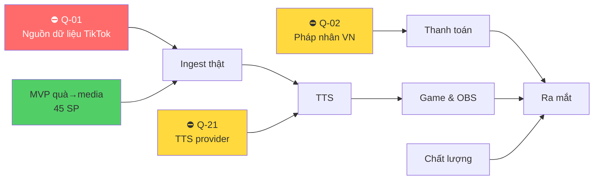

# LiveNova — Danh sách chức năng & Kế hoạch 2 Dev

**Ngày:** 2026-08-06 · **Commit gốc:** `09dbc39`
**Nguồn:** SRS (`appendixB.md`, 87 FR / 33 NFR / 25 BR) + Code Audit (`CODE-AUDIT-LiveNova.md`) + trạng thái repo đã kiểm chứng
**Stack sau khi đổi:** Next.js 14 · NestJS 10 · **Go 1.25 + Wails v2** (thay Rust/Tauri) · Prisma + Postgres

> File này **thay thế** `ROADMAP_AND_TASK_DIVISION.md` ở phần phân chia công việc.
> Roadmap cũ viết khi desktop còn là Rust và trước khi audit sửa 8 lỗi Nghiêm trọng.

---

## 0. Trạng thái thực tế — đã kiểm chứng, không phải giả định

Chạy lúc viết file này: `go vet` sạch · `go test ./...` 3/3 package pass · `pnpm test` 64 pass · 3 build OK.

### ✅ Đã có và chạy được

| Hạng mục | Chi tiết |
|---|---|
| Auth | JWT access 15m + refresh xoay vòng có phát hiện tái sử dụng, `Session` model, logout thật, redirect allowlist |
| Credit | Ledger append-only, optimistic lock + retry, 402 khi hết tiền, 8 CHECK constraint SQL |
| TTS service | Cache sha256 + TTL, tính phí theo độ dài (BR-03), hoàn tiền khi lỗi — **chưa có provider thật** |
| Rule | CRUD + `RuleEvaluator` (16 test) + dry-run thật |
| Overlay | CRUD + token 256-bit + endpoint công khai `GET /public/overlays/:token` |
| Channel | Model + kiểm quyền sở hữu (`isOwnedBy`, `assertOwnedAndVerified`) |
| WS `/events` | Xác thực JWT thật, phân quyền theo kênh, client **không** phát được sự kiện |
| Desktop Go | `bridge` (token + Origin allowlist, so sánh constant-time), `keysim` (allowlist phím + cooldown + clamp), `netguard` (chặn SSRF) — có test |
| Hạ tầng | pnpm workspace, CI 6 job, ESLint sạch, TS strict, scope `@livenova/*` |

### ❌ Chưa có — và đây chính là chỗ MVP đang đứt

**Chuỗi `quà → luật → hành động → overlay` đang đứt ở 3 mắt xích:**

| # | Mắt xích thiếu | Hệ quả |
|---|---|---|
| 1 | **Không có `RuleEngineService`** nghe `live.any` | Luật lưu trong DB nhưng **không bao giờ được chạy** khi có sự kiện thật |
| 2 | **Không có WS namespace `/overlay`** | Overlay không có đường nhận lệnh từ server |
| 3 | **Trang overlay vẫn `setInterval` giả lập** | `socket.io-client` đã cài nhưng chưa dùng dòng nào |

Ngoài ra chưa có: `BillingModule`, ingest TikTok thật, provider TTS thật, xác minh sở hữu kênh, admin, analytics.

### 🚧 Đang bị chặn bởi quyết định của bạn

| Mã | Câu hỏi | Chặn cái gì |
|---|---|---|
| **Q-01** | Nguồn dữ liệu TikTok LIVE lấy từ đâu, có hợp pháp không? | Toàn bộ ingest thật. **Rủi ro lớn nhất dự án** |
| **Q-02** | Có pháp nhân VN để tích hợp VNPay/MoMo? | `BillingModule` |
| **Q-12** | Xác minh sở hữu kênh bằng cách nào? | `ChannelService.verify()` (hiện từ chối thay vì cấp quyền bừa) |
| **Q-21** | Dùng TTS provider nào, giá bao nhiêu? | `TtsService.callProvider()` |
| **Q-04/07** | Bảng giá + định nghĩa "1 lượt đọc" | Mô hình kinh doanh |
| — | Chứng chỉ ký số Windows | Ký installer (`SEC-15`) |

---

## 1. Nguyên tắc chống chồng chéo

Chia theo **thư mục sở hữu**, không chia theo "tính năng". Hai dev **không bao giờ** sửa cùng một file.

### 1.1 Ma trận sở hữu file

| Đường dẫn | Chủ sở hữu | Ghi chú |
|---|---|---|
| `apps/server/src/modules/tiktok/**` | **A** | Ingest |
| `apps/server/src/modules/rule/**` | **A** | Rule engine + CRUD |
| `apps/server/src/modules/channel/**` | **A** | |
| `apps/server/src/modules/credit/**` | **A** | |
| `apps/server/src/modules/tts/**` | **A** | |
| `apps/server/src/modules/billing/**` | **A** | Sẽ tạo |
| `apps/server/src/common/**` | **A** | Env, guard, decorator, exception |
| `apps/server/prisma/**` | **A** | **Chỉ A được sửa schema** |
| `apps/desktop-app/**` (Go + Wails frontend) | **A** | Toàn bộ Go |
| `apps/server/src/modules/websocket/**` | **B** | Gateway `/events` + `/overlay` |
| `apps/server/src/modules/overlay/**` | **B** | |
| `apps/server/src/modules/user/**` | **B** | |
| `apps/web/**` | **B** | Toàn bộ Next.js, **trừ** `app/(dashboard)/billing/**` |
| `apps/web/app/(dashboard)/billing/**` | **A** | Giao diện thanh toán đi cùng BillingModule |
| `packages/shared/**` | ⚠️ **HỢP ĐỒNG** | Xem §1.2 |
| `apps/server/src/app.module.ts` | ⚠️ **HỢP ĐỒNG** | Xem §1.2 |
| `.github/**`, `docker-compose.yml` | **A** | |
| `*.md` ở gốc | Ai viết người sửa | |

### 1.2 Hai file dùng chung — quy tắc bắt buộc

`packages/shared/src/types/index.ts` và `apps/server/src/app.module.ts` là hai chỗ **buộc phải** cả hai chạm tới.

Quy tắc:

1. **Chốt hợp đồng trước, code sau.** Đầu mỗi sprint, hai dev ngồi 30 phút thống nhất type/tên event cần thêm. Merge vào `main` **ngay trong ngày đầu sprint**.
2. **Đóng băng giữa sprint.** Sau đó không ai sửa `shared/types` nữa. Cần gấp → nhắn nhau, không tự sửa.
3. **`app.module.ts` chỉ thêm dòng import + 1 dòng vào mảng `imports`.** Không refactor. Xung đột git nếu có cũng chỉ 1 dòng, giải quyết trong 10 giây.
4. Mỗi dev làm trên nhánh riêng: `feat/a-<task>` và `feat/b-<task>`. Rebase lên `main` hàng ngày.

### 1.3 Đường nối giữa A và B — chỉ có MỘT

```
Dev A                              Dev B
─────                              ─────
TiktokService ─┐
               ├─> RuleEngineService
Rule (DB)    ──┘        │
                        │  eventEmitter.emit('overlay.dispatch', { userId, action })
                        └───────────────────────►  OverlayGateway
                                                        │
                                                        └──> WS /overlay ──> Trang overlay OBS
```

**Hợp đồng duy nhất giữa hai người:**

```ts
// A phát ra — B tiêu thụ. Đã có sẵn trong packages/shared/src/types/index.ts
eventEmitter.emit('overlay.dispatch', {
  userId: string,
  action: OverlayAction,   // { id, ruleId, ruleName, type, payload, event, createdAt }
});
```

A **không cần biết** WebSocket hoạt động ra sao. B **không cần biết** luật được đánh giá thế nào.
Cả hai có thể làm song song ngay từ ngày 1: A test bằng unit test, B test bằng cách tự `emit` sự kiện giả.

---

## 2. 🔥 MVP — Quà tặng kích hoạt Video/Ảnh

> Đây là ưu tiên số 1 bạn đã chọn. Mục tiêu: **streamer nhận quà trên TikTok → video/ảnh hiện lên trong OBS**.

### 2.1 Định nghĩa hoàn thành (Definition of Done cho MVP)

- [ ] Streamer đăng nhập, liên kết kênh
- [ ] Tạo luật: "quà `Hoa hồng` ≥ 1 coin → chạy video X trong 5 giây"
- [ ] Copy URL overlay, dán vào OBS Browser Source
- [ ] Có người tặng quà → **video chạy trong OBS trong vòng ≤300ms** (NFR-02)
- [ ] Nhiều quà liên tiếp → xếp hàng, không đè lên nhau
- [ ] Mất mạng → overlay tự kết nối lại, không cần đụng OBS (FR-048)
- [ ] Hết credit → **video vẫn chạy** (BR-10, chỉ TTS mới dừng)

### 2.2 Task MVP

| ID | Task | Dev | Files | Phụ thuộc | SP |
|---|---|---|---|---|---|
| **M-1** | `RuleEngineService`: nghe `live.any`, nạp luật theo channel→user (cache TTL 5s), chạy `RuleEvaluator`, phát `overlay.dispatch` | **A** | `modules/rule/rule-engine.service.ts` (mới) | — | 5 |
| **M-2** | Validate + clamp payload `MEDIA_POPUP` phía server (URL https, duration 500–30000ms, chặn URL nội bộ bằng `netguard` logic) | **A** | `modules/rule/media-action.validator.ts` (mới) | M-1 | 3 |
| **M-3** | Test `RuleEngineService`: quà khớp → phát đúng 1 action; không khớp → im lặng; cooldown; nhiều luật | **A** | `rule-engine.service.spec.ts` | M-1 | 3 |
| **M-4** | **`OverlayGateway`** namespace `/overlay`: xác thực bằng `publicToken` (không JWT), join room `overlay_user_<userId>`, `@OnEvent('overlay.dispatch')` → emit | **B** | `modules/websocket/overlay.gateway.ts` (mới) | hợp đồng §1.3 | 5 |
| **M-5** | Test `OverlayGateway`: token sai → ngắt; token đúng → join đúng room; không nhận action của user khác | **B** | `overlay.gateway.spec.ts` | M-4 | 3 |
| **M-6** | Hook `useOverlaySocket(token)`: kết nối, reconnect backoff, khử trùng lặp theo `action.id` | **B** | `apps/web/lib/use-overlay-socket.ts` (mới) | M-4 | 3 |
| **M-7** | **Trang `/overlays/media`**: bỏ `setInterval`, nhận action thật, hàng đợi FIFO (max 20), render video/ảnh theo `position`, nền trong suốt | **B** | `apps/web/app/overlays/media/page.tsx` | M-6 | 5 |
| **M-8** | UI tạo luật quà→media: chọn quà, ngưỡng coin, upload/dán URL, chọn thời lượng, **nút Test bắn thử** | **B** | `apps/web/app/(dashboard)/rules/**` | M-2 | 8 |
| **M-9** | UI overlay manager: liệt kê, copy URL kèm token, nút xoay token, hướng dẫn dán vào OBS | **B** | `apps/web/app/overlays/page.tsx` | — | 3 |
| **M-10** | Nút "Bắn sự kiện giả" cho dev/QA (chỉ non-production, có guard) | **A** | `modules/tiktok/tiktok.controller.ts` | M-1 | 2 |
| **M-11** | E2E: tạo luật → bắn sự kiện giả → overlay nhận đúng payload | **A+B** | `apps/web/e2e/` | tất cả | 5 |

**Tổng MVP: 45 SP ≈ 180 giờ ≈ 4–5 tuần với 2 người.**

### 2.3 Thứ tự làm — tuần đầu

```
Ngày 1   : Cả hai chốt hợp đồng OverlayAction (đã có sẵn) → merge → đóng băng
Ngày 2-4 : A làm M-1, M-2   ║  B làm M-4, M-6
Ngày 5-7 : A làm M-3, M-10  ║  B làm M-7
Tuần 2   : A hỗ trợ ingest  ║  B làm M-8, M-9
Tuần 3   : M-11 chung + sửa lỗi
```

Từ ngày 2, hai người **không cần chờ nhau**. B tự `emit` `overlay.dispatch` trong test để phát triển.

---

## 3. Danh sách chức năng đầy đủ theo giai đoạn

Ký hiệu: `M` = MUST · `S` = SHOULD · `C` = COULD · `⛔` = đang bị chặn

### Giai đoạn 1 — MVP (§2 ở trên)

### Giai đoạn 2 — Ingest thật & Kết nối kênh

| ID | Chức năng | FR | Dev | Ưu tiên | SP | Ghi chú |
|---|---|---|---|---|---|---|
| P2-01 | ⛔ Adapter ingest TikTok thật | FR-011 | A | M | 13 | **Chặn bởi Q-01** |
| P2-02 | Interface `IngestAdapter` + adapter simulation (đã gần xong) | — | A | M | 3 | Làm được ngay, để Q-01 chỉ cần thay adapter |
| P2-03 | Tự kết nối lại + backoff khi mất luồng | FR-015 | A | M | 3 | |
| P2-04 | ⛔ Xác minh sở hữu kênh | FR-012 | A | M | 5 | **Chặn bởi Q-12** |
| P2-05 | UI liên kết/hủy kênh + trạng thái live realtime | FR-013/14 | B | M | 5 | |
| P2-06 | Ghi `LiveSession` + `LiveEvent` vào DB | — | A | S | 5 | |
| P2-07 | Feed sự kiện live trên dashboard | — | B | S | 5 | |

### Giai đoạn 3 — TTS (lõi sản phẩm gốc)

| ID | Chức năng | FR | Dev | Ưu tiên | SP | Ghi chú |
|---|---|---|---|---|---|---|
| P3-01 | ⛔ Nối TTS provider thật | FR-016 | A | M | 8 | **Chặn bởi Q-21**. Cache/metering đã xong |
| P3-02 | Hàng đợi đọc có ưu tiên (quà > follow > bình luận) | FR-025/BR-22 | A | M | 5 | |
| P3-03 | Bỏ qua câu / xóa hàng đợi (≤200ms) | FR-026 | A | M | 3 | Dùng khi đang live |
| P3-04 | Mẫu câu tùy biến `{ten} tặng {qua}` | FR-021 | A | M | 3 | |
| P3-05 | Lọc từ cấm | FR-022 | A | M | 3 | |
| P3-06 | Model + API `TtsSettings` | FR-019/20 | A | M | 3 | Model đã có trong schema |
| P3-07 | UI cấu hình giọng + nghe thử | FR-019/20 | B | M | 5 | |
| P3-08 | Phát audio ra thiết bị chọn được (Go) | FR-028/70 | A | M | 8 | Cần thiết bị ảo — **Q-23** |
| P3-09 | Cảnh báo hết quota ở mức 20% | BR-09/FR-066 | A | M | 3 | |

### Giai đoạn 4 — Overlay mở rộng

| ID | Chức năng | FR | Dev | Ưu tiên | SP |
|---|---|---|---|---|---|
| P4-01 | Overlay Chatbox nối WS thật | FR-039 | B | M | 5 |
| P4-02 | Overlay Thanh mục tiêu (Goal) | FR-041 | B | M | 5 |
| P4-03 | Overlay Thanh PK nhiều đội | FR-040 | B | S | 8 |
| P4-04 | Overlay Bảng xếp hạng quà | FR-042 | B | S | 5 |
| P4-05 | Overlay Hiệu ứng vào phòng | FR-044 | B | C | 5 |
| P4-06 | Thư viện hiệu ứng có sẵn (≥20) | FR-035 | B | S | 8 |
| P4-07 | Upload media của người dùng + quét an toàn | FR-036 | A | S | 8 |
| P4-08 | Overlay chạy được khi mất internet (chế độ Local Bridge) | FR-049 | A+B | S | 8 |

### Giai đoạn 5 — Game & OBS (Desktop Go)

| ID | Chức năng | FR | Dev | Ưu tiên | SP | Ghi chú |
|---|---|---|---|---|---|---|
| P5-01 | OBS WebSocket v5 client (đang là stub) | FR-050 | A | M | 8 | `internal/obs/obs.go` |
| P5-02 | Liệt kê + chuyển scene OBS | FR-051 | A | M | 3 | |
| P5-03 | RCON client thật (đang là stub) | FR-054 | A | S | 5 | `internal/rcon/rcon.go` |
| P5-04 | Nối `keysim` vào Local Bridge (quà → phím) | FR-055 | A | M | 5 | Giới hạn an toàn đã xong |
| P5-05 | Model + UI `GameProfile`/`GameBinding` | FR-056 | A/B | S | 8 | Model đã có |
| P5-06 | **Nút dừng khẩn cấp toàn cục** | FR-057 | A | **M** | 3 | Bắt buộc trước khi bật P5-04 |
| P5-07 | UI điều khiển OBS | FR-052 | B | S | 5 | |

### Giai đoạn 6 — Thanh toán

| ID | Chức năng | FR | Dev | Ưu tiên | SP | Ghi chú |
|---|---|---|---|---|---|---|
| P6-01 | `BillingModule` + interface `PaymentAdapter` | — | A | M | 5 | **Làm được ngay** — không chặn |
| P6-02 | Vòng đời `Transaction` + webhook idempotent có xác minh chữ ký | FR-063 | A | M | 8 | Làm được ngay, chưa cần adapter thật |
| P6-03 | ⛔ Adapter VNPay | FR-060 | A | M | 8 | **Chặn bởi Q-02** |
| P6-04 | ⛔ Adapter MoMo | FR-061 | A | M | 8 | **Chặn bởi Q-02** |
| P6-05 | ⛔ Trang bảng giá công khai | FR-059 | B | M | 5 | **Chặn bởi Q-04** (chưa có giá) |
| P6-06 | UI mua credit + lịch sử giao dịch | FR-058/65 | **A** | M | 8 | Chuyển từ B sang A — toàn bộ luồng tiền thuộc một chủ |
| P6-07 | Hóa đơn PDF | FR-065 | A | C | 5 | |

### Giai đoạn 7 — Admin, Analytics, Vận hành

| ID | Chức năng | FR | Dev | Ưu tiên | SP |
|---|---|---|---|---|---|
| P7-01 | Admin: quản lý user, whitelist, ban | FR-077 | A | M | 8 |
| P7-02 | Admin: chỉnh quota toàn hệ thống | FR-078 | A | M | 3 |
| P7-03 | Admin: kill-switch đăng ký | FR-079 | A | M | 2 |
| P7-04 | **Admin: bảng theo dõi chi phí TTS** | FR-080 | A | M | 5 |
| P7-05 | Thống kê phiên live | FR-075 | A | S | 8 |
| P7-06 | UI dashboard analytics | FR-076 | B | C | 8 |
| P7-07 | Onboarding từng bước | FR-081 | B | S | 8 |
| P7-08 | Cron: cấp quota ngày, dọn cache TTS, dọn session hết hạn | BR-06/DR-03 | A | M | 3 |

### Giai đoạn 8 — Chất lượng & Phát hành

| ID | Chức năng | Nguồn | Dev | Ưu tiên | SP | Ghi chú |
|---|---|---|---|---|---|---|
| P8-01 | Landing page SSG đủ metadata (Lighthouse SEO 100) | FR-083 | B | M | 8 | Sửa §10 của audit web gốc |
| P8-02 | **Dark mode** | NFR-30 | B | M | 5 | Streamer làm việc ban đêm cạnh OBS |
| P8-03 | Đạt **WCAG 2.1 AA** | NFR-29 | B | M | 13 | |
| P8-04 | Trạng thái loading/rỗng/lỗi mọi màn hình | NFR-33 | B | M | 5 | |
| P8-05 | ⛔ Ký số installer + updater Wails | SEC-15 | A | M | 5 | **Cần chứng chỉ của bạn** |
| P8-06 | Công bố SHA-256 bản tải | — | A | S | 1 | Giải pháp tạm chờ P8-05 |
| P8-07 | OpenTelemetry + Sentry + RUM | NFR-24/25 | A | M | 8 | |
| P8-08 | Load test 10k socket / 5k event/s | NFR-04/21 | A | S | 8 | |
| P8-09 | Pentest bên thứ ba | SEC-20 | — | M | — | Thuê ngoài |
| P8-10 | i18n vi/en đầy đủ + hreflang | FR-085 | B | M | 5 | |

---

## 4. Tổng hợp khối lượng

| Giai đoạn | Dev A (SP) | Dev B (SP) | Tổng | Ước tính |
|---|---|---|---|---|
| 1 — MVP quà→media | 18 | 24 | **45** | 4–5 tuần |
| 2 — Ingest & Kênh | 29 | 10 | 39 | 3 tuần |
| 3 — TTS | 36 | 5 | 41 | 3 tuần |
| 4 — Overlay mở rộng | 12 | 36 | 48 | 3–4 tuần |
| 5 — Game & OBS | 28 | 5 | 33 | 3 tuần |
| 6 — Thanh toán | 34 | 13 | 47 | 3–4 tuần |
| 7 — Admin & Analytics | 29 | 16 | 45 | 3 tuần |
| 8 — Chất lượng & Phát hành | 22 | 36 | 58 | 4 tuần |
| **TỔNG** | **208** | **145** | **356 SP** | **~26 tuần (6 tháng)** |

Dev A nặng hơn (208 vs 145). Cân bằng bằng cách chuyển sang B: P4-07 (upload media, 8 SP), P5-05 (UI game profile, 8 SP), P7-05 (thống kê, 8 SP) → còn 184 vs 169. Hợp lý.

**1 SP ≈ 4 giờ tập trung.** Không tính thời gian giải quyết Q-01…Q-21.

---

## 5. Đường găng (critical path)



**MVP không bị chặn bởi bất kỳ câu hỏi nào** — làm được ngay hôm nay bằng adapter simulation. Đây là lý do nên làm nó trước.

**Nhưng Q-01 vẫn là rủi ro sống còn.** MVP chạy đẹp với dữ liệu giả không chứng minh được gì nếu cuối cùng không lấy được dữ liệu TikTok hợp pháp. Đề nghị: **làm MVP song song với việc trả lời Q-01**, đừng để MVP xong rồi mới hỏi.

---

## 6. Quy tắc làm việc

### 6.1 Git

```
main                    ← chỉ merge qua PR, CI phải xanh
├── feat/a-rule-engine
└── feat/b-overlay-gateway
```

- Rebase lên `main` **mỗi sáng**. Nhánh sống > 3 ngày là mùi xấu.
- PR ≤ 400 dòng thay đổi. Lớn hơn thì chẻ nhỏ.
- Không ai merge PR của chính mình vào `main`.

### 6.2 Definition of Done (mọi task)

- [ ] Có ID requirement truy vết (FR/NFR/BR)
- [ ] Unit test cho logic nghiệp vụ; **100% cho luồng credit/thanh toán** (NFR-23)
- [ ] `pnpm lint` + `tsc --noEmit` + `go vet` sạch
- [ ] CI xanh
- [ ] Nếu chạm UI: có trạng thái loading/rỗng/lỗi
- [ ] Nếu chạm `shared/types`: đã báo dev kia

### 6.3 Ba điều tuyệt đối không làm lại

Ba mẫu lỗi từ audit — mỗi cái đều "trông như đã bảo vệ nhưng không":

1. **Không viết cơ chế bảo vệ mà không bật.** `ValidationPipe` không DTO, `ThrottlerModule` không guard. Viết xong phải có test chứng minh nó chặn được.
2. **Không trả thành công giả.** Chưa làm thì trả lỗi tường minh (`ErrNotImplemented`), đừng `return Ok(true)`.
3. **Không bỏ qua `userId` ở service.** Mọi truy vấn theo id phải kèm `where: { id, userId }`.

---

## 7. Việc cần bạn quyết — xếp theo mức chặn

| Thứ tự | Việc | Ai làm | Thời gian |
|---|---|---|---|
| 1 | **Trả lời Q-01** (nguồn dữ liệu TikTok) — cần tư vấn pháp lý | Bạn | 1–2 tuần |
| 2 | Q-02 pháp nhân VN | Bạn | 1 tuần |
| 3 | Q-04/Q-07 bảng giá + định nghĩa "1 lượt đọc" | Bạn | vài ngày |
| 4 | Q-21 chọn TTS provider + đo giá tiếng Việt | Dev A khảo sát, bạn duyệt | 3 ngày |
| 5 | Q-12 cách xác minh sở hữu kênh | Phụ thuộc Q-01 | — |
| 6 | Mua chứng chỉ ký số Windows | Bạn | 1 tuần + ~vài trăm USD/năm |
| 7 | Q-23 thiết bị âm thanh ảo — tự đóng gói hay hướng dẫn user | Dev A khảo sát | 2 ngày |

---

## 8. Đề xuất bắt đầu ngay ngày mai

**Dev A:** M-1 `RuleEngineService` — mắt xích quan trọng nhất đang thiếu. Luật đã có trong DB, evaluator đã có và đã test, chỉ thiếu người gọi nó khi sự kiện đến.

**Dev B:** M-4 `OverlayGateway` — chỉ cần nghe `overlay.dispatch` và đẩy ra socket. Test được ngay bằng cách tự `emit` sự kiện giả, không phải chờ A.

Hai task này **hoàn toàn độc lập**, gặp nhau đúng một chỗ: tên event `overlay.dispatch` và type `OverlayAction` — cả hai đã nằm sẵn trong `packages/shared/src/types/index.ts`.

Nối được hai đầu này là MVP có xương sống. Phần còn lại là đắp thịt.
