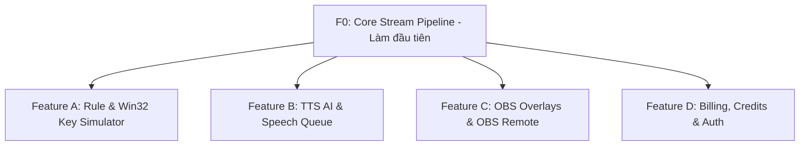

# 🚀 LiveNova — Feature-Based & Zero-Overlap Development Roadmap

> **Nguyên tắc phân chia:** Chia công việc theo **Tính Năng Độc Lập (Vertical Feature Ownership)**. Mỗi người làm trọn gói từ Backend -> Frontend -> Desktop cho tính năng đó.
> 🛡️ **Zero Overlap:** Mỗi người sở hữu thư mục code riêng biệt, KHÔNG SỬA CHUNG FILE của nhau, tránh bị trùng lặp (conflict) khi merge code.

---

## 🎯 1. Thứ Tự Triển Khai Tính Năng (Feature Priorities)

1. **F0: Core Stream Pipeline (Làm Đầu Tiên - Lead/Core Dev)**:
   - Dẫn sự kiện TikTok Live (Comment, Gift, Like) về Local Bridge (`ws://127.0.0.1:4000`).
   - Đảm bảo kênh giao tiếp giữa Web Server và Desktop Client thông suốt.

---

## 🧩 2. Chia Công Việc Theo Feature (Phân Chia Không Trùng Lặp)

### 📌 FEATURE A: Rule Engine & Win32 Key Simulator (Tự Động Bấm Phím Game)
> **Mục tiêu:** Streamer cài đặt: khi viewer tặng quà/gửi comment -> tự động bấm phím trong Game (vd: nhảy, xả đạn, bật skill).

- 📂 **Thư mục sở hữu độc quyền (Exclusive Paths):**
  - `apps/server/src/modules/rule/`
  - `apps/web/app/(dashboard)/rules/`
  - `apps/desktop-app/src-tauri/src/key_simulator.rs`
- 📋 **Nhiệm vụ cụ thể:**
  - **Frontend:** Giao diện thêm/sửa Rule, chọn phím game, kéo-thả thứ tự ưu tiên (Priority), lọc loại quà/từ khóa.
  - **Backend:** Xử lý logic so khớp điều kiện Rule (`RuleEvaluator`), đếm thời gian Cooldown.
  - **Desktop (Rust):** Thực thi bấm phím Windows (`SendInput`), bấm giữ phím, phím tổ hợp (Combo keys) & Nút **Emergency Stop** dừng khẩn cấp.

---

### 📌 FEATURE B: TTS AI & Speech Queue (Đọc Bình Luận / Thông Báo Trí Tuệ Nhân Tạo)
> **Mục tiêu:** Tự động chuyển comment/gift trên TikTok thành giọng đọc thông báo trực tiếp trên stream.

- 📂 **Thư mục sở hữu độc quyền (Exclusive Paths):**
  - `apps/server/src/modules/tts/`
  - `apps/web/app/(dashboard)/tts/`
  - `apps/desktop-app/src/components/SpeechQueue.tsx`
- 📋 **Nhiệm vụ cụ thể:**
  - **Frontend:** Trình chỉnh giọng đọc (Việt Nam Standard / Wavenet, Pitch, Speed), nút nghe thử.
  - **Backend:** Gọi TTS API, mã hóa & lưu Cache âm thanh (`TtsCache`), tính toán số Credit tiêu tốn cho câu đọc.
  - **Desktop (Rust/React):** Quản lý Hàng chờ giọng đọc (Speech Queue), nút Bỏ qua câu hiện tại (Skip), Xóa hàng chờ (Clear Queue), phát âm thanh.

---

### 📌 FEATURE C: OBS Overlays & OBS Remote Control (Giao Diện Livestream & Điều Khiển OBS)
> **Mục tiêu:** Cung cấp Chatbox, PK Bar, Goal Bar hiển thị trên OBS và điều khiển OBS Studio từ xa.

- 📂 **Thư mục sở hữu độc quyền (Exclusive Paths):**
  - `apps/web/app/overlays/` (`chat`, `pk`, `goal`)
  - `apps/server/src/modules/overlay/`
  - `apps/desktop-app/src-tauri/src/obs_controller.rs`
- 📋 **Nhiệm vụ cụ thể:**
  - **Frontend Overlays:** 
    - `chat/page.tsx`: Khung Chatbox trong suốt cho OBS, animation cuộn mượt.
    - `pk/page.tsx`: Thanh thanh đo PK 2-8 đội có hiệu ứng nổ điểm.
    - `goal/page.tsx`: Widget mục tiêu Follower/Gift có hiệu ứng pháo hoa.
  - **Backend:** Quản lý Public Token cho Browser Source của OBS, xoay Token bảo mật.
  - **Desktop (Rust):** Kết nối OBS Studio WebSocket v5 (`ws://localhost:4455`) -> Chuyển Scene, ẩn/hiện Source, Mute Audio khi có quà lớn.

---

### 📌 FEATURE D: Billing, Credits System & Security (Thanh Toán & Nạp Tiền)
> **Mục tiêu:** Quản lý tài khoản Streamer, nạp tiền tự động và quản lý số dư Credit.

- 📂 **Thư mục sở hữu độc quyền (Exclusive Paths):**
  - `apps/server/src/modules/credit/`
  - `apps/server/src/modules/auth/`
  - `apps/server/src/modules/user/`
  - `apps/web/app/(dashboard)/billing/`
- 📋 **Nhiệm vụ cụ thể:**
  - **Frontend:** Trang Nạp tiền (Billing), chọn gói Credit, xem lịch sử biến động số dư (Ledger).
  - **Backend:** Tích hợp cổng thanh toán VNPay / MoMo / Stripe (Webhook Callback), xử lý trừ Credit an toàn (Optimistic Locking), tự động tặng Quota hàng ngày.
  - **Security:** Đăng nhập OAuth 2.0 (Google/Facebook), JWT Token Rotation.

---

## 🔒 3. Quy Tắc Tránh Overlap (Trùng Lập Code) Khi Làm Việc Team

1. **Không sửa chung File:** 
   - Code của ai thuộc Thư mục sở hữu của người đó.
   - Nếu cần sử dụng Type chung -> Đóng góp vào `packages/shared/src/types/index.ts`.
2. **Giao tiếp qua API / Contract:**
   - Người làm Frontend chỉ cần khớp API endpoint hoặc WebSocket payload theo chuẩn từ `packages/shared`.
3. **Mỗi Feature một Git Branch:**
   - Người A làm branch: `feature/rule-key-simulator`
   - Người B làm branch: `feature/tts-speech-queue`
   - Người C làm branch: `feature/obs-overlays`
   - Người D làm branch: `feature/billing-credit`
