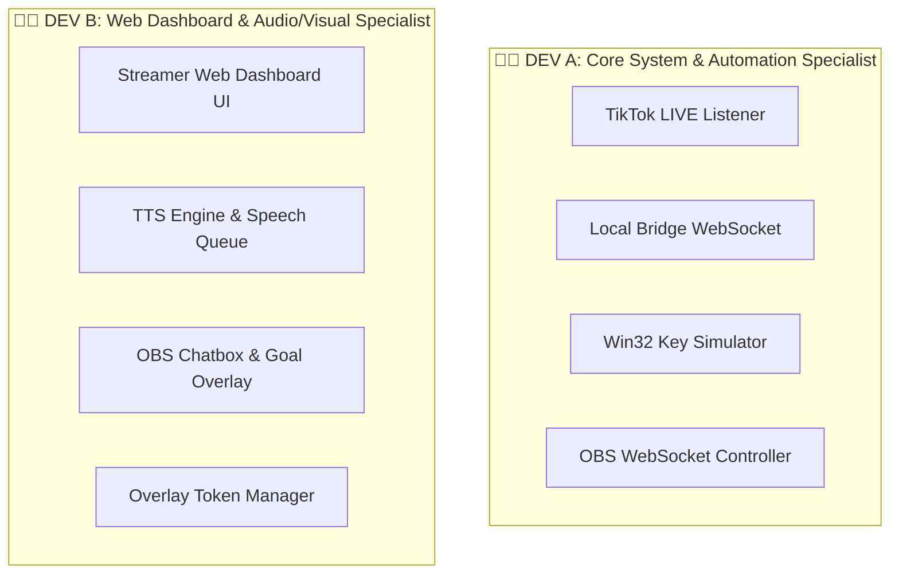

# ⚡ LiveNova — 2-Developer MVP Roadmap & Task Breakdown

> **Mô hình 2 Developers:** Tối ưu hóa cho team **2 người**, tập trung 100% vào **MVP (Minimum Viable Product)** để chạy thử trực tiếp trên Livestream TikTok sớm nhất.
> 🛡️ **Zero Overlap:** Phân chia ranh giới rõ ràng giữa Dev A (Desktop & Core Engine) và Dev B (Web Dashboard & Audio/Visual Overlays).

---

## 🎯 1. Phạm Vi MVP (Những gì CẦN CÓ để Livestream ngay)

| Tính năng MVP | Mục đích | Phân công |
|---|---|---|
| 📡 **1. TikTok LIVE Pipeline** | Đọc bình luận & quà từ TikTok LIVE thời gian thực | **DEV A** |
| 🎮 **2. Win32 Key Simulator** | Tặng quà/Comment -> Tự động bấm phím trong Game | **DEV A** |
| 🎬 **3. OBS Controller** | Kết nối OBS Studio -> Chuyển cảnh/Ẩn hiện Source | **DEV A** |
| 🗣️ **4. TTS Voice & Speech Queue** | Đọc bình luận bằng giọng nói AI Tiếng Việt | **DEV B** |
| 📺 **5. OBS Chatbox & Goal Widget** | Hiển thị bong bóng chat & mục tiêu quà trên OBS | **DEV B** |
| 🎛️ **6. Streamer Web Dashboard** | Giao diện bật/tắt ứng dụng & cài đặt phím bấm | **DEV B** |

*(Giai đoạn 2 sau MVP: Cổng thanh toán VNPay/MoMo, PK Bar 8 đội, Game RCON server)*

---

## 👥 2. Phân Chia Chi Tiết Cho 2 Developers



---

### 👨‍💻 DEV A (Bạn — Core Engine & Desktop Automation)
> **Trọng tâm:** Dữ liệu thời gian thực, điều khiển phần cứng/game và kết nối phần mềm livestream.

- 📂 **Thư mục sở hữu độc quyền:**
  - `apps/desktop-app/` (Rust + Tauri Client)
  - `apps/server/src/modules/rule/` (Engine khớp điều kiện phím bấm)
  - `packages/shared/` (Khai báo Data Types & Constants)

- 📋 **Danh sách Công việc MVP (Checklist):**
  - [ ] **A1. TikTok Live Parser:** Nhận sự kiện TikTok (Comment, Gift) -> Gửi dữ liệu qua Local Bridge (`ws://127.0.0.1:4000`).
  - [ ] **A2. Win32 Key Simulator (`key_simulator.rs`):** 
    - Nhận lệnh bấm phím từ Rule Engine -> Thực thi `SendInput` bấm phím game.
    - Xử lý thời gian giữ phím (Hold ms) & Cooldown chống đè phím.
    - Nút **Emergency Stop** trên Desktop App để hủy bấm phím lập tức.
  - [ ] **A3. OBS WebSocket v5 Controller (`obs_controller.rs`):**
    - Kết nối `ws://localhost:4455` của OBS Studio.
    - Thực thi chuyển Scene / Mute Micro khi nhận được quà lớn.

---

### 👨‍💻 DEV B (Đồng nghiệp — Web Dashboard & Audio/Visual Overlays)
> **Trọng tâm:** Giao diện điều khiển Streamer, đọc giọng nói AI và các Widget hiển thị trên OBS.

- 📂 **Thư mục sở hữu độc quyền:**
  - `apps/web/` (Next.js Dashboard & Overlays)
  - `apps/server/src/modules/tts/` (Hệ thống TTS API & Speech Queue)
  - `apps/server/src/modules/overlay/` (Quản lý Token Overlay)

- 📋 **Danh sách Công việc MVP (Checklist):**
  - [ ] **B1. Streamer Web Dashboard UI (`apps/web/app/(dashboard)/`):**
    - Giao diện kết nối kênh TikTok (Nhập Username TikTok).
    - Trình cài đặt danh sách Rule: Chọn loại quà/từ khóa -> Chọn phím bấm tương ứng.
    - Bảng hiển thị trạng thái kết nối (Local Bridge, OBS, TikTok).
  - [ ] **B2. TTS AI & Speech Queue (`apps/server/src/modules/tts/`):**
    - Gọi API giọng đọc Tiếng Việt (Google / Viettel / FPT TTS), lưu Cache âm thanh.
    - Hàng chờ đọc thoại (Speech Queue) hiển thị câu đang đọc + nút Skip câu tiếp theo.
  - [ ] **B3. OBS Browser Source Overlays (`apps/web/app/overlays/`):**
    - `chat/page.tsx`: Khung Chatbox nền trong suốt cho OBS, hiệu ứng tin nhắn trượt mượt.
    - `goal/page.tsx`: Thanh mục tiêu quà/follower với hiệu ứng chúc mừng khi hoàn thành.

---

## 📅 3. Lộ Trình 2 Tuần Cán Đích MVP

```
Tuần 1: Nối Luồng & Khung Giao Diện
├── DEV A: Xong kết nối TikTok Live -> Đẩy tin nhắn qua Local Bridge + Bấm phím thử nghiệm.
└── DEV B: Xong giao diện Web Dashboard cài phím bấm + Dựng khung OBS Chatbox Overlay.

Tuần 2: Hoàn Thiện MVP & Livestream Thực Tế
├── DEV A: Tích hợp OBS WebSocket controller + Nút Emergency Stop phím bấm.
└── DEV B: Tích hợp TTS đọc bình luận Tiếng Việt + Hoàn thiện Goal Widget.
└── TEST CHUNG: Chạy livestream thử nghiệm trực tiếp trên TikTok! 🚀
```
