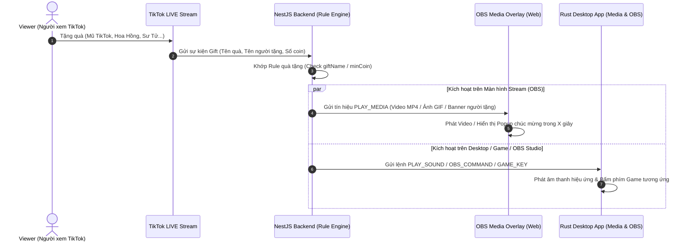

# ⚡ LiveNova — Gift Triggered Media Action MVP (Roadmap 2 Developers)

> **Mục tiêu ưu tiên số 1 của MVP:** 
> 🎁 **Sự kiện Nhận Quà (TikTok Gift Event)** -> 🚀 **Kích hoạt Hành động trên Stream** (Chạy Video Clip, Hiển thị Hình ảnh/GIF Popup, Phát Âm thanh hiệu ứng, Bấm phím Game).

---

## 🎯 1. Luồng Hoạt Động Ưu Tiên Của MVP (Gift Action Flow)

---

## 👥 2. Phân Chia Công Việc Cho 2 Developers (Zero-Overlap)

### 👨‍💻 DEV A (Bạn — Gift Event Listener & Media Engine Controller)
> **Trọng tâm:** Bắt chính xác quà TikTok, quản lý Hàng chờ phát Media (Media Queue) & Điều khiển OBS/Desktop Client.

- 📂 **Thư mục sở hữu độc quyền:**
  - `apps/desktop-app/` (Rust + Tauri Desktop App)
  - `apps/server/src/modules/rule/` (Engine quản lý & Khớp Rule quà tặng)
  - `packages/shared/` (Khai báo Data Types về Gift, Action & Rules)

- 📋 **Danh sách Công việc MVP (Checklist):**
  - [ ] **A1. TikTok Gift Event Filter:**
    - Lắng nghe chính xác sự kiện `LiveEventType.GIFT`.
    - Trích xuất: Tên quà (`giftName`), số Coin (`giftCoinValue`), Tên & Avatar người tặng (`senderDisplayName`, `senderAvatar`).
  - [ ] **A2. Media Action & Queue Engine (`rule.service.ts`):**
    - Định nghĩa các loại Action khi nhận quà:
      - `ActionType.PLAY_VIDEO` (Chạy video clip `.mp4`/`.webm`).
      - `ActionType.SHOW_IMAGE` (Hiển thị ảnh/GIF popup trong X giây).
      - `ActionType.PLAY_SOUND` (Phát âm thanh hiệu ứng `.mp3`).
      - `ActionType.GAME_KEY` (Tự động bấm phím trong Game).
    - Hàng chờ Media (Media Queue): Xử lý khi nhận nhiều quà liên tục (dồn hàng chờ phát từng video/ảnh mượt mà, không bị đè đè video).
  - [ ] **A3. OBS WebSocket Controller (`obs_controller.rs`):**
    - Tự động bật/tắt Media Source trong OBS hoặc chuyển Scene đặc biệt khi nhận quà khủng (Sư tử, Vũ trụ...).

---

### 👨‍💻 DEV B (Đồng nghiệp — OBS Media Overlay & Gift Rule Dashboard)
> **Trọng tâm:** Giao diện cài đặt Quà -> Video/Ảnh & Màn hình hiển thị hiệu ứng trên OBS.

- 📂 **Thư mục sở hữu độc quyền:**
  - `apps/web/app/overlays/` (`media/page.tsx`, `chat/page.tsx`, `goal/page.tsx`)
  - `apps/server/src/modules/overlay/`
  - `apps/web/app/(dashboard)/rules/`

- 📋 **Danh sách Công việc MVP (Checklist):**
  - [ ] **B1. OBS Media & Popup Overlay (`apps/web/app/overlays/media/page.tsx`):**
    - Màn hình OBS Browser Source chuyên biệt:
      - Phát Video clip MP4/WEBM với nền trong suốt (Chromakey).
      - Hiển thị Banner Popup vinh danh người tặng quà: *"Cảm ơn [Tên User] đã tặng [Tên Quà]!"* + Ảnh Avatar.
      - Hiệu ứng xuất hiện mượt mà (Fade in, Zoom in, Bounce).
  - [ ] **B2. Gift Rule Builder UI (`apps/web/app/(dashboard)/rules/page.tsx`):**
    - Giao diện cài đặt trực quan cho Streamer:
      - Chọn loại quà (Tất cả quà / Quà cụ thể / Quà từ X Coin trở lên).
      - Tải lên hoặc nhập URL Video, Hình ảnh GIF, Âm thanh hiệu ứng.
      - Thiết lập thời gian hiển thị (ví dụ: phát video trong 5 giây).
  - [ ] **B3. Goal Bar & Top Gifter Banner (`apps/web/app/overlays/goal/page.tsx`):**
    - Thanh tích lũy số quà nhận được trong buổi stream.

---

## 📅 3. Lộ Trình 2 Tuần Cán Đích MVP

| Thời gian | DEV A (Gift Listener & Media Controller) | DEV B (OBS Media Overlay & Dashboard) |
|---|---|---|
| **Tuần 1** | Bắt sự kiện Tặng Quà TikTok -> Xây dựng Hàng chờ phát Media (Media Queue) | Dựng OBS Browser Source (`overlays/media`): Nhận lệnh là phát ngay Video / Hiện Banner Popup |
| **Tuần 2** | Ghép nối bấm phím Game + Điều khiển OBS Studio (Chuyển Scene quà khủng) | Dựng UI Dashboard cho Streamer upload Video/Ảnh và gán vào từng món quà |
| **🚀 TEST** | **CHẠY THỬ THỰC TẾ: Viewer tặng Mũ TikTok -> Streamer phát Video Clip chúc mừng & nhảy hiệu ứng trên OBS!** |

