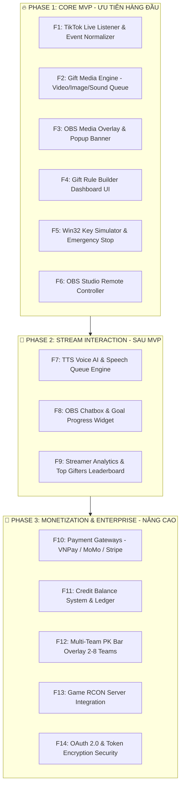

# 📋 LIVENOVA — MASTER FEATURE LIST & TASK DIVISION (2 DEVELOPERS)

> **Mô hình triển khai:** Team 2 Developers (Dev A & Dev B).
> 🌟 **Ưu tiên Hàng đầu (Phase 1 MVP):** **Sự Kiện Nhận Quà TikTok (Gift Event)** ➔ Tự động kích hoạt **Video Clip / Popup Hình Ảnh / Hiệu ứng Âm Thanh / Bấm Phím Game / Đổi Scene OBS**.

---

## 🧭 BẢNG TỔNG HỢP TOÀN BỘ CHỨC NĂNG (MASTER FEATURE LIST)



---

## 👥 PHÂN CHIA CHI TIẾT DÀNH CHO 2 DEVELOPERS (ZERO-OVERLAP)

---

### 🔥 GIAI ĐOẠN 1: CORE MVP (ƯU TIÊN HÀNG ĐẦU — DỰ KIẾN 2 TUẦN)

#### 👨‍💻 DEV A (Bạn — Core Engine & Desktop Automation)
*Sở hữu thư mục: `apps/desktop-app/`, `apps/server/src/modules/rule/`, `packages/shared/`*

1. **[F1] TikTok LIVE Event Listener & Filter:**
   - Kết nối lắng nghe sự kiện trực tiếp từ TikTok LIVE.
   - Bắt chính xác sự kiện Gift (`LiveEventType.GIFT`): Tên quà (`giftName`), số Coin (`giftCoinValue`), Tên người tặng (`senderDisplayName`), Avatar (`senderAvatar`).
   - Chuẩn hóa dữ liệu về định dạng `LiveEvent` trong `@tiktok-live/shared`.
2. **[F2] Media Action & Queue Engine (`rule.service.ts`):**
   - Xây dựng Engine xử lý các loại hành động khi nhận quà:
     - `PLAY_VIDEO`: Phát video clip (`.mp4`/`.webm`).
     - `SHOW_IMAGE`: Hiển thị ảnh (`.gif`/`.png`) popup chúc mừng.
     - `PLAY_SOUND`: Phát âm thanh hiệu ứng (`.mp3`/`.wav`).
     - `GAME_KEY`: Bấm phím game tương ứng.
   - Hàng chờ Media (Media Queue): Sắp xếp thứ tự phát từng video/ảnh mượt mà khi nhận nhiều quà liên tục, không bị đè video.
3. **[F5] Win32 Key Simulator (`key_simulator.rs`):**
   - Kích hoạt phím bấm game bằng `SendInput` API khi nhận quà.
   - Quản lý thời gian giữ phím (Hold ms), thời gian hồi phím (Cooldown).
   - Nút **Emergency Stop (Hủy khẩn cấp)** trên Desktop App để dừng phím lập tức.
4. **[F6] OBS Studio Remote Controller (`obs_controller.rs`):**
   - Kết nối OBS Studio qua `ws://localhost:4455` (OBS WebSocket v5).
   - Tự động chuyển Scene / Bật Source OBS đặc biệt khi nhận quà giá trị cao.

---

#### 👨‍💻 DEV B (Đồng nghiệp — Web Dashboard & OBS Overlays)
*Sở hữu thư mục: `apps/web/app/overlays/`, `apps/web/app/(dashboard)/rules/`, `apps/server/src/modules/overlay/`*

1. **[F3] OBS Media & Popup Overlay Widget (`overlays/media/page.tsx`):**
   - Màn hình OBS Browser Source nền trong suốt:
     - Trình phát Video clip MP4/WEBM với hiệu ứng Chromakey.
     - Banner Popup vinh danh: *"Cảm ơn [Tên User] đã tặng [Tên Quà]!"* kèm Avatar người tặng.
     - Hiệu ứng chuyển động mượt mà (Fade in, Zoom in, Bounce).
2. **[F4] Gift Rule Builder Dashboard UI (`app/(dashboard)/rules/page.tsx`):**
   - Giao diện trực quan cho Streamer thiết lập:
     - Chọn món quà (vd: "Hoa hồng", "Mũ TikTok", "Sư tử") hoặc ngưỡng Coin.
     - Tải lên (Upload) / Dán URL Video clip, Hình ảnh GIF, Âm thanh hiệu ứng.
     - Thiết lập thời gian hiển thị (ví dụ: phát video trong 5 giây).
3. **[F6-UI] OBS Overlay Token & Link Manager:**
   - Quản lý link Browser Source bảo mật cho OBS Studio (có nút Copy link & xoay Token bảo mật).

---

### 🚀 GIAI ĐOẠN 2: STREAM INTERACTION & AUTOMATION (SAU MVP)

#### 👨‍💻 DEV A (Backend & Speech Queue Backend)
- **[F7-A] Speech Queue Manager (Desktop):** Quản lý luồng phát âm thanh đọc comment trên Desktop Client, hỗ trợ nút Skip & Clear Queue.

#### 👨‍💻 DEV B (TTS AI & Interaction Overlays)
- **[F7-B] TTS Voice AI (`apps/server/src/modules/tts/`):** Tích hợp gọi giọng đọc Tiếng Việt (Google / Viettel TTS), lưu Cache âm thanh (`TtsCache`), tính số credit tiêu tốn.
- **[F8] OBS Live Chatbox Overlay (`overlays/chat/page.tsx`):** Khung hiển thị bong bóng chat trong suốt trên livestream với animation cuộn mượt.
- **[F8-Goal] OBS Goal Widget (`overlays/goal/page.tsx`):** Thanh mục tiêu nhận quà/follower với hiệu ứng pháo hoa khi hoàn thành.
- **[F9] Streamer Analytics Dashboard (`(dashboard)/dashboard/page.tsx`):** Biểu đồ thống kê số quà nhận được, thống kê Top Gifters đóng góp nhiều nhất.

---

### 💎 GIAI ĐOẠN 3: MONETIZATION & ENTERPRISE (NÂNG CAO)

#### 👨‍💻 DEV A (Security, Game RCON & High-Load Architecture)
- **[F13] Game RCON Client (`rcon_client.rs`):** Gửi lệnh RCON trực tiếp đến Game Server (Minecraft, Source Engine) khi streamer nhận quà khủng.
- **[F14] Security & Encryption:** Mã hóa token liên kết tài khoản bằng AES-256-GCM, cấu hình Rate Limiting chống DDOS API.

#### 👨‍💻 DEV B (Billing, Credits & PK Bar Overlays)
- **[F10] Payment Gateways (`modules/credit/`):** Tích hợp cổng thanh toán VNPay, MoMo, Stripe với Webhook Idempotency.
- **[F11] Credit Balance & Ledger:** Quản lý trừ Credit tự động (Optimistic Locking `version`), lịch sử biến động số dư, tự động tặng Quota hàng ngày.
- **[F12] Multi-Team PK Bar Overlay (`overlays/pk/page.tsx`):** Thanh so sánh điểm thi đấu PK 2 đến 8 đội thời gian thực trên OBS.

---

## 📅 MA TRẬN TIẾN ĐỘ DỰ ÁN (MILESTONE MATRIX)

```
       TUẦN 1                    TUẦN 2                    TUẦN 3+
┌───────────────────────┐ ┌───────────────────────┐ ┌───────────────────────┐
│  PHASE 1: MVP FOCUS   │ │   COMPLETING MVP      │ │  PHASE 2 & PHASE 3    │
├───────────────────────┤ ├───────────────────────┤ ├───────────────────────┤
│ DEV A:                │ │ DEV A:                │ │ DEV A:                │
│ • TikTok Gift Listener│ │ • Win32 Key Simulator │ │ • Game RCON Client    │
│ • Media Queue Engine  │ │ • OBS WS v5 Control   │ │ • Security Encryption │
│                       │ │                       │ │                       │
│ DEV B:                │ │ DEV B:                │ │ DEV B:                │
│ • OBS Media Overlay   │ │ • Gift Rule Builder UI│ │ • TTS Voice AI        │
│ • Video/Popup Player  │ │ • Goal Bar Widget     │ │ • VNPay/MoMo Billing  │
└───────────────────────┘ └───────────────────────┘ └───────────────────────┘
```
