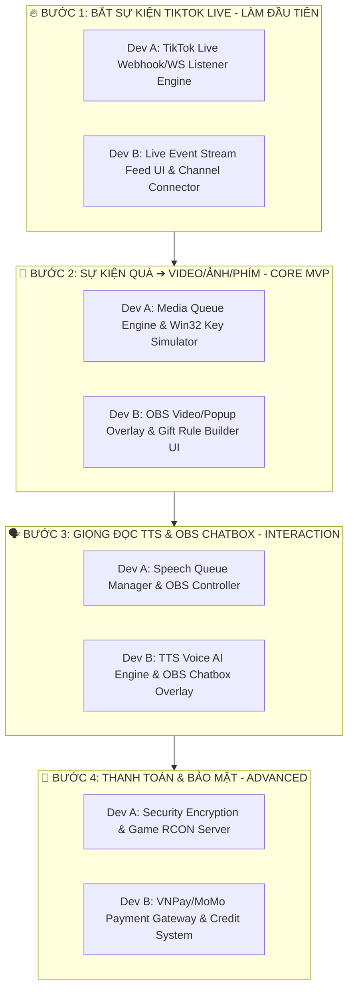

# 🚀 LIVENOVA — TOÀN BỘ CÁC TASK DÀNH CHO 2 DEVS (ƯU TIÊN BẮT SỰ KIỆN TIKTOK LIVE)

> **Chiến lược làm việc:** 
> 🎯 **BƯỚC 1 (LÀM NGAY):** Bắt sự kiện trực tiếp từ TikTok LIVE (Comment, Gift, Like, Follow).
> 🎁 **BƯỚC 2:** Khi nhận quà TikTok ➔ Tự động chạy Video Clip, hiện Banner Popup Ảnh, phát Âm thanh MP3 & Bấm phím Game.
> 👥 **Phân chia 2 Devs:** Ranh giới rõ ràng, Dev A làm Core Engine & Rust Desktop; Dev B làm Web Dashboard & OBS Overlays.

---

## 🎯 MA TRẬN PHÂN CHIA CÔNG VIỆC TOÀN BỘ DỰ ÁN (MASTER TASK MATRIX)

---

## 👨‍💻 DEV A (Bạn — Backend, Live Engine & Desktop Automation)
*📂 **Thư mục quản lý độc quyền:** `apps/desktop-app/`, `apps/server/src/modules/rule/`, `packages/shared/`*

### 📋 DANH SÁCH TASKS CHI TIẾT THEO THỨ TỰ ƯU TIÊN:

#### 🔥 BƯỚC 1: BẮT SỰ KIỆN TIKTOK LIVE (LÀM NGAY BAN ĐẦU)
- [ ] **Task A0.1 — TikTok Live Event Listener (`apps/server/src/modules/rule/`):**
  - Kết nối lắng nghe luồng dữ liệu TikTok LIVE (Stream Connection).
  - Bắt 5 loại sự kiện cốt lõi:
    1. `LiveEventType.GIFT`: Quà tặng (`giftName`, `giftCoinValue`, `senderDisplayName`, `senderAvatar`).
    2. `LiveEventType.COMMENT`: Bình luận (`content`, `senderDisplayName`).
    3. `LiveEventType.LIKE`: Lượt thả tim (`likeCount`).
    4. `LiveEventType.FOLLOW`: Người theo dõi mới.
    5. `LiveEventType.SHARE`: Lượt chia sẻ stream.
  - Chuẩn hóa gói tin về đối tượng `LiveEvent` trong `@livenova/shared`.
- [ ] **Task A0.2 — Local Bridge WebSocket Relay (`local_bridge.rs`):**
  - Chuyển tiếp ngay lập tức (Relay < 20ms) toàn bộ sự kiện nhận từ Server về ứng dụng Desktop (`127.0.0.1:4000`).

#### 🎁 BƯỚC 2: XỬ LÝ QUÀ ➔ KÍCH HOẠT ACTION (MVP CORE)
- [ ] **Task A1.1 — Media Action & Queue Engine (`rule.service.ts`):**
  - Xây dựng Engine khớp điều kiện Quà tặng (`giftName` hoặc `minCoinValue`).
  - Hàng chờ Media Queue: Khi nhận 5-10 quà cùng lúc, tự động lưu vào danh sách chờ và xếp lịch đẩy từng sự kiện đến OBS Overlay (tránh đè video).
- [ ] **Task A1.2 — Multi-Action Dispatcher:**
  - Phát tín hiệu `PLAY_MEDIA` (Video/Ảnh) về OBS Overlay của Dev B.
  - Phát âm thanh MP3 trực tiếp trên Desktop (`PLAY_SOUND`).
  - Gọi Win32 `key_simulator.rs` kích hoạt phím bấm game (`GAME_KEY`) + Nút Emergency Stop.
- [ ] **Task A1.3 — OBS Studio Remote (`obs_controller.rs`):**
  - Kết nối OBS Studio qua WebSocket v5 (`ws://localhost:4455`) -> Chuyển Scene hoặc bật/tắt Source khi nhận quà giá trị cao.

#### 🗣️ BƯỚC 3 & BƯỚC 4: TÍNH NĂNG MỞ RỘNG (SAU MVP)
- [ ] **Task A2.1 — Speech Queue Engine:** Quản lý hàng chờ âm thanh đọc bình luận trên Desktop Client (nút Skip/Clear).
- [ ] **Task A3.1 — Game RCON Client (`rcon_client.rs`):** Gửi lệnh RCON trực tiếp đến Game Server (Minecraft, Source Engine) khi streamer nhận quà khủng.
- [ ] **Task A3.2 — Security & Rate Limiting:** Mã hóa Token bằng AES-256-GCM & Throttler chốn DDOS API.

---

## 👨‍💻 DEV B (Đồng nghiệp — Web Dashboard & OBS Overlays)
*📂 **Thư mục quản lý độc quyền:** `apps/web/app/`, `apps/server/src/modules/tts/`, `apps/server/src/modules/overlay/`, `apps/server/src/modules/credit/`*

### 📋 DANH SÁCH TASKS CHI TIẾT THEO THỨ TỰ ƯU TIÊN:

#### 🔥 BƯỚC 1: HIỂN THỊ LUỒNG SỰ KIỆN TIKTOK LIVE (LÀM NGAY BAN ĐẦU)
- [ ] **Task B0.1 — Channel Connector UI (`apps/web/app/(dashboard)/dashboard/page.tsx`):**
  - Giao diện nhập Username TikTok LIVE để bấm "Kết nối" / "Ngắt kết nối".
  - Thẻ hiển thị Trạng thái kết nối thời gian thực (TikTok Live Status, Local Bridge Status, OBS Status).
- [ ] **Task B0.2 — Live Event Stream Feed:**
  - Bảng hiển thị danh sách bình luận, quà tặng và lượt like trượt thời gian thực (Live Stream Event Feed) trên Web Dashboard để test kiểm thử sự kiện.

#### 🎁 BƯỚC 2: OBS MEDIA OVERLAY & GIFT RULE DASHBOARD (MVP CORE)
- [ ] **Task B1.1 — OBS Media & Popup Overlay Widget (`apps/web/app/overlays/media/page.tsx`):**
  - Màn hình OBS Browser Source (nền trong suốt `background: transparent`).
  - Trình phát Video HTML5 hỗ trợ MP4/WEBM có hiệu ứng tách nền Chromakey.
  - Banner Popup vinh danh: *"Cảm ơn [Tên User] đã tặng [Tên Quà]!"* kèm khung Avatar người tặng.
  - Animation chuyển động (Fade-in, Zoom-in, Bounce) và tự động ẩn sau X giây.
- [ ] **Task B1.2 — Gift Rule Builder UI (`apps/web/app/(dashboard)/rules/page.tsx`):**
  - Giao diện cài đặt cho Streamer: Chọn loại quà -> Upload Video MP4 / Ảnh GIF / Âm thanh MP3 -> Thiết lập thời gian hiển thị & chọn phím bấm Game tương ứng.
- [ ] **Task B1.3 — OBS Overlay Token Link Generator:**
  - Quản lý link Browser Source bảo mật gắn vào OBS Studio (nút Copy link & xoay Token).

#### 🗣️ BƯỚC 3 & BƯỚC 4: TÍNH NĂNG MỞ RỘNG (SAU MVP)
- [ ] **Task B2.1 — TTS Voice AI (`apps/server/src/modules/tts/`):** Gọi API giọng đọc Tiếng Việt (Google / Viettel TTS), lưu Cache âm thanh (`TtsCache`), tính số credit tiêu tốn.
- [ ] **Task B2.2 — OBS Live Chatbox Overlay (`overlays/chat/page.tsx`):** Khung bong bóng chat trong suốt trên livestream.
- [ ] **Task B2.3 — OBS Goal Widget (`overlays/goal/page.tsx`):** Thanh mục tiêu quà/Follower với hiệu ứng pháo hoa.
- [ ] **Task B3.1 — Payment Gateways (`modules/credit/`):** Tích hợp cổng thanh toán VNPay, MoMo, Stripe với Webhook Idempotency.
- [ ] **Task B3.2 — Credit Balance & Ledger:** Quản lý trừ Credit tự động (Optimistic Locking `version`), lịch sử biến động số dư, tự động tặng Quota hàng ngày.
