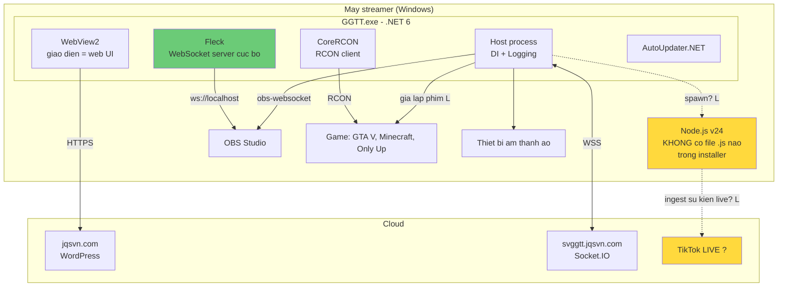

---
---

# PHỤ LỤC A — Phân tích Desktop Client (`GGTT-Installer-vi.exe`)

**Bổ sung ngày:** 2026-08-05
**Phương pháp:** Phân tích tĩnh (static analysis). **Không thực thi installer, không cài đặt, không chạy binary.**
**File:** `E:\ASUS\GGTT-Installer-vi.exe` · 97,488,625 bytes (93.0 MB)
**SHA-256:** `7c2e307c194cb2c5b837a72943afb74709641b156c3e281f86637ab3c755c359`

> Phụ lục này **thay thế** phần suy luận `[L]` ở §6.2 ("Desktop app = C# WinForms/WPF, Windows-only") bằng bằng chứng trực tiếp. Toàn bộ nội dung dưới đây trích từ metadata và manifest cài đặt — **không giải nén payload, không dịch ngược, không sao chép mã nguồn của ứng dụng.**

## A.1 Cách thu thập bằng chứng

| Bước | Kỹ thuật | Kết quả |
|---|---|---|
| 1 | Đọc PE header | Magic `MZP` → stub Delphi |
| 2 | Quét marker installer | `Inno Setup Setup Data (6.4.2)` |
| 3 | `Get-AuthenticodeSignature` | **NotSigned** |
| 4 | `VersionInfo` resource | GG Tiktok 1.1.3.3, Company "JQ" |
| 5 | Parse `TCompressedBlockHeader` @ `0x05bef3dd` | crc / stored_size 47236 / compressed=1 |
| 6 | De-chunk (bỏ CRC 4 byte mỗi 4096 byte) + giải nén LZMA1 | 274,131 byte header |
| 7 | Trích chuỗi UTF-16LE + ASCII | Manifest file + script Pascal |
| 8 | Bản đồ entropy 24 điểm | 8.00 toàn bộ → payload nén đặc, ~95 MB |

## A.2 Kiến trúc thực tế của Desktop Client — [C] Đã xác nhận

| Thành phần | Bằng chứng | Ý nghĩa |
|---|---|---|
| **Installer** | Inno Setup 6.4.2, Delphi `MZP` | — |
| **Ngôn ngữ app** | `GGTT.exe` + `GGTT.dll` + `GGTT.deps.json` + `GGTT.runtimeconfig.json` | **.NET, framework-dependent** (không self-contained) |
| **Runtime .NET** | `windowsdesktop-runtime-6.0.36-win-x64.exe` | **.NET 6 Desktop, x64** |
| **UI** | `Microsoft.Web.WebView2.Core/.WinForms/.Wpf.dll` + `WebView2Loader.dll` (x64/x86/arm64) | **Hybrid: WebView2 (Chromium) nhúng trong vỏ .NET** |
| **WebSocket server** | **`Fleck.dll`** | App **chạy WebSocket server cục bộ** |
| **Game integration** | **`CoreRCON.dll`** | Điều khiển game qua **giao thức RCON** |
| **Tự cập nhật** | `AutoUpdater.NET.dll` | Cơ chế auto-update |
| **JSON** | `Newtonsoft.Json.dll` | — |
| **DI / Logging** | `Microsoft.Extensions.{DependencyInjection,Logging,Options,Primitives}` | Kiến trúc .NET hiện đại, có DI container |
| **I/O** | `System.IO.Pipelines.dll`, `System.Diagnostics.DiagnosticSource.dll` | I/O hiệu năng cao |
| **WinRT** | `WinRT.Runtime.dll`, `Microsoft.Windows.SDK.NET.dll` | Gọi API Windows hiện đại |
| **Thư mục cài** | `{pf}\GGTT` | **Program Files — cài toàn máy** |
| **Shortcut** | `{commondesktop}\GG Tiktok`, `{group}\GGTT` | — |
| **Ngôn ngữ** | Vietnamese (Tieng Viet) | Bản Việt hóa |
| **URL nhúng** | `https://jqsvn.com`, `/google-tiktok-livestream/`, `/contact.html` | Liên kết về web |

### A.2.1 Ba runtime được cài ngầm — [C]

Script Pascal trong installer kiểm tra registry rồi cài im lặng nếu thiếu:

| Runtime | Lệnh cài | Registry kiểm tra |
|---|---|---|
| .NET 6 Desktop 6.0.36 | `/install /quiet /norestart` | `SOFTWARE\dotnet\Setup\InstalledVersions\x64\sharedfx\Microsoft.WindowsDesktop.App\6.0` |
| **Node.js v24.14.0 x64** | `msiexec /i "{tmp}\node-v24.14.0-x64.msi" /qn /norestart` | `SOFTWARE\Node.js` |
| Edge WebView2 | `/silent /install` | `SOFTWARE\Microsoft\EdgeUpdate\Clients\{F3017226-FE2A-4295-8BDF-00C3A9A7E4C5}` |

Hàm trong script: `ISDOTNETINSTALLED`, `ISNODEINSTALLED`, `ISWEBVIEW2INSTALLED` — điều kiện `not IsNodeInstalled`.

## A.3 Kiến trúc suy luận — [L] Có cơ sở

### A.3.1 Ba suy luận quan trọng nhất

**1. `Fleck` = WebSocket server cục bộ → overlay OBS chạy nội bộ, không vòng qua cloud. [L] cao**

Đây là **quyết định kiến trúc tốt**. Overlay trong OBS trỏ tới `ws://localhost:<port>` thay vì gọi lên server. Kết quả: độ trễ gần như bằng 0 giữa "có người tặng quà" và "hiệu ứng nổ trên màn hình", giảm tải server, và vẫn chạy khi mạng chập chờn. Đây là điểm mạnh kỹ thuật thật sự của sản phẩm — mạnh hơn những gì quan sát được từ phía web.

**2. `CoreRCON` → tính năng "quà kích hoạt game" có hai đường. [L] cao**

RCON dành cho game có server console (Minecraft, Source engine, Rust). Với game không hỗ trợ RCON (GTA V, Only Climb Better Together — cả hai đều được nêu trên trang web), phải dùng **giả lập bàn phím**. Việc ship cả `CoreRCON` cho thấy họ đã làm đường "sạch" cho những game hỗ trợ nó — trưởng thành hơn mức tôi dự đoán ở §5.2.

**3. Cài Node.js nhưng KHÔNG ship file JS nào. [C] tiền đề — [L] kết luận**

Manifest liệt kê **đầy đủ** file trong `{app}`: toàn bộ là DLL .NET. **Không có `.js`, không có `node_modules`, không có `package.json`.**

Vậy Node.js dùng để làm gì? Giả thuyết hợp lý nhất `[L]`: mã JavaScript được **tải hoặc sinh ra lúc chạy**, và nhiều khả năng phục vụ **kết nối luồng sự kiện TikTok LIVE** — hệ sinh thái thư viện trưởng thành cho việc này nằm ở phía Node, không phải .NET.

Điều này khớp với §14.6: **phương thức truy cập dữ liệu TikTok vẫn là `[U]`**, và giờ có thêm dấu hiệu cho thấy nó nằm ở tầng JS được nạp sau khi cài.

## A.4 Phát hiện bảo mật mới

| # | Mức | Phát hiện | Tag |
|---|---|---|---|
| **D1** | 🔴 **Nghiêm trọng** | **Installer KHÔNG ký số.** `Get-AuthenticodeSignature` → `Status: NotSigned`, không có certificate. | [C] |
| **D2** | 🟠 Cao | **Cài Node.js toàn máy trong im lặng** (`/qn`). Người dùng nhận thêm một runtime JS + npm vào máy mà không được hỏi riêng, và installer này sẽ **không bao giờ vá nó** về sau. | [C] |
| **D3** | 🟠 Cao | **Không ship JS nhưng bắt buộc có Node** → nhiều khả năng **nạp mã lúc chạy**. Mã đến sau khi cài không nằm trong bất kỳ vòng kiểm duyệt nào. | [C] tiền đề, [L] kết luận |
| **D4** | 🟠 Cao | **`GGTT.pdb` được ship kèm bản phát hành.** Debug symbols lộ namespace nội bộ, tên hàm, và đường dẫn build của máy lập trình viên. | [C] |
| **D5** | 🟡 Trung bình | **Nhắm .NET 6 — đã hết hỗ trợ (EOL) từ 12/11/2024**, khoảng 21 tháng trước thời điểm audit. Bản cài mới (1.1.3.3) vẫn dựa trên runtime không còn được vá bảo mật. | [C] |
| **D6** | 🟡 Trung bình | WebSocket server cục bộ (`Fleck`) — **[U]** bind vào `127.0.0.1` hay `0.0.0.0`. Nếu là `0.0.0.0`, thiết bị khác trong LAN có thể kết nối. **Cần kiểm chứng lúc chạy.** | [U] |
| **D7** | 🟡 Trung bình | `AutoUpdater.NET` — **[U]** kênh cập nhật dùng HTTPS hay HTTP, có kiểm chữ ký gói cập nhật không. Nếu không, đây là đường chiếm quyền qua update. **Cần kiểm chứng.** | [U] |
| **D8** | 🟢 Thấp | Cài vào `Program Files` toàn máy → cần quyền admin; kết hợp D1 nghĩa là người dùng phải cấp UAC cho một binary không xác thực được nguồn gốc. | [C] |

### A.4.1 Vì sao D1 nghiêm trọng trong bối cảnh sản phẩm này

Ứng dụng này **giữ token OAuth Facebook/Google của những tài khoản đang tạo ra thu nhập cho người dùng**. Một installer không ký số nghĩa là:

- SmartScreen sẽ cảnh báo → người dùng được **huấn luyện để bấm bỏ qua** → mất luôn lớp phòng vệ đó cho mọi lần cài sau.
- Không có cách nào phân biệt bản gốc với bản đã bị chèn mã (qua MITM, qua trang tải lại, qua nhóm Facebook giả mạo).
- Kết hợp với §13.1 (không CSP) và §13.2 (cookie phiên đọc được từ JS) trên web: hệ sinh thái này **không có bất kỳ ranh giới tin cậy nào được xác lập bằng mật mã**.

Chi phí ký số OV/EV khoảng vài trăm USD/năm — thấp nhất so với mọi hạng mục trong roadmap §20, và tác động lên lòng tin là ngay lập tức.

## A.5 Cập nhật §6 — Tech Stack

Các mục sau **chuyển từ `[L]` sang `[C]`**:

| Trước | Sau |
|---|---|
| `[L]` Desktop = C# WinForms/WPF, Windows-only | **`[C]` .NET 6 Desktop, x64, Windows, hybrid WebView2** |
| `[L]` Desktop nói chuyện cloud qua Socket.IO | `[L]` giữ nguyên — chưa quan sát được traffic |
| `[U]` Cơ chế điều khiển game | **`[C]` RCON (CoreRCON)** + `[L]` giả lập phím |
| `[U]` Cơ chế cập nhật | **`[C]` AutoUpdater.NET** |

**Mục mới `[C]`:** Fleck (local WS server) · phụ thuộc bắt buộc Node.js v24.14.0 · WebView2 · ship PDB · installer không ký số.

## A.6 Bổ sung Improvement Register (113–124)

113. 🔴 **Ký số (code signing) cho installer và toàn bộ EXE/DLL.** Ưu tiên cao nhất trong phụ lục này.
114. 🟠 Loại `GGTT.pdb` khỏi bản phát hành; đẩy symbol lên symbol server riêng phục vụ crash reporting.
115. 🟠 Nâng .NET 6 (EOL) lên **.NET 8 LTS** hoặc .NET 10 LTS.
116. 🟠 Cân nhắc **self-contained deployment** — bỏ được bước cài .NET runtime toàn máy, giảm rủi ro và ma sát cài đặt.
117. 🟠 Hỏi ý kiến người dùng trước khi cài Node.js, hoặc tốt hơn: **đóng gói Node runtime riêng trong `{app}`** thay vì cài toàn máy bằng `/qn`.
118. 🟠 Nếu có nạp JS lúc chạy: **ký và xác minh chữ ký từng bundle** trước khi thực thi.
119. 🟠 Xác minh `AutoUpdater.NET` dùng HTTPS **và** kiểm chữ ký gói cập nhật trước khi áp dụng.
120. 🟡 Xác minh `Fleck` bind `127.0.0.1`, không phải `0.0.0.0`; thêm token xác thực cho kết nối overlay cục bộ.
121. 🟡 Công bố **SHA-256 của installer** trên trang tải để người dùng tự đối chiếu (giải pháp tạm trong lúc chờ #113).
122. 🟡 Bổ sung SBOM cho desktop client; quét CVE cho `Fleck`, `CoreRCON`, `Newtonsoft.Json`, `AutoUpdater.NET`.
123. 🟢 Bản `arm64` — `WebView2Loader.dll` đã có sẵn cho arm64 nhưng app chỉ x64.
124. 🟢 Ghi rõ trên trang tải: cài đặt sẽ thêm .NET 6, Node.js và WebView2 vào máy. Minh bạch trước khi cài.

## A.7 Ảnh hưởng tới Blueprint (§16–§19)

Phát hiện `Fleck` làm thay đổi một quyết định thiết kế:

> **Sửa đổi §16.2 / §19.1:** overlay OBS **không nên** lấy dữ liệu từ cloud gateway như sơ đồ ban đầu mô tả. Thiết kế đúng — và là thứ sản phẩm hiện tại đang làm — là **desktop client chạy WebSocket server cục bộ, overlay kết nối `ws://127.0.0.1:<port>`**; cloud chỉ đồng bộ cấu hình và tính credit.
>
> Lợi ích: độ trễ quà→hiệu ứng gần bằng 0; overlay vẫn chạy khi mạng chập chờn; chi phí băng thông cloud giảm mạnh. **Đây là điểm nên học về mặt kiến trúc** (ý tưởng thiết kế, không phải mã nguồn).

Bổ sung vào §17.3 WebSocket contract: namespace cục bộ `/local`, bind `127.0.0.1`, token sinh mỗi phiên, dùng cho overlay và giao tiếp trong máy.

---

*Phụ lục A kết thúc. Toàn bộ phân tích là tĩnh; installer không được thực thi. Không giải nén payload, không dịch ngược, không sao chép mã nguồn ứng dụng — chỉ đọc metadata và manifest cài đặt.*
